# Astervoids Architecture

## System Overview

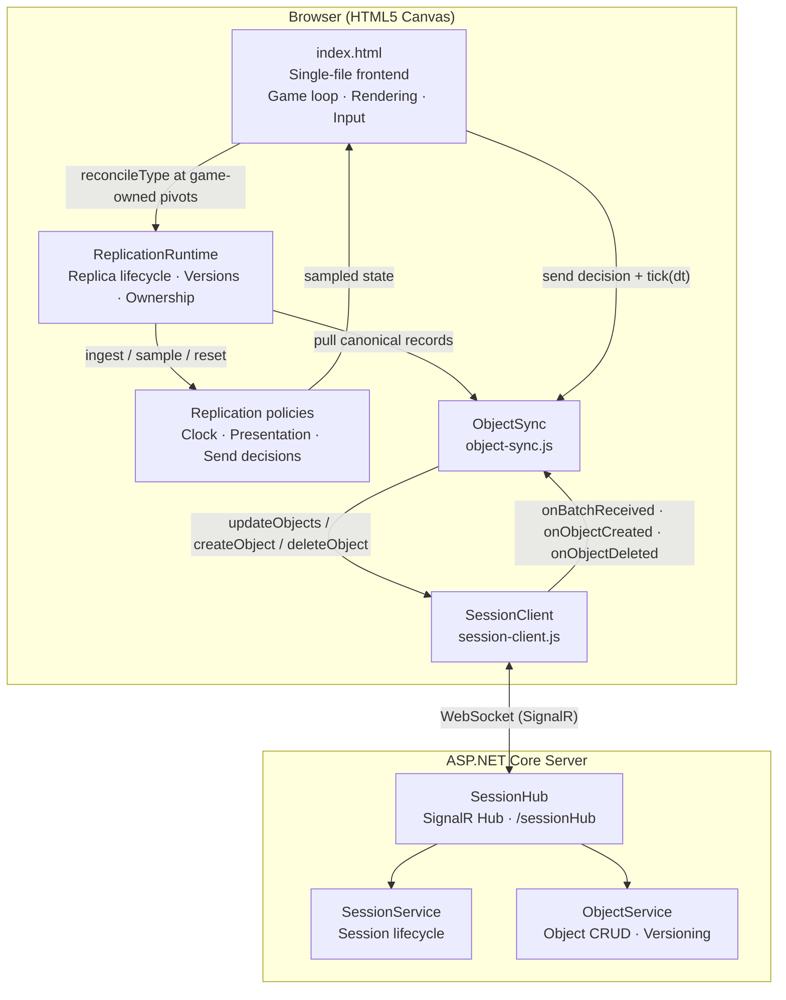

---

## Client Architecture

The browser client uses classic-script modules loaded before `index.html`'s
inline composition root. There is no bundler or transpilation step. Each module
exposes an explicit public object while retaining internal state in closures.
The game composes the layers and supplies Astervoids-specific adapters.

### Layer Boundaries

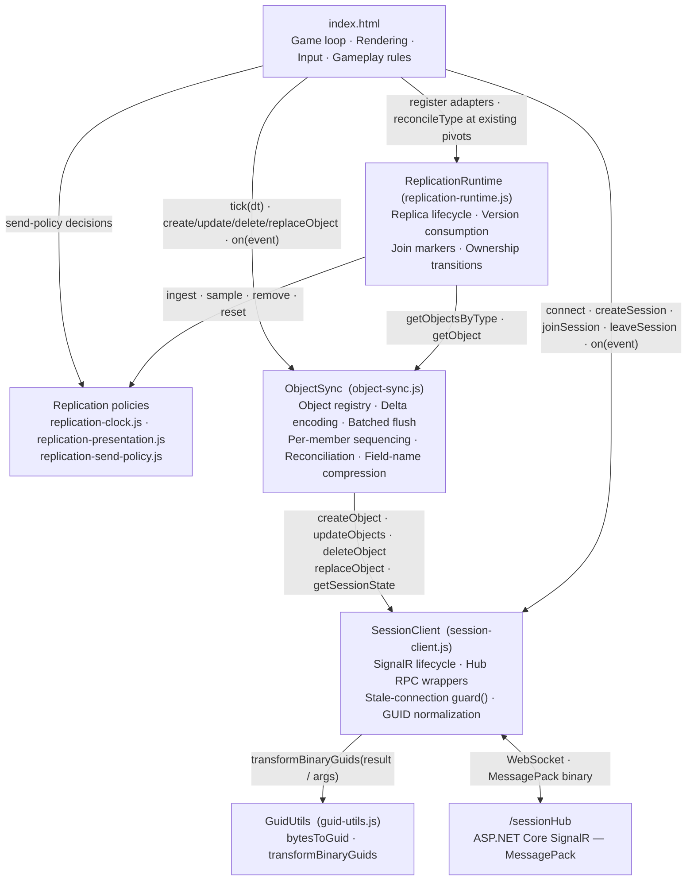

### Dependency Invariants

These rules are enforced purely by module structure and must not be violated when extending the client:

- **Only `SessionClient` holds a `signalR.HubConnection`.** The hub URL `/sessionHub` and `MessagePackHubProtocol` are referenced nowhere outside `session-client.js`. `index.html` contains no `signalR.*` references.
- **Only `SessionClient` calls `GuidUtils.transformBinaryGuids`.** It is applied in both the `guard()` event wrapper (all hub push callbacks) and `invokeHub()` (all RPC responses), so nothing above `SessionClient` ever observes a raw 16-byte `Uint8Array` GUID.
- **`ObjectSync` is the sole consumer of `SessionClient.{createObject, updateObjects, deleteObject, replaceObject, getSessionState}`.** The game never calls these transport methods directly.
- **The game never directly manages `memberSequence`, delta encoding, or reconciliation.** Per-member sequence tracking, gap detection, and `GetSessionState` calls are entirely encapsulated inside `ObjectSync`.
- **Send rate is decoupled from frame rate.** The game calls only `ObjectSync.tick(frameTimeSec)` once per frame; `ObjectSync` internally computes `sendThreshold` from `nominalFrameTime` and flushes batched mutations independently.
- **`ReplicationRuntime` is pull-driven.** It never owns a frame loop, calls
  `ObjectSync.tick`, sends a mutation, or subscribes to SignalR. The game invokes
  one type reconciliation at each existing collision-visible simulation pivot.
- **`ReplicationRuntime` never interprets game data.** Record classification
  and entity create/apply/adopt/remove behavior are adapter callbacks.
  Reusable kinematic/control policies define explicit input state contracts and
  receive geometry, prediction, replay, wrapping, and clock behavior through
  injection.
- **Serialization has one seam.** Entity `toSyncData`, `toUpdateData`, and
  `fromSyncData` methods plus the schema selector remain authoritative; runtime
  descriptors do not duplicate wire mappings.

> These are the client-side analogues of the server-side lock ordering described in the [Thread Safety](#sessionservice-thread-safety) section.

### Replication Responsibilities and State Ownership

| Layer | Owns | Does not own |
|---|---|---|
| `SessionClient` | SignalR connection, session identity/epoch, RPC lifecycle | Replicated entities or presentation |
| `ObjectSync` | Canonical records, versions, deltas, batching, sequencing, reconciliation | Game fields, physics, concrete entities |
| Replication policies | Clock estimates, interpolation/dead-reckoning state, send eligibility | Transport, collections, frame scheduling |
| `ReplicationRuntime` | Consumed versions, one-shot join markers, role bindings, migration-pending state | Serialization, simulation, collisions, audio |
| Astervoids adapters | Record-to-entity mapping and game-specific transition effects | SignalR and wire mechanics |
| Astervoids game | Local authority, rules, physics, collisions, rendering, UX | Generic record ordering and migration gates |

The canonical record in `ObjectSync`, a locally authoritative entity, a remote
game instance, and transient presentation state are deliberately separate
objects with one owner each. `ReplicationRuntime` coordinates them without
copying canonical data into a second generic store.

### Pull-Driven Frame Contract

The extraction preserves the existing order rather than introducing one global
replication update:

1. `ObjectSync.tick` pumps the outbound scheduler once per frame.
2. Local authoritative entities simulate and enqueue their latest state.
3. `updateRemoteShips`, `updateAstervoidsFromSync`,
   `updateBulletsFromSync`, and `updateGameStateFromSync` reconcile their type
   at their original game-owned pivots.
4. Collision detection observes the same local and sampled remote state as
   before extraction.
5. Rendering remains outside the runtime.

The hidden-tab fallback keeps its own established order: outbound tick, local
ownership simulation, asteroid and bullet reconciliation, collision handling,
then ship reconciliation. Consolidating these calls into a single automatic
runtime tick is prohibited because it would change collision-visible state.

Outbound authority remains game-owned. `replication-send-policy.js` returns
explicit `{ send, immediate, reason }` decisions, but the game still invokes
entity serializers and `ObjectSync.updateObject`; `ObjectSync` still owns
coalescing, immediate edge flushes, cadence, and backpressure. An
`AuthorityPublisher` was intentionally not introduced because it would combine
independently tested scheduling layers without adding receive-side reuse.

### Replica Lifecycle Contract

`ReplicationRuntime` consumes plain records with `id`, `type`, `data`,
`creatorMemberId`, `ownerMemberId`, `scope`, `version`, `validAt`, and optional
ownership-migration metadata. A registered type adapter classifies each record
as `owned`, `replica`, or `ignore` and supplies collection and lifecycle hooks.

- `beginSession({ epoch, snapshotObjectIds })` scopes all work to a
  `SessionClient` epoch and installs one-shot join markers.
- A join marker is consumed only by the first applicable replica ingest or
  owned adoption.
- Equal consumed versions continue to sample existing presentation state but
  do not ingest another anchor.
- A metadata-only ownership version advances consumption without re-anchoring
  an existing replica. The first later data-bearing version receives a
  `preserveDirection` transition fact.
- Delete, ownership gain, ignored role, missing type, and session reset use
  explicit removal reasons so game adapters can suppress inappropriate
  cosmetic effects.
- Stale-epoch reconciliation, deletion, migration, and reset work is rejected.

This remains a client-side boundary for one joined session. Server authority is
still the in-memory, per-session state protected by `Session.SyncRoot` inside
one application instance; the runtime does not add cross-process or
cross-region session replication.

### Future Native Client Contract

The JavaScript callbacks and `Map` usage are implementation details, not the
cross-language API. A native client should reproduce these protocol-neutral
contracts:

- plain record fields, session epochs, role transitions, version acceptance,
  and removal reasons;
- explicit wall, server-UTC, and monotonic clock domains in milliseconds;
- primitive-input prediction/interpolation kernels and documented clamp rules;
- explicit send decisions, while retaining a separate transport scheduler;
- golden codec, timing, join, migration, and cadence fixtures.

Normative behavior must not depend on DOM APIs, JavaScript object identity, or
hidden calls to `performance.now()`. The existing JS/C# cross-wire fixtures and
policy/runtime vectors are the starting point for a future C/C++ implementation.
Packaging, code generation, a full ECS, distributed authority, and a separate
session/reconnect coordinator remain deferred until a second client proves
those seams.

### SessionClient Public API

#### RPC Wrappers

All wrappers route through `invokeHub()`, which enforces session membership and applies `GuidUtils.transformBinaryGuids` to the result before returning it to the caller.

| Wrapper | Hub method | Wire args | Return (after GUID normalization) |
|---|---|---|---|
| `createSession(metadata?)` | `CreateSession` | `metadata?` | `{ session, member }` or `null` |
| `joinSession(sessionId, evictMemberId?)` | `JoinSession` | `sessionId, evictMemberId?` | `{ session, member }` or `null` |
| `leaveSession()` | `LeaveSession` | — | `void` (broadcast only) |
| `getActiveSessions()` | `GetActiveSessions` | — | `{ sessions[], maxSessions, canCreateSession }` |
| `createObject(data, scope, ownerMemberId?, clientValidAt?)` | `CreateObject` | `data, scope, ownerMemberId?, clientValidAt?` | `{ objectInfo, memberSequence }` |
| `updateObjects(updates, senderSequence, senderSendIntervalMs, clientValidAt?)` | `UpdateObjects` | `updates[], senderSequence, senderSendIntervalMs, clientValidAt?` | `{ versions{}, memberSequence, serverTimestamp }` |
| `replaceObject(deleteObjectId, replacements, scope, ownerMemberId?, clientValidAt?)` | `ReplaceObject` | `deleteObjectId, replacements[], scope, ownerMemberId?, clientValidAt?` | `createdInfos[]` |
| `deleteObject(objectId)` | `DeleteObject` | `objectId` | `{ success, memberSequence }` |
| `getSessionState()` | `GetSessionState` | — | `{ members[], objects[], memberSequences{} }` |

† `clientValidAt` is the owner's NTP-aligned operation timestamp. Updates sample
it once at flush, after latest-state coalescing, so it is not an exact timestamp
for every simulation pose. The server clamps it to ±2s of its own UtcNow and
forwards `validAt`; if `null`, it falls back to hub-entry time. See
"Networking: Unified `validAt` Interpolation Axis" below.

#### Lifecycle and State Methods

These methods have no corresponding hub RPC.

| Method | Description |
|---|---|
| `connect(force?)` | Opens `/sessionHub` with `MessagePackHubProtocol`; `force=true` tears down the existing connection first (awaits `stop()` with a 3 s timeout before creating a new one) |
| `disconnect()` | Stops the connection and clears all state including `lastSessionId` |
| `on(eventName, callback)` | Registers a named callback from the fixed `callbacks` set |
| `getCurrentSession()` | Returns the current session object (`id, name, members[], objects[], metadata`) or `null` |
| `getCurrentMember()` | Returns the current member object (`id, role`) or `null` |
| `getSessionEpoch()` | Returns the monotonically changing local lifecycle epoch used to reject stale async work |
| `isConnected()` | `true` when the connection is `HubConnectionState.Connected` |
| `isInSession()` | `true` when `currentSession !== null` |
| `getLastSessionId()` | Returns the session id from the most recent join; preserved across unexpected disconnects for auto-rejoin |
| `clearSessionState()` | Blanks `currentSession` and `currentMember` without stopping the transport; used during auto-rejoin |

### SessionClient Event Callbacks

`SessionClient.on(name, fn)` registers callbacks from a fixed set of **16** names. The regular mapping is `OnFooBar` (hub broadcast) → `onFooBar` (JS callback). All handler arguments are walked through `GuidUtils.transformBinaryGuids` by `guard()` before dispatch, so callers never observe raw `Uint8Array` GUIDs.

| JS callback | Hub source | Notes |
|---|---|---|
| `onConnected` | `onreconnected` / initial `connect()` | Fires on first connect and after every successful automatic reconnection |
| `onReconnecting` | `onreconnecting` | Transport lost; SignalR is retrying |
| `onDisconnected` | `onclose` | Connection permanently closed; `error` is `null` for intentional disconnect |
| `onSessionCreated` | `createSession()` response | Not a hub broadcast; fired after local state is populated from the RPC response |
| `onSessionJoined` | `joinSession()` response | Not a hub broadcast |
| `onSessionLeft` | `leaveSession()` | Not a hub broadcast |
| `onMemberJoined` | `OnMemberJoined` | `(memberInfo, senderMemberId, memberSequence)` |
| `onMemberLeft` | `OnMemberLeft` | `(info, senderMemberId, memberSequence)`; may be immediately followed by `onRoleChanged` if the local member was promoted |
| `onRoleChanged` | Derived from `OnMemberLeft` | Fired only when `info.promotedMemberId === currentMember.id`; arg: `(newRole)` |
| `onObjectCreated` | `OnObjectCreated` | `(objectInfo, senderMemberId, memberSequence)` |
| `onObjectsUpdated` | `OnObjectsUpdated` | Arg reorder: hub sends `serverTimestamp` at position 4; callback puts it at position 1 → `(objects, serverTimestamp, senderMemberId, senderSequence, memberSequence, senderSendIntervalMs)` |
| `onObjectDeleted` | `OnObjectDeleted` | `(objectId, senderMemberId, memberSequence)` |
| `onObjectReplaced` | `OnObjectReplaced` | `(event, senderMemberId, memberSequence)` |
| `onSessionsChanged` | `OnSessionsChanged` | No args; signal only — caller must call `getActiveSessions()` to get the updated list |
| `onSessionExpired` | `OnSessionExpired` | `(reason)` — server-driven session destroy via `SessionCleanupService` |
| `onError` | Internal | `(errorMessage)` — fired on connection or RPC errors |

### ObjectSync Public API

#### Lifecycle / Config

| Method | Description |
|---|---|
| `init()` | Subscribes to the six `SessionClient` events the sync layer consumes (`onObjectCreated`, `onObjectsUpdated`, `onObjectDeleted`, `onObjectReplaced`, `onSessionJoined`, `onSessionLeft`) |
| `configure(config)` | Sets `nominalFrameTime`, `minFrameTime`, `deltaEncoding`, `adaptiveSendRate`, and `fieldMap` |
| `clear()` | Resets all local state (objects, sequences, pending updates); called on session leave |

#### Object Mutations

| Method | Description |
|---|---|
| `createObject(data, scope?, ownerMemberId?, isStillNeeded?)` | **Response-first**: invokes `CreateObject`, registers the server-assigned id + version; if `isStillNeeded()` returns `false` after the round-trip, fires a fire-and-forget delete to clean up the orphan |
| `updateObject(id, data, immediate?)` | Mutates the local object immediately and queues for batched flush; `immediate=true` forces a flush without waiting for `tick()` |
| `deleteObject(id)` | **Local-first**: removes from the local map and `pendingUpdates`, adds to `pendingDeletes`, then invokes `DeleteObject` |
| `replaceObject(deleteId, replacements, scope?, ownerMemberId?)` | Atomic delete-plus-create round-trip; local map is not mutated until the `OnObjectReplaced` broadcast echo arrives |
| `flushUpdates()` | Builds the wire batch (delta or full), compresses field names via `fieldMap`, and calls `SessionClient.updateObjects` |

#### Frame Pump

| Method | Description |
|---|---|
| `tick(frameTimeSec)` | Called once per game frame; recomputes `sendThreshold = round(nominalFrameTime / clampedFrameTime)`, increments the frame counter, and calls `flushUpdates()` when the threshold is reached |

#### Queries

| Method | Description |
|---|---|
| `getObject(id)` | Returns the local object with the given id, or `undefined` |
| `getAllObjects()` | Returns an array of all locally tracked objects |
| `getObjectsByOwner(memberId)` | Returns all objects where `ownerMemberId === memberId` |
| `getObjectsByType(type)` | O(n-matching) type lookup via the internal `typeIndex` |
| `getObjectByType(type)` | O(1) singleton lookup (e.g. `GameState`) via `typeIndex` |
| `getObjectCount()` | Returns the number of locally tracked objects |
| `getReconciliationCount()` | Returns the number of completed reconciliations in this session |
| `getSendRate()` | Returns the current effective send rate in Hz (`round(1 / nominalFrameTime)`) |
| `isReconciling()` | `true` while a `GetSessionState` reconciliation round-trip is in progress |

#### Adaptive Send Rate

| Method | Description |
|---|---|
| `updateSendRate(rttMs)` | Scales `nominalFrameTime` linearly from measured RTT (only when `adaptiveSendRate` is enabled); low RTT → 20 Hz, high RTT → 1 Hz |

#### Reconciliation Control

| Method | Description |
|---|---|
| `triggerReconciliation()` | Fetches a full state snapshot from the server and syncs the local object map; no-op while suspended or already reconciling |
| `suspendReconciliation()` | Increments the suspend counter; while `> 0`, `triggerReconciliation()` is a silent no-op |
| `resumeReconciliation()` | Decrements the suspend counter |

#### Cross-Layer Coordination Hooks

| Method | Description |
|---|---|
| `handleOwnershipMigration(migratedObjects)` | Applies server-authoritative `{ objectId, newOwnerId, newVersion }` entries from `MemberLeftInfo`; prevents version drift from blind local increments |
| `handleMemberDeparture(deletedObjectIds)` | Removes member-scoped objects from the local map and fires `onObjectDeleted` for each |
| `trackEventSequence(senderMemberId, memberSequence)` | Public alias for `trackMemberSequence`; keeps the per-member sequence map current for events not handled internally by `ObjectSync` |

#### Event Registration

| Method | Description |
|---|---|
| `on(eventName, callback)` | Registers a callback from the fixed 7-name `callbacks` set |

### ObjectSync Event Callbacks

`ObjectSync.on(name, fn)` registers callbacks from a fixed set of **7** names.

| Callback | Signature | Notes |
|---|---|---|
| `onObjectCreated` | `(obj)` | Fires when an object is first registered locally (from remote creation, reconciliation, or own `createObject` response) |
| `onObjectUpdated` | `(obj)` | Fires when a remote update is applied to a locally tracked object |
| `onObjectDeleted` | `(obj)` | Fires when an object is removed from the local map (remote delete, member departure, or reconciliation ghost removal) |
| `onBatchReceived` | `(serverTimestamp, clientTimestamp?, senderSendIntervalMs?, senderMemberId?, responseTimestamp?)` | Powers the full RTT→TX→BUF pipeline (see [Networking: RTT → TX → BUF Pipeline](#networking-rtt--tx--buf-pipeline)). For remote batches `clientTimestamp` is `null`; for own flush responses `clientTimestamp` is set and RTT is computable as `responseTimestamp - clientTimestamp` |
| `onSyncError` | `(operation, error)` | Fires when a `createObject`, `updateObject`, or `deleteObject` RPC fails |
| `onReconciliationFailed` | `()` | Fires when `GetSessionState` returns `null` or throws — the server no longer recognizes this connection as a session member; drives `attemptAutoRejoin` in the game |
| `onReconciliationComplete` | `()` | Fires at the end of a successful reconciliation round-trip |

### Cross-Layer Coordination Contracts

The following implicit protocols are promoted here to explicit contracts.

#### Member Departure Ordering

Inside the game's `onMemberLeft(info, ...)` handler, the game **must** call `ObjectSync.handleOwnershipMigration(info.migratedObjects)` and `ObjectSync.handleMemberDeparture(info.deletedObjectIds)` **before** reading ownership from the local object map. These calls apply the server-authoritative versions from `MemberLeftInfo` — skipping them would cause blind local increments to diverge from the server version, triggering spurious reconciliations.

#### Auto-Rejoin Reentry

The `attemptAutoRejoin` path wraps its multi-step reentry with `suspendReconciliation` / `resumeReconciliation` (counter-based, so nested calls compose correctly) and uses `clearSessionState()` to drop stale refs without tearing down the transport:

```
ObjectSync.suspendReconciliation()      // prevent snapshot races mid-rejoin
SessionClient.clearSessionState()       // drop stale currentSession/currentMember
                                        //   without stopping the SignalR connection
SessionClient.joinSession(sessionId, evictMemberId)   // evict own stale member if still present
ObjectSync.resumeReconciliation()
```

Cross-reference: [SignalR Reconnection & Reconciliation](#signalr-reconnection--reconciliation).

#### Local-First Delete Safety

`ObjectSync.deleteObject` adds the object id to `pendingDeletes` immediately after removing it from the local map, before the `DeleteObject` invoke resolves. A concurrent `triggerReconciliation` snapshot skips ids in `pendingDeletes` on the "add missing object" pass, preventing a racing snapshot from resurrecting a locally-deleted object. `pendingDeletes` is cleared when the invoke resolves (success or failure).

#### Field-Name Compression Boundary

`ObjectSync.compressData` / `expandData` apply the configured `fieldMap` exactly at the wire boundary:

- **Before send**: after delta computation, field names are compressed (e.g. `velocityX` → `vx`).
- **After receive**: field names are expanded before dispatch to game callbacks.

Game logic always uses readable field names. An empty `fieldMap` (the default) means pass-through — compression is purely opt-in via `configure({ fieldMap: { ... } })`.

---

## Backend Data Model

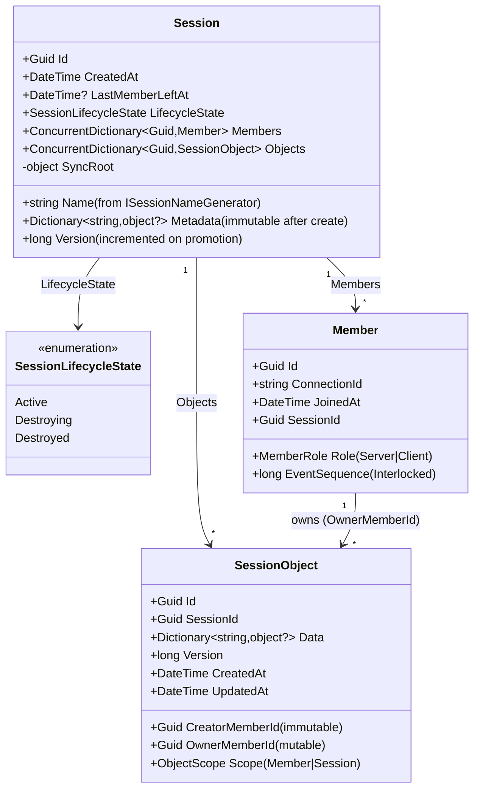

## Service Layer

```mermaid
graph TB
    subgraph "SessionService"
        direction TB
        SS_DICT["State:<br/>_sessions: ConcurrentDictionary&lt;Guid, Session&gt;<br/>_connectionToMember: ConcurrentDictionary&lt;string, Guid&gt;<br/>_memberToSession: ConcurrentDictionary&lt;Guid, Guid&gt;"]
        SS_CFG["Config:<br/>MaxSessions: 6<br/>MaxMembersPerSession: 4<br/>Names from ISessionNameGenerator<br/>(default: FruitNameGenerator, 50 names)"]
        SS_DEP["Member departure (atomic in LeaveSession):<br/>• Remove from indexes<br/>• Promote oldest remaining if Server left<br/>• HandleObjectDeparture: delete Member-scoped,<br/>  migrate Session-scoped (round-robin)<br/>• Mark LastMemberLeftAt for deferred cleanup"]
    end

    subgraph "ObjectService"
        direction TB
        OS_OPS["Operations (all enforce ownership + lifecycle<br/>under session.SyncRoot):<br/>CreateObject → Id, Version=1, Owner<br/>UpdateObject → merge, Version++ (no ownership check)<br/>UpdateObjects → Batch, owner-filtered atomically<br/>DeleteObject → ownership-checked TryRemove<br/>ReplaceObject → atomic delete + create children"]
    end

    subgraph "FruitNameGenerator (ISessionNameGenerator)"
        direction TB
        FNG["50-fruit pool (Apple, Banana, ...)<br/>Pick random unused name<br/>If all used → append counter (Apple2)"]
    end

    subgraph "ServerMetricsService (singleton)"
        direction TB
        SMS["Tracks: CPU/memory/GC/thread pool,<br/>connection counts, hub invocations,<br/>per-member TX/RX bytes, reconciliations,<br/>reconnects.<br/>Exposed via GET /api/srvmon (camelCase JSON)."]
    end

    subgraph "SessionCleanupService (BackgroundService)"
        direction TB
        SCS_OPS["Runs every 10 seconds<br/>Empty timeout: destroy sessions with no members<br/>Absolute timeout: destroy sessions exceeding max lifetime<br/>Notifies connected members via SignalR OnSessionExpired<br/>Broadcasts OnSessionsChanged on any cleanup"]
        SCS_CFG["Config (SessionSettings):<br/>EmptyTimeoutSeconds: 30<br/>AbsoluteTimeoutMinutes: 20<br/>ClientTimeoutSeconds: 20<br/>KeepAliveSeconds: 10"]
    end
```

## SessionService: Lookup Chain

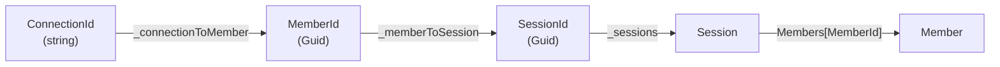

## SessionService: Create & Join

```mermaid
flowchart TB
    subgraph "CreateSession(metadata?)"
        CS1{"Connection already<br/>in a session?"}
        CS2{"Active sessions<br/>>= maxSessions (6)?"}
        CS4["Pick session name via ISessionNameGenerator<br/>(default FruitNameGenerator: random unused fruit;<br/>append counter if pool exhausted)"]
        CS5["Create Session with Name + Metadata"]
        CS6["Create Member with Role=Server"]
        CS7["Add to _sessions, _connectionToMember,<br/>_memberToSession, session.Members"]
        CS8["Return CreateSessionResult<br/>{Success, Session, Creator}"]
        CSE["Return error"]

        CS1 -->|Yes| CSE
        CS1 -->|No| CS2
        CS2 -->|Yes| CSE
        CS2 -->|No| CS4 --> CS5 --> CS6 --> CS7 --> CS8
    end

    subgraph "JoinSession(sessionId, evictMemberId?)"
        JS1{"Connection already<br/>in a session?"}
        JS2{"Session exists<br/>AND Active?"}
        JSE_EVICT{"evictMemberId given<br/>AND stale member found<br/>(different connection)?"}
        EVI["EvictMemberInternal:<br/>remove from indexes, promote if was Server,<br/>HandleObjectDeparture (delete + migrate)"]
        JS3{"Members.Count<br/>>= maxMembers (4)?"}
        WAS{"Session was empty<br/>(rejoining)?"}
        JS4S["Create Member with Role=Server"]
        JS4C["Create Member with Role=Client"]
        ADOPT["AdoptOrphanedObjects:<br/>reassign session-scoped objects<br/>without a current owner"]
        JS5["Clear session.LastMemberLeftAt"]
        JS6["Return JoinSessionResult<br/>{Success, Session, Member, Eviction?}"]
        JSE["Return error"]

        JS1 -->|Yes| JSE
        JS1 -->|No| JS2
        JS2 -->|No| JSE
        JS2 -->|Yes| JSE_EVICT
        JSE_EVICT -->|Yes| EVI --> JS3
        JSE_EVICT -->|No| JS3
        JS3 -->|Yes| JSE
        JS3 -->|No| WAS
        WAS -->|Yes| JS4S --> ADOPT --> JS5
        WAS -->|No| JS4C --> JS5
        JS5 --> JS6
    end
```

## SessionService: Leave & Server Promotion

`LeaveSession` is **atomic** under `session.SyncRoot` — membership change, server
promotion, and object cleanup happen in one critical section and a single
`LeaveSessionResult` is returned to the hub. There is no separate
`HandleMemberDeparture` call (that responsibility moved out of `ObjectService`).

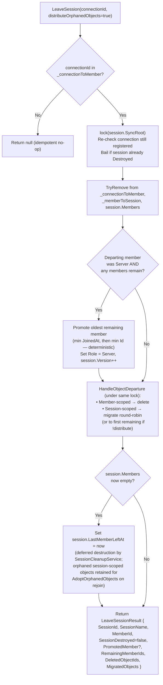

## ObjectService: Update Flow

All mutations run under `Session.SyncRoot`. Ownership and session lifecycle are
validated atomically inside `ObjectService` itself (the hub still pre-checks for
fast early-return / logging, but correctness does not rely on it).

```mermaid
flowchart TB
    subgraph "UpdateObject (single, no ownership check)"
        U1["UpdateObject(sessionId, objectId, data)"]
        U2{"Session active?<br/>Object exists?"}
        U4["Replace obj.Data with merged copy<br/>obj.Version++<br/>obj.UpdatedAt = now"]
        U5["Return updated SessionObject"]
        UF["Return null (failure)"]

        U1 --> U2
        U2 -->|No| UF
        U2 -->|Yes| U4 --> U5
    end

    subgraph "UpdateObjects (batch, ownership enforced in service)"
        B1["UpdateObjects(sessionId, ownerMemberId, updates)"]
        B2{"For each update:<br/>object exists AND<br/>OwnerMemberId == ownerMemberId?"}
        B3["Merge data, Version++,<br/>UpdatedAt = now"]
        B4["Skip (continue)"]
        B5["Return ONLY successfully<br/>updated objects"]

        B1 --> B2
        B2 -->|Yes| B3 --> B5
        B2 -->|No| B4 --> B5
    end

    subgraph "DeleteObject (ownership enforced in service)"
        D1["DeleteObject(sessionId, objectId, ownerMemberId)"]
        D2{"Object exists AND<br/>owned by ownerMemberId?"}
        D3["TryRemove from session.Objects<br/>Return deleted SessionObject"]
        D4["Return null (no-op)"]

        D1 --> D2
        D2 -->|Yes| D3
        D2 -->|No| D4
    end

    subgraph "ReplaceObject (atomic delete + create)"
        R1["ReplaceObject(sessionId, deleteObjectId,<br/>ownerMemberId, replacements[])"]
        R2{"Session active AND<br/>delete target owned<br/>by ownerMemberId?"}
        R3["Delete target,<br/>create each replacement<br/>(Version=1, owner = caller or override)"]
        R4["Return created list"]
        R5["Return null (no changes applied)"]

        R1 --> R2
        R2 -->|Yes| R3 --> R4
        R2 -->|No| R5
    end
```

## SessionService: Member Departure & Ownership Redistribution

`HandleObjectDeparture` is a private helper of `SessionService`, called inside
`LeaveSession` and `EvictMemberInternal` while `session.SyncRoot` is held. The
results (`DeletedObjectIds`, `MigratedObjects`) are bundled into
`LeaveSessionResult` / `EvictionInfo` so the hub can broadcast a single
`OnMemberLeft` event.

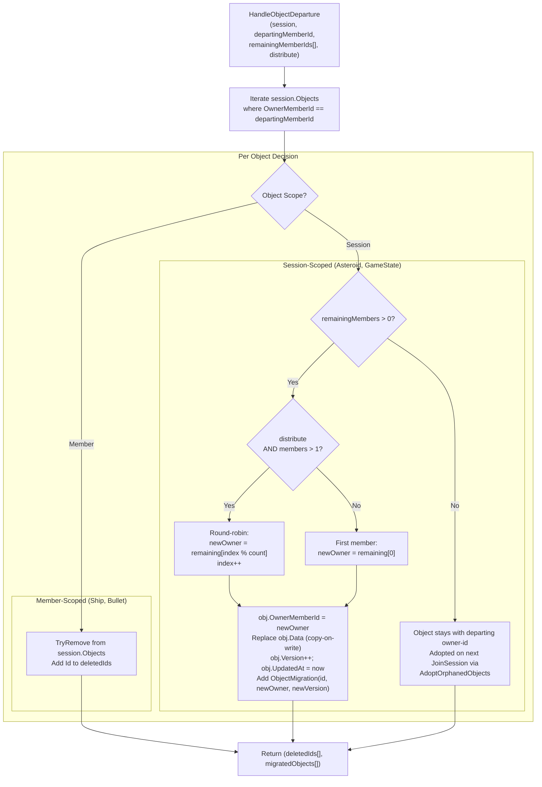

### Round-Robin Example (3 players, Player B leaves)

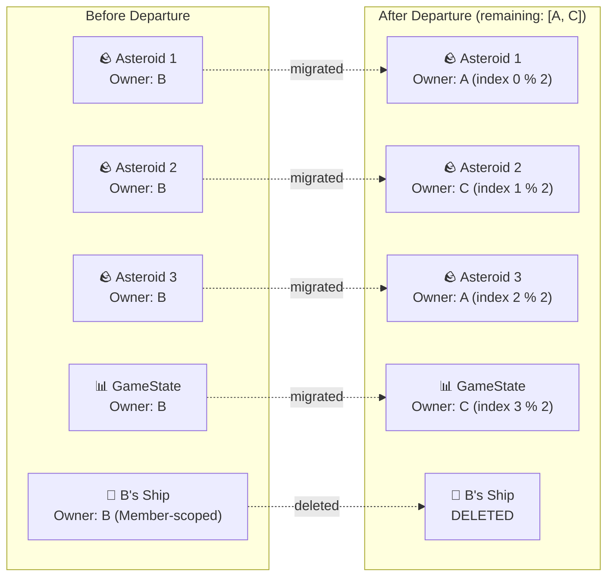

## SessionHub: Method Signatures & Broadcast Patterns

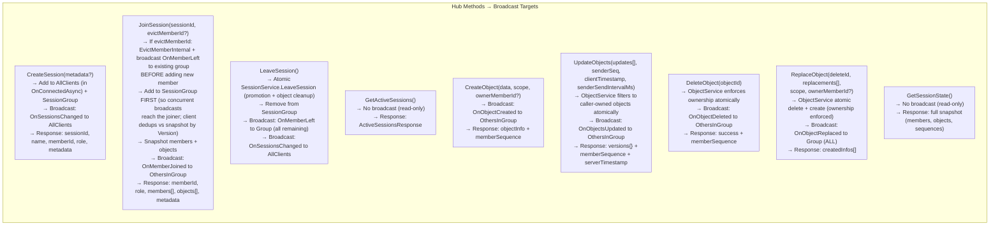

## SessionHub: UpdateObjects Detail

```mermaid
sequenceDiagram
    participant C as Caller
    participant HUB as SessionHub
    participant OS as ObjectService
    participant OTH as Other Members

    C->>HUB: UpdateObjects(updates[], senderSeq,<br/>clientTimestamp, senderSendIntervalMs)
    HUB->>HUB: GetMemberByConnectionId(connectionId)
    HUB->>HUB: Filter updates: only objects where<br/>obj.OwnerMemberId == caller.Id
    HUB->>OS: UpdateObjects(sessionId, authorizedUpdates)
    OS-->>HUB: List of successfully updated objects<br/>(partial success — failed versions skipped)
    HUB->>HUB: memberSequence = Interlocked.Increment(member.EventSequence)
    HUB->>HUB: serverTimestamp = DateTimeOffset.UtcNow.ToUnixTimeMilliseconds()

    par Broadcast to others
        HUB->>OTH: OnObjectsUpdated(<br/>  updateInfos[{Id, Data, Version}],<br/>  member.Id,<br/>  senderSequence,<br/>  memberSequence,<br/>  serverTimestamp,<br/>  clientTimestamp,<br/>  senderSendIntervalMs)
    and Response to caller
        HUB-->>C: UpdateObjectsResponse(<br/>  versions: {objectId → version},<br/>  memberSequence,<br/>  serverTimestamp)
    end

    Note over C: clientTimestamp echoed back in broadcast<br/>→ null for others (RTT discriminator)<br/>→ original value in response
```

## SessionHub: Leave & Disconnect Flow

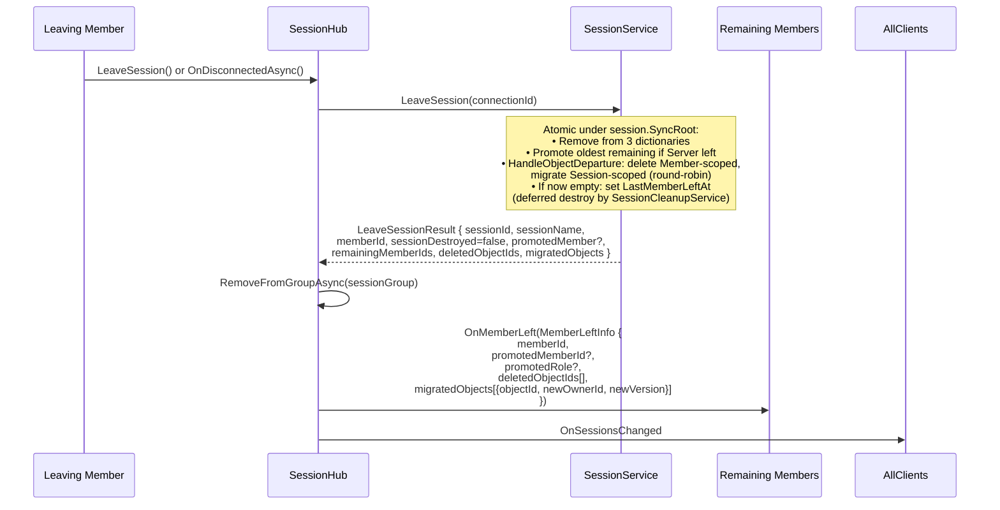

## SignalR Group Management

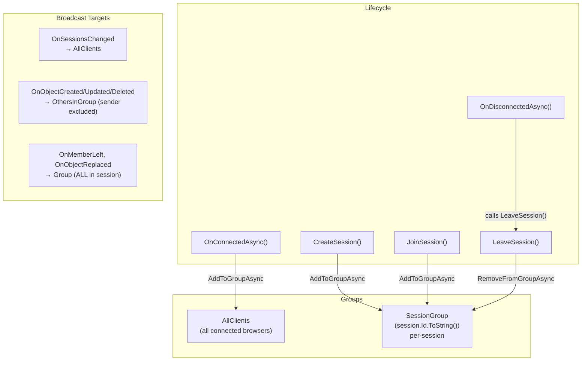

## SessionHub: ReplaceObject (Atomic Delete + Create)

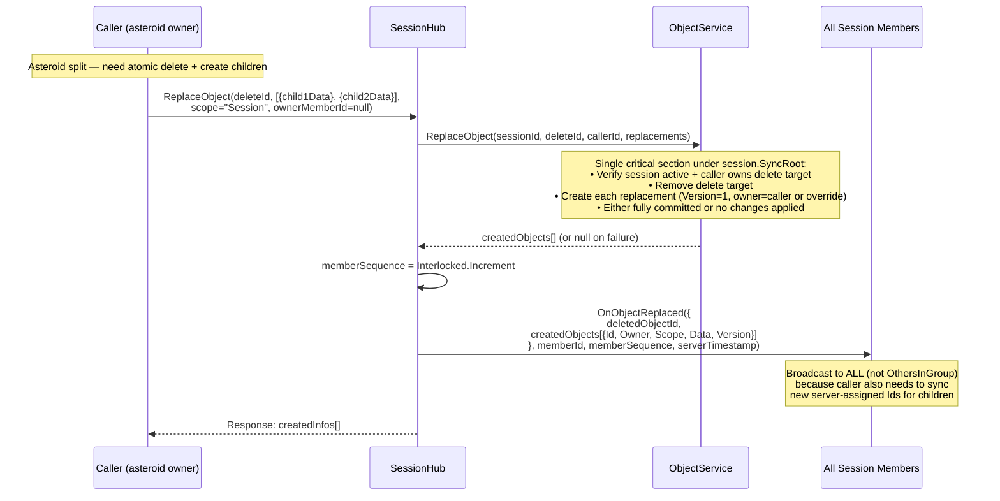

## Session & Member Model

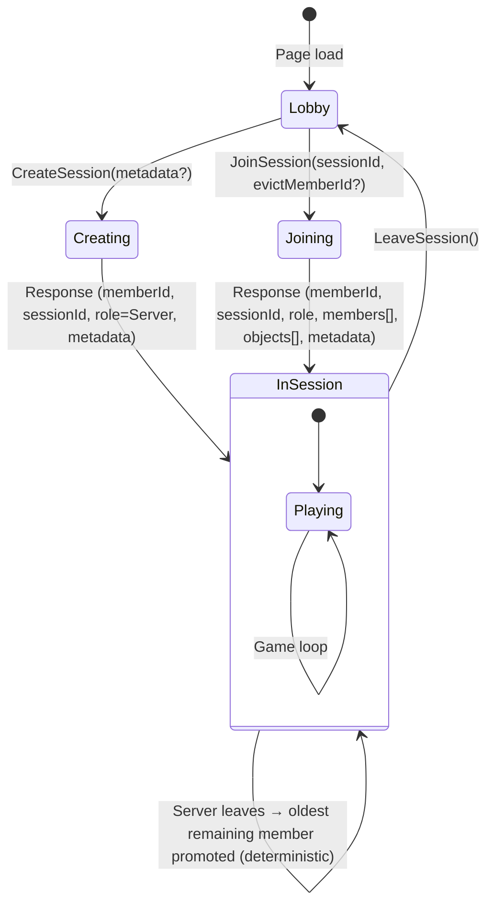

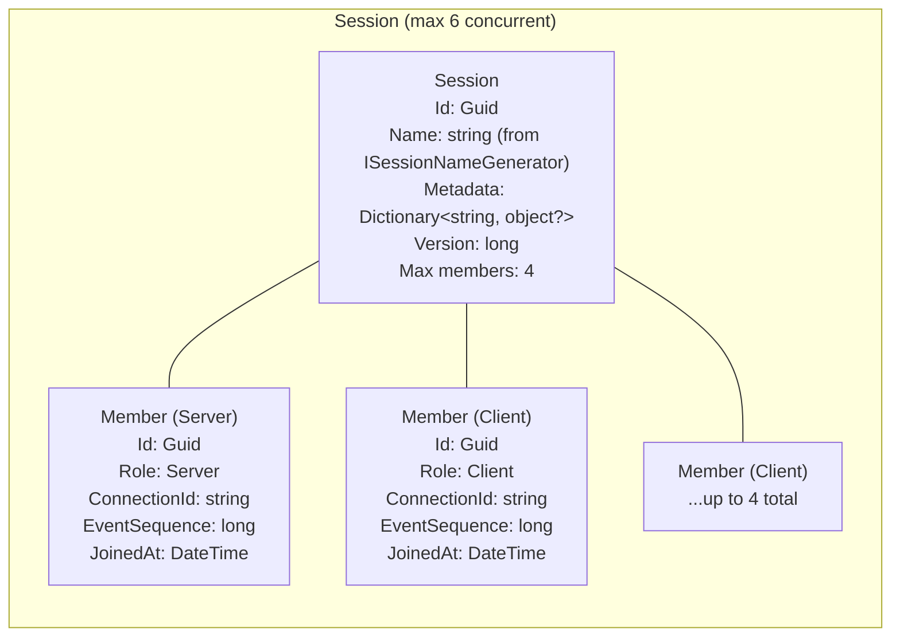

## Object Model & Ownership

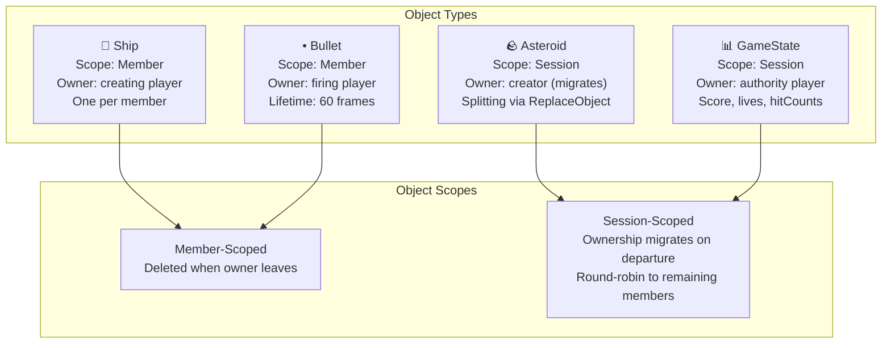

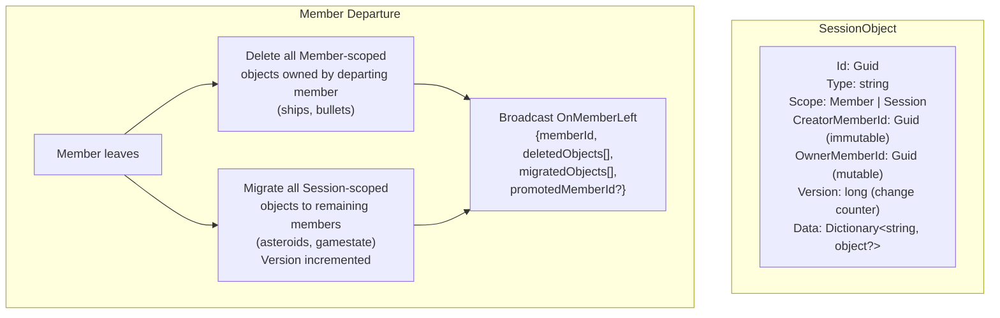

## Async Send/Receive & Sequencing


## Sequence Gap Detection & Reconciliation

```mermaid
flowchart TB
    RX["Receive event from member X<br/>with memberSequence N"]
    CHK{"lastSeq[X] exists<br/>AND N > lastSeq[X] + 1?"}
    OK["Update lastSeq[X] = N<br/>Process event normally"]
    GAP["Sequence gap detected!<br/>Expected lastSeq+1, got N"]
    RECON["triggerReconciliation()"]
    FETCH["GetSessionState() from server"]
    SYNC["Sync local objects:<br/>• Add missing<br/>• Update stale versions<br/>• Remove ghosts<br/>Reset memberSequences from snapshot"]

    RX --> CHK
    CHK -->|No gap| OK
    CHK -->|Gap detected| GAP
    GAP --> RECON
    RECON --> FETCH
    FETCH --> SYNC

    NOTE["Note: own-member gaps NOT checked<br/>(response/broadcast channels can race)"]
```

## Networking: RTT → TX → BUF Pipeline

```mermaid
flowchart LR
    subgraph "RTT Estimation"
        SAMPLE["RTT sample =<br/>responseTimestamp - clientTimestamp<br/>(captured on accepted update-batch echoes)"]
        EMA["Asymmetric EMA:<br/>spike: α=0.3 (fast up)<br/>decay: α=0.1 (slow down)<br/>rtt += α × (sample - rtt)"]
        SAMPLE --> EMA
    end

    subgraph "TX (Send Rate)"
        FORMULA["nominalFrameTime =<br/>clamp(rtt/1000,<br/>1/20, 1/1)"]
        TABLE["RTT 4ms → TX 50ms (20Hz)<br/>RTT 100ms → TX 100ms (10Hz)<br/>RTT 500ms → TX 500ms (2Hz)<br/>RTT 1500ms → TX 1000ms (1Hz)"]
        FORMULA --- TABLE
    end

    subgraph "Backpressure"
        BP["flushInProgress?<br/>→ cap frame counter at threshold<br/>→ flush on next tick after completion<br/>(instant congestion signal)"]
    end

    EMA --> FORMULA
    EMA --> BP
```

TX is the shared ObjectSync flush cadence for both simulation modes. It is not
the same as legacy BUF (render delay), and it is not a packet guarantee:
game-layer send-on-change gates may queue nothing, while in-flight backpressure
can coalesce multiple simulation frames into a later batch.

```mermaid
flowchart TB
    subgraph "Per-Member BUF Calculation"
        direction TB
        PKT["Packet arrives from member X<br/>(remote broadcast only: clientTimestamp=null)"]
        MEM["getMemberDelay(senderMemberId)<br/>Independent state per member"]
        LAG["lag = arrivalServerTime - validAt<br/>(post-flush transit + clock residual)"]
        LAGREC["Retain valid lag sample<br/>(0-5000ms)"]
        INT["interval = serverTimestamp - lastServerTimestamp"]
        OUT{"interval > 2 × remoteSendInterval?"}
        SKIP["Outlier: skip interval<br/>(idle gap / delta suppression)"]
        INTREC["Retain packet interval<br/>(30-sample window)"]

        PKT --> MEM
        MEM --> LAG
        LAG --> LAGREC
        MEM --> INT
        INT --> OUT
        OUT -->|Yes| SKIP
        OUT -->|No| INTREC
    end

    subgraph "BUF Formula"
        direction TB
        READY{"At least 5 lag samples?"}
        WARMREADY{"At least 5 interval samples?"}
        LAGCALC["raw = max(16.67ms,<br/>lagMean + 2×lagStddev<br/>+ intervalStddev)"]
        WARM["Warm-up fallback:<br/>mean = advertised interval ∥ observed mean<br/>factor = min(1, 0.8 + RTT/(2×mean))<br/>raw = max(16.67ms, mean×factor + 2σ)"]
        HOLD["Keep current delay"]
        EMA2["computedDelay += 0.1 ×<br/>(raw - computedDelay)"]
        READY -->|Yes| LAGCALC
        READY -->|No| WARMREADY
        WARMREADY -->|Yes| WARM
        WARMREADY -->|No| HOLD
        LAGCALC --> EMA2
        WARM --> EMA2
    end

    LAGREC --> READY
    INTREC --> READY
```

## Networking: Unified `validAt` Interpolation Axis

Owner operations (`CreateObject`, `UpdateObjects`, `ReplaceObject`, and object
events) carry `validAt`, an NTP-aligned estimate sampled before invocation.
`UpdateObjects` samples once at flush and fans that value across the coalesced
batch, so it is an ordering/presentation anchor rather than an exact simulation
timestamp for every pose. Legacy interpolation and replacement projection use
this axis; deterministic live motion normally remains arrival-anchored.

```mermaid
flowchart LR
    subgraph "Owner (sender)"
        QUEUE["Game queues latest state<br/>(updates may coalesce)"]
        STAMP["At operation/flush:<br/>clientValidAt = Math.round(serverNowMs())<br/>or null before clock bootstrap"]
        QUEUE --> STAMP
    end

    subgraph "Server hub"
        CLAMP["validAt =<br/>±2s clamp(clientValidAt) ?? hub-entry ServerTimestamp"]
    end

    subgraph "Receiver"
        CONV["snapshot.time =<br/>validAt - clock.offsetMs + wallToPerfDelta"]
        BRACKET["Bracket search runs in<br/>perf.now domain<br/>(monotonic, immune to wall-clock slewing)"]
        CONV --> BRACKET
    end

    STAMP -->|"clientValidAt"| CLAMP
    CLAMP -->|"validAt"| CONV
```

* **`clock.offsetMs`** is the NTP-style estimate `serverTime - wall` (5-ping bootstrap, 30 s refresh, min-RTT-per-burst selection). Min-RTT sampling reduces transient queue bias, but persistent path asymmetry remains as clock error; projection callers gate initialization and cap elapsed time.
* **`clock.wallToPerfDelta = performance.now() - Date.now()`** is refreshed on every accepted ping burst. The conversion `validAt → snapshot.time` runs through it so bracket-search stays on a monotonic clock while the snapshot key still encodes the global server-time agreement.
* **No present-time spawn projection on observers.** Legacy mode keys the first snapshot at `validAt` and initially clamps/extrapolates on that delayed timeline. Deterministic mode arrival-anchors live lifecycle state instead.
* **Local-owner replacement projection.** The shooter who invokes `replaceObject` adopts resulting children about one operation round trip later. `updateAstervoidsFromSync` forward-projects from bounded `obj.validAt` staleness because owned objects are driven by local physics, not interpolation. Clock asymmetry and pre-invocation work remain residual error.
* **Migration handoff.** A newly promoted owner deliberately retains the asteroid's currently displayed puppet pose and clears both remote presentation states; `getMigrationSeed` is not used. Observers skip the metadata-only version. Deterministic mode direction-smooths the first data-bearing new-owner correction; legacy mode temporarily uses its fallback delay after removing the departed owner's samples, then switches to the new owner's delay.

### Per-batch `validAt` collapse on `OnObjectsUpdated`

The hot-path `OnObjectsUpdated` broadcast carries one `validAt` for the whole
batch (rather than one per object) — `updatedObjects[0].ValidAt` — saving 8 B
per object. This bandwidth tradeoff relies on the following:

* **One owner flush stamp.** ObjectSync samples one `clientValidAt` after coalescing the batch, so all outbound entries begin with the same operation timestamp. It does not retain each pose's original simulation time.
* **Server-side caps can still differ.** `ObjectService.ValidateValidAt` clamps a regressing value to each object's previous `ValidAt`. If objects had different prior values, their validated values can diverge even though the wire broadcast selects the first entry's value.
* **Receiver insertion is monotonic.** The snapshot presentation policy
  prevents regressing keys, and its near-coincident-key cushion avoids an
  immediate Hermite jump. This protects bracket ordering; it does not restore
  discarded per-object timestamps.

Snapshot/join paths are not batch-collapsed: `JoinSessionResponse` and
`SessionStateSnapshot` carry `validAts: Dictionary<string, long>`, preserving
each object's last accepted operation timestamp. Those timestamps can still be
older/newer than the exact underlying pose time because update writes coalesce.

## Ring Buffer Interpolation

```mermaid
flowchart TB
    subgraph "Per-Object Ring Buffer (max 6 snapshots)"
        S1["snapshot[0]<br/>data, time, velocity, rotationSpeed"]
        S2["snapshot[1]"]
        S3["snapshot[2]"]
        S4["snapshot[3]"]
        S5["..."]
        S6["snapshot[5]<br/>(newest)"]
        S1 --- S2 --- S3 --- S4 --- S5 --- S6
    end

    TARGET["targetTime = renderTime - getDelayForMember(ownerMemberId)"]

    subgraph "Bracket Search (reverse scan)"
        direction TB
        BEFORE{"targetTime ≤ oldest?"}
        CLAMP["Return oldest snapshot (clamped)"]
        BRACKET{"Find i where<br/>snap[i].time ≤ targetTime < snap[i+1].time"}
        HERMITE["Build pseudo-state from snap[i] & snap[i+1]<br/>Hermite interpolate with t ∈ (0,1]"]
        AFTER{"targetTime ≥ newest?"}
        EXTRAP["Extrapolate with velocity<br/>capped at MAX_EXTRAPOLATION (1.0s)"]
    end

    TARGET --> BEFORE
    BEFORE -->|Yes| CLAMP
    BEFORE -->|No| AFTER
    AFTER -->|Yes| EXTRAP
    AFTER -->|No| BRACKET
    BRACKET --> HERMITE
```

```mermaid
flowchart LR
    subgraph "Hermite Interpolation"
        BASIS["Basis functions:<br/>h00 = 2t³ - 3t² + 1<br/>h10 = t³ - 2t² + t<br/>h01 = -2t³ + 3t²<br/>h11 = t³ - t²"]
        POS["Position (x,y):<br/>p = h00·p₀ + h10·m₀ + h01·p₁ + h11·m₁<br/><br/>Tangents m = velocity × velScale × dt<br/>velScale = refDim / gameWidth<br/>Wrap-aware Δ for p₁ - p₀"]
        ANG["Angle:<br/>Same Hermite with rotationSpeed tangents<br/>rpsToPerSec = TARGET_FPS (60)<br/>Shortest-arc via ±π wrapping"]
        SNAP{"‖p₁ - p₀‖ > SNAP_THRESHOLD (0.25)?"}
        SNAPR["Skip interpolation → snap to p₁"]

        BASIS --> POS
        BASIS --> ANG
        POS --> SNAP
        SNAP -->|Yes| SNAPR
    end
```

## Cross-Owner Collision

```mermaid
sequenceDiagram
    participant A as Player A (bullet owner)
    participant SRV as Server
    participant B as Player B (asteroid owner)

    Note over A: A's bullet hits B's asteroid locally
    A->>A: Mark bullet pendingHit=true, hitTargetId=asteroidId
    A->>SRV: UpdateObjects(bullet with pendingHit)
    SRV->>B: OnObjectsUpdated (bullet data with pendingHit)

    Note over B: B scans remote bullets for pendingHit on own asteroids
    B->>B: Process split: create child asteroids
    B->>SRV: ReplaceObject(asteroidId, [child1, child2])
    SRV->>A: OnObjectReplaced (broadcast to ALL)
    SRV->>B: OnObjectReplaced (broadcast to ALL)

    Note over A: A sees asteroid replaced → confirms hit, awards points
```

## Response-First vs Local-First Patterns

```mermaid
flowchart TB
    subgraph "CreateObject (Response-First)"
        direction TB
        C1["Caller invokes CreateObject"]
        C2["Wait for server response<br/>(server assigns Id, Version=1)"]
        C3["Register object in local Map<br/>from response"]
        C4["Broadcast: OthersInGroup<br/>(sender excluded)"]
        C5["If isStillNeeded callback returns false:<br/>auto-delete server object"]
        C1 --> C2 --> C3
        C2 --> C4
        C3 --> C5
    end

    subgraph "DeleteObject (Local-First)"
        direction TB
        D1["Remove from local Map immediately<br/>(before server call)"]
        D2["Remove from pendingUpdates"]
        D3["Invoke server DeleteObject"]
        D4["Server verifies ownership<br/>(rejects if not owner)"]
        D5["Broadcast: OthersInGroup<br/>(sender excluded)"]
        D1 --> D2 --> D3 --> D4 --> D5
    end

    subgraph "ReplaceObject (Broadcast-Dependent)"
        direction TB
        R1["Invoke server ReplaceObject"]
        R2["Server creates children,<br/>deletes parent"]
        R3["Broadcast: Group (ALL)<br/>sender included"]
        R4["Sender updates local Map<br/>from broadcast echo"]
        R1 --> R2 --> R3 --> R4
    end
```

## Delta Encoding & Deferred Confirmation

```mermaid
sequenceDiagram
    participant OS as ObjectSync
    participant SC as SessionClient
    participant SRV as Server

    Note over OS: computeDelta(): compare current data vs lastSentData<br/>Uses shallow reference comparison (===)<br/>Nested objects must be spread into new refs

    OS->>OS: delta = computeDelta(objectId, data)<br/>lastSentData NOT updated yet

    OS->>SC: updateObjects(deltas, senderSeq, sendIntervalMs)
    SC->>SRV: Invoke UpdateObjects(deltas, ...)

    alt Server accepts batch
        SRV-->>SC: Response {versions: {id→ver}, ...}
        SC-->>OS: confirmSentDeltas(sentDeltas, versions)
        OS->>OS: Update lastSentData only for<br/>confirmed objects
    else Network error / null response
        Note over OS: sentDeltas NOT confirmed<br/>→ all changed fields re-sent next flush
    end

    Note over OS: Full sync forced every 6000 frames<br/>(FULL_SYNC_INTERVAL) — bypasses delta,<br/>sends complete object state

    Note over OS: Field name compression (FIELD_MAP) is applied<br/>after delta computation — wire payloads use short<br/>keys (e.g. velocityX→vx) while game logic uses<br/>readable names. expandData() reverses on receive.
```

## Type Index (ObjectSync)

```mermaid
flowchart TB
    subgraph "Type Index (Map<string, Set<objectId>>)"
        direction TB
        IDX["typeIndex: Map<br/>e.g. 'ship' → {id1, id2}<br/>'asteroid' → {id3, id4, id5}<br/>'gameState' → {id6}"]
    end

    subgraph "Index Maintenance"
        ADD["addToTypeIndex(obj)<br/>On: createObject, handleRemoteObjectCreated"]
        REM["removeFromTypeIndex(obj)<br/>On: deleteObject, handleRemoteObjectDeleted"]
        UPD["updateTypeIndex(obj, oldType, newType)<br/>On: updateObject, handleRemoteObjectsUpdated<br/>(only when data.type changes)"]
    end

    subgraph "Efficient Queries"
        QT["getObjectsByType(type) → O(n) for n = matching<br/>vs O(N) scanning all objects"]
        QS["getObjectByType(type) → O(1) singleton lookup<br/>e.g. GameState"]
    end

    ADD --> IDX
    REM --> IDX
    UPD --> IDX
    IDX --> QT
    IDX --> QS
```

## SignalR Reconnection & Reconciliation

```mermaid
sequenceDiagram
    participant C as Client
    participant SR as SignalR
    participant HUB as SessionHub

    Note over C,SR: Connection lost (network interruption)

    SR->>SR: withAutomaticReconnect<br/>Linear 1s interval<br/>Max 10 attempts (10s window)

    SR->>C: onreconnecting(error) → freeze gameplay,<br/>show #reconnecting-overlay

    alt Reconnection succeeds (transport restored)
        SR->>C: onreconnected(connectionId)
        C->>C: ObjectSync.triggerReconciliation()
        C->>HUB: GetSessionState()

        alt Server still has the member
            HUB-->>C: Full snapshot + memberSequences
            C->>C: Sync local objects:<br/>• Add missing<br/>• Update stale<br/>• Remove ghosts<br/>• Reset sequences<br/>onConnected fires → unfreeze gameplay
        else Server already processed disconnect
            HUB-->>C: null
            C->>C: onReconciliationFailed → re-freeze<br/>and call attemptAutoRejoin (full path below)
        end
    else Max retries exceeded (or mobile auto-rejoin)
        SR->>C: onclose(error)
        C->>C: attemptAutoRejoin(sessionId, oldMemberId)<br/>Guards: rejoinInProgress, leavingSession.<br/>If document.hidden: defer (save pendingRejoinSessionId/MemberId,<br/>resume on visibilitychange).<br/>ObjectSync.suspendReconciliation() while rejoining.
        loop Up to 5 attempts (delay 0.5s, then 2s × n)
            C->>C: connectToSessionHub(force=true) —<br/>await stale.stop() with timeout, clear currentSession/<br/>currentMember, then build new connection.
            C->>HUB: JoinSession(sessionId, evictMemberId=oldMemberId)
            Note over HUB: If old member still present (server hadn't<br/>processed disconnect yet — up to ClientTimeoutSeconds),<br/>it is evicted atomically and OnMemberLeft is broadcast<br/>to remaining members BEFORE the new member is added.
            HUB-->>C: Rejoin response (new memberId, members[], objects[])
        end
        C->>C: resetMultiplayerState() BEFORE handleSessionJoined<br/>loads snapshot (avoids ObjectSync.clear wiping it).<br/>game.connectionLost cleared, ObjectSync.resumeReconciliation().
    end

    Note over C: Stale connection guard: setupEventHandlers()<br/>captures thisConnection reference.<br/>Old connection's onclose/on* events<br/>are silently ignored if connection<br/>has been replaced by connect().
    Note over C: Reconciliation safety: ObjectSync.pendingDeletes Set<br/>prevents triggerReconciliation from resurrecting<br/>locally-deleted objects whose server delete is in flight.
```

## SessionService: Thread Safety

```mermaid
flowchart TB
    subgraph "Serialization Strategy"
        direction TB
        LOCK["_sessionLock (object)<br/>Serializes CreateSession & JoinSession<br/>Prevents TOCTOU races on:<br/>• connection-already-in-session check<br/>• max sessions count check<br/>• concurrent join + capacity check"]
        SYNC["session.SyncRoot (object, per-session)<br/>Serializes ALL session-local mutations:<br/>• member add/remove<br/>• server promotion (deterministic — no race)<br/>• object create/update/delete/replace<br/>• ownership migration<br/>• lifecycle transitions<br/>• LastMemberLeftAt updates"]
        CONC["ConcurrentDictionary (4 instances)<br/>_sessions, _connectionToMember,<br/>_memberToSession, session.Members<br/>Thread-safe individual operations"]
    end

    subgraph "Lock ordering"
        ORDER["Acquisition order is always:<br/>_sessionLock → session.SyncRoot<br/>(prevents deadlocks across cross-session ops)"]
    end

    LOCK --> CONC
    SYNC --> CONC
```

## Hub: Ownership Enforcement

Ownership and session lifecycle are validated **inside the service layer** under
`Session.SyncRoot`, atomically with the mutation. Hub-layer pre-checks remain
only as fast early-return / logging — they are not relied on for correctness.

```mermaid
flowchart TB
    subgraph "ObjectService (authoritative — under SyncRoot)"
        OS_UPD["UpdateObjects: filters batch to objects<br/>where OwnerMemberId == ownerMemberId"]
        OS_DEL["DeleteObject(sessionId, objectId, ownerMemberId):<br/>verifies ownership before TryRemove"]
        OS_REP["ReplaceObject(sessionId, deleteId,<br/>ownerMemberId, replacements[]):<br/>verifies ownership of delete target<br/>before atomic delete + create"]
    end

    subgraph "SessionHub (early-return + logging)"
        HUB_UPD["UpdateObjects: passes caller.Id as ownerMemberId<br/>to ObjectService"]
        HUB_DEL["DeleteObject: optional pre-check + warning if not owner;<br/>passes caller.Id to ObjectService"]
        HUB_REP["ReplaceObject: optional pre-check;<br/>passes caller.Id to ObjectService"]
    end

    HUB_UPD --> OS_UPD
    HUB_DEL --> OS_DEL
    HUB_REP --> OS_REP
```

## Wire Format & Server Monitoring

```mermaid
flowchart TB
    subgraph "SignalR transport (binary MessagePack)"
        direction TB
        MP["AddMessagePackProtocol with CompositeResolver:<br/>• BinaryGuidResolver (16-byte binary GUIDs<br/>  via BinaryGuidFormatter / NullableGuidFormatter)<br/>• ContractlessStandardResolver (DTOs + collections)<br/>• MessagePackSecurity.UntrustedData<br/>~25-30% smaller payloads vs JSON;<br/>~19 bytes saved per GUID over the wire."]
        DTO["Hub DTOs (HubDtos.cs) annotated with<br/>[MessagePackObject] + [Key('camelCaseName')]<br/>so the JS contract is preserved (camelCase names)."]
        JSGUID["JS client transforms binary GUIDs to strings<br/>at the boundary via GuidUtils.transformBinaryGuids<br/>(applied to handler args + invokeHub responses).<br/>See: Client Architecture — Dependency Invariants."]
    end

    subgraph "REST API (camelCase JSON)"
        REST["ConfigureHttpJsonOptions →<br/>JsonNamingPolicy.CamelCase.<br/>Used by GET /api/srvmon."]
    end

    subgraph "ServerMetricsService (singleton, IDisposable)"
        SMS_SAMPLE["Background CPU sampling every 2s.<br/>Tracks: connectedCount, peakConnections,<br/>totalHubInvocations, per-member TX/RX bytes,<br/>reconciliations, reconnects."]
        SMS_EST["SessionHub.EstimatePayloadBytes() uses<br/>a static MessagePackSerializerOptions<br/>matching Program.cs to compute byte counts<br/>per OnHubInvocation / OnBroadcastToMembers call."]
        SMS_API["GET /api/srvmon → snapshot record (camelCase JSON).<br/>/srvmon/index.html polls every 2s and renders<br/>TX Rate / RX Rate / CPU / connection counts."]
    end

    MP --> DTO --> JSGUID
    SMS_SAMPLE --> SMS_API
    SMS_EST --> SMS_API
    REST --> SMS_API
```

## Networking: Wire Optimization (Phases 3-5)

The hot-path object payload (`ObjectInfo.Data`, `ObjectUpdateInfo.Data`,
`ObjectUpdateRequest.Data`) does not flow as a `Dictionary<string, object?>`
on the wire. It is wrapped in a `SyncPayload(byte SchemaId, byte[] Data)`
envelope so encoding can be selected per object type without re-shaping the
DTOs.

### Schema registry (game-agnostic)

`object-sync.js` exposes a 3-call surface that the game uses to opt in:

1. `SchemaCodec.register(id, fields)` — declare a positional schema.
2. `ObjectSync.setSchemaIdSelector((data, kind, ctx) => id)` — given a
   payload + its kind (`'create' | 'update' | 'replace'`) + context
   (`{objectId, object}` for updates, where `data.type` may be absent),
   return the byte schemaId or `0` for the legacy MsgPack dict path.
3. Pass `schemas: [...]` into `SessionClient.createSession({...})` so
   late joiners receive the same registry via `metadata.schemas`.

The C# counterpart `SyncSchemaRegistry` (per-`SessionId` map) parses
`metadata.schemas` at session create and clears it on the last leave.

### Wire shape (SchemaId >= 1)

```
SyncPayload.Data = <bitmask: ceil(N/8) bytes>
                  + <slot_i ...>   (only present slots, in declaration order)
```

A leading bit-presence mask preserves delta encoding: omitted slots are
absent from both the bitmask and the body, and the receiver merges over
prior state (matching the existing `Object.assign` semantics in JS and
`ObjectService.ApplyUpdate` dict-merge in C#).

### Type tags

| Tag             | Bytes | Range                | Notes                          |
| --------------- | ----- | -------------------- | ------------------------------ |
| `f64`           | 8     | IEEE-754             | Lossless                       |
| `f32`           | 4     | IEEE-754             | ~7 decimal digits              |
| `u8/u16/u32`    | 1/2/4 | unsigned LE          |                                |
| `i8/i16/i32`    | 1/2/4 | signed LE            |                                |
| `bool`          | 1     | 0/1                  |                                |
| `str`           | 2+N   | 2-byte LE len + UTF8 | max 65535 bytes                |
| `guid`          | 16    | binary               | Matches `BinaryGuidResolver`   |
| `bytes`         | 4+N   | 4-byte LE len + raw  |                                |
| `nullable-str`  | 1+…   | flag + (str)         |                                |
| `nullable-guid` | 1+…   | flag + (guid)        |                                |
| `q16`           | 2     | [0, 1)               | resolution ≈ 1.5e-5; clamps    |
| `q16s`          | 2     | [-1, 1]              | resolution ≈ 3.0e-5; clamps    |
| `q16_2pi`       | 2     | [0, 2π)              | ~0.0055°; wraps negatives      |
| `q8`            | 1     | [0, 1)               | resolution ≈ 4e-3; clamps      |

`q16_2pi` normalizes via `((v % 2π) + 2π) % 2π` before quantizing so
boundary inputs (e.g. -0.0001 vs +0.0001) round to angularly-close
codes rather than opposite ends of the range.

Both codecs use half-away-from-zero rounding (JS `Math.round`,
C# `MidpointRounding.AwayFromZero`) to keep cross-wire bytes identical
on midpoint inputs.

### Game adoption (current)

Registered in `index.html` `WIREOPT_SCHEMAS`:

| SchemaId | Type             | Fields (positional)                                                              |
| -------- | ---------------- | -------------------------------------------------------------------------------- |
| 1        | ship-update      | x q16, y q16, angle q16_2pi, vx q16s, vy q16s, rotSpeed q16s, thrusting bool, invul bool |
| 3        | asteroid-update  | x q16, y q16, angle q16_2pi                                                      |

Bullets (create + update) intentionally remain on `SchemaId=0` (legacy
MsgPack dict) because the `pendingHit` 3-way handshake still rides on the
per-frame data; converting it cleanly needs a multiplayer integration test
harness that the suite doesn't yet have. See Phase 2.2 deferral note.

### Wire-size measurements (locked into `WireSizeBenchTests.cs`)

| Payload                | Phase 3 | Phase 4 | Phase 5 | Total ↓ |
| ---------------------- | ------- | ------- | ------- | ------- |
| asteroid update        | 78 B    | 65 B    | 47 B    | -40%    |
| ship update            | 164 B   | 91 B    | 47 B    | -71%    |
| 3-asteroid batch       | 235 B   | 196 B   | 142 B   | -40%    |
| 7-object mixed batch   | 901 B   | —       | ~640 B  | -29%    |

(7-object batch includes 2 bullets which are still on SchemaId=0.)

### Hazards verified by tests

- **L6** delta encoding survives positional packing (bitmask preserves
  partial updates) — `Phase4_AsteroidUpdate_DeltaOnly_Positional` /
  `quantized fields work with delta encoding`.
- **L8** joiner schema race: `handleSessionJoined` calls
  `SchemaCodec.replaceAll(metadata.schemas)` BEFORE iterating
  `response.objects`. JS is single-threaded so this is sequential.
- **L10** angle wrap at 0/2π — `q16_2pi roundtrip: angle near 0 vs
  near 2π wrap correctly`.
- **L11** extrapolation drift: receiver uses `pos = snapshot.x + dt *
  snapshot.vx` (non-integrating). 3600-frame simulation asserts max
  render error stays within `quantum + lag × velocity_quantum`.
- **L14** `validAt` continuity preserved — existing `validAt-axis`,
  `spawn-extrapolation`, and `clock-offset` suites stay green at every
  phase.

## Networking: Regional Deployment

Astervoids can deploy to one or many Azure regions simultaneously. Every
visitor sees every active session in every region; sessions live in
exactly one region (no replication) and the client routes its Create/Join
SignalR connection to the correct region's hub.

### Architectural choices

- **Independent regions, client-side merge.** Each region runs its own
  in-memory `SessionService`; the client polls `GET /api/sessions` on
  every region in parallel and merges the results. No central registry,
  no cross-region writes — keeps the existing per-process state model
  unchanged.
- **One process owns a joined session.** The replication runtime consumes
  canonical records without assuming where they are stored, but current server
  ordering and authority remain process-local. Future distributed sessions
  require a shared ordered session/object store and fan-out below this client
  boundary; client extraction alone does not provide them.
- **Apex entrypoint via Static Web App.** First-time visitors land on the
  static shell via apex CNAME → Static Web App. After the client downloads
  `region-service.js` it takes over: pings every region and pins to its
  measured-best region for API/SignalR traffic.
- **Spectator SignalR connections (picker only).** While the start
  screen is visible, the client opens one read-only SignalR connection
  per region. Each region's hub still broadcasts `OnSessionsChanged` to
  every connected client, so cross-region changes surface within
  ~1 inter-region RTT (typically 50–200 ms). Connections close on
  Join/Create/Solo and on `document.hidden` — backgrounded tabs must
  NOT keep regions warm or scale-to-zero is defeated.
- **Scale-to-zero everywhere.** Container Apps `minReplicas: 0` +
  `cooldownPeriod: 60s` returns regions to zero ~1 min after the last
  connection closes. In the static-apex path there is no Traffic Manager
  probe loop hitting regional APIs, so idle regions are not kept warm by
  DNS routing infrastructure.

### Latency budget

| Event | Single region (today) | Multi-region (this design) | Mechanism |
|---|---|---|---|
| Picker open, regions warm | ~1 RTT to origin | ~1 RTT to slowest region | parallel `/api/sessions` fan-out + parallel WS negotiate |
| Picker open, regions cold | n/a | up to 15 s budget per region; `🔥 Warming up…` shown until first real sample | client-side cold-start detection (samples >1500 ms suppressed from EMA) |
| Change in **same** region as visitor | ~1 LAN RTT (push) | ~1 LAN RTT (push) | unchanged `OnSessionsChanged` push |
| Change in **other** region | n/a | ~1 inter-region RTT | spectator hub in that region pushes `OnSessionsChanged` |
| Spectator WebSocket dropped | n/a | ≤30 s worst case, `↻` badge sooner | belt-and-suspenders REST 30 s repoll |
| Ping column updates | n/a | first value ≤1 RTT after load; settled (`confidence === 1`) ~50 s later | RegionService bursts + EMA(α=0.3) + per-cell re-render |

### Module layout

```mermaid
graph TB
    BR["Browser"]
    subgraph Client modules
        RS["RegionService<br/>region-service.js<br/>Discovers regions · Progressive RTT bursts<br/>EMA · Cold-start handling · bestRegion hysteresis"]
        SP["SpectatorClient<br/>spectator-client.js<br/>N read-only SignalR connections<br/>OnSessionsChanged → per-region refetch"]
        SC["SessionClient<br/>session-client.js<br/>Single join connection · region-aware hub URL"]
        MR["MultiRegionSessions<br/>(inline in index.html)<br/>Parallel /api/sessions fetch · Merge · Coalesce"]
        UI["Session picker UI<br/>Region+Ping columns · 'Your region' banner<br/>'Create in <region>' button · Native <select>"]
    end
    subgraph Per-region server
        API["GET /api/ping<br/>GET /api/regions<br/>GET /api/sessions"]
        HUB["/sessionHub<br/>(CORS-enabled for cross-region)"]
    end
    SA["Azure Static Web App<br/>(apex CNAME · no redirect shell)"]

    BR -->|"apex DNS + static shell"| SA
    SA -->|"client RTT probing + region choice"| API
    RS -->|"GET /api/regions, /api/ping × N"| API
    MR -->|"GET /api/sessions × N"| API
    SP -->|"WS × N (picker only)"| HUB
    SC -->|"WS × 1 (joined region)"| HUB
    SP -->|"sessionsChanged(regionId)"| MR
    MR --> UI
    RS --> UI
```

### Cold-start handling

CAE scaling to zero means a visitor opening the picker after an idle
period hits cold containers on the first ping. `RegionService` handles
this honestly:

1. First-ever ping per region uses 15 s timeout (vs 5 s for warm pings).
2. If the first valid sample is > 1500 ms it's treated as container
   start-up (emits `coldStart` event, **suppressed** from the EMA).
3. State stays `'warming'` (`🔥 Warming up…` shown in the cell) until a
   real sub-1500 ms sample lands. `bestRegion()` never picks a warming
   region.
4. Once a real sample arrives, state → `'measuring'` → `'settled'`.

### Configuration

- **Server**: `Region__Id` + `Region__DisplayName` env vars (per region).
  Manifest in `appsettings.json` under `Region:Regions`. Empty manifest
  triggers permissive same-origin CORS for local dev.
- **Infra**: `infra/main.bicep` `regions` array param (empty = legacy
  single-region; non-empty = multi-region). Primary region (index 0)
  owns the shared ACR + DNS zone.
- **CI**: `REGIONS_JSON` env var in `.github/workflows/azure-deploy.yml`
  (empty by default). Set to a JSON array to enable multi-region prod.

  ### Deployment permutation contract

  The deployment paths are expected to remain reproducible from IaC inputs:

  - **`main` + empty `REGIONS_JSON`** → production single-region (greenfield-capable).
  - **`main` + non-empty `REGIONS_JSON`** → production multi-region static-apex path (greenfield-capable).
  - **non-`main` + shared infra** → branch preview deploys from scratch against shared production infra.
  - **non-`main` + standalone** → isolated env in its own resource group.

  Cleanup automation must only remove branch-ephemeral resources and never delete
  production resources by name-pattern collision.

  ### BYO wildcard cert for regional hostnames

Azure Container Apps' free managed certificates have a hard requirement:
the custom-domain CNAME must point **directly** at the container app's
generated FQDN. That makes them awkward for this deployment's per-region
custom hostnames, where we use a shared wildcard cert across regions and
branches. (Reference:
[Microsoft docs](https://learn.microsoft.com/en-us/azure/container-apps/custom-domains-managed-certificates)).

For multi-region production, the apex now points at a Static Web App, while
gameplay APIs/SignalR still target per-region ACA hostnames. We use a BYO
wildcard cert in Key Vault and bind it on every region's container app (and
on branch container apps too, by reusing the same cert).

The recommended automation is [keyvault-acmebot](https://github.com/shibayan/keyvault-acmebot)
— an open-source Azure Function App that auto-issues and rotates Let's
Encrypt certs into Key Vault. Total cost: <$1/mo for hobby traffic. One
wildcard cert covers all per-region / per-branch ACA subdomains, while the
apex hostname is bound on the Static Web App entrypoint.

#### One-time setup (~10 min)

Steps 1 and 3 below are manual (one-time external setup that doesn't fit
bicep). Steps 2, 4, and 5 are now bicep-managed — when you deploy `main`
with `manageAcmebotPermissions: true` (the default), bicep provisions
`id-acme-cert-reader` in `rg-production`, grants ACMEbot DNS Zone
Contributor on the production DNS zone, and grants the cert reader Key
Vault Certificate User on the ACMEbot KV. They're listed here for
reference / disaster recovery; you don't normally run them.

```bash
# 1. [MANUAL, ONE-TIME] Deploy ACMEbot via its ARM template (use the README button):
#    https://github.com/shibayan/keyvault-acmebot
#    Pick: subscription, resource group (default: sg-acmebot), Key Vault name (default: kv-astervoids).
#    Configure: DNS provider = Azure DNS, mailbox for Let's Encrypt notifications.
#
#    Enabling Easy Auth (REQUIRED before the dashboard works — the ARM
#    template does NOT auto-enable it; visiting the dashboard pre-auth
#    returns 401 with a JSON error body):
#
#      a. In the Azure Portal: Function App → Authentication → Add
#         identity provider → Microsoft.
#      b. App registration: "Create new app registration" with name
#         `<acmebot-function-app>-easyauth`.
#         IMPORTANT: pick "Workforce" tenant (default) — NOT "Customers"
#         (B2C is a separate product and the Function App can't use it).
#      c. Restrict access: "Require authentication". Unauthenticated
#         request action: "HTTP 401 Unauthorized".
#      d. After it saves, go to Entra ID → App registrations → find
#         the new `<acmebot-function-app>-easyauth` app:
#           • Authentication → enable "ID tokens (used for implicit
#             and hybrid flows)" checkbox. Save. Without this you'll
#             hit AADSTS700054 (response_type 'id_token' is not enabled).
#           • Manifest → confirm `accessTokenAcceptedVersion: 2` and
#             that the Function App's authsettingsV2 uses the v2 issuer
#             URL `https://login.microsoftonline.com/<tenant-id>/v2.0`.
#             (The Portal sometimes wires the v1 URL by default; v1
#             rejects v2 tokens and you'll get login-loop 401s.)
#           • Certificates & secrets → "New client secret" → 6-month
#             expiry. Copy the value.
#           • In the Function App → Configuration, set
#             `MICROSOFT_PROVIDER_AUTHENTICATION_SECRET` to that value.
#             (The portal stores it on the Authentication blade but
#             also exposes it as an app setting under this name.)
#
#      Calendar reminder: rotate `MICROSOFT_PROVIDER_AUTHENTICATION_SECRET`
#      before the 6-month expiry, or the dashboard locks you out. The
#      scheduled workflow `.github/workflows/check-easy-auth-secret.yml`
#      checks weekly and auto-opens a GitHub issue (with the rotation
#      runbook from `.github/ISSUE_TEMPLATE/easy-auth-secret-rotation.md`)
#      when < 30 days remain — set the repo variable `EASYAUTH_APP_ID` to
#      the app reg's client ID to enable it.

# 2. [BICEP-MANAGED — provided here for disaster recovery only]
#    DNS Zone Contributor on the production DNS zone for ACMEbot's identity,
#    so it can write _acme-challenge TXT records for the DNS-01 challenge.
DNS_ZONE_RG=rg-production
DNS_ZONE_NAME=<your-domain.com>
ACMEBOT_IDENTITY_ID=$(az functionapp identity show \
  --resource-group sg-acmebot --name func-astervoids \
  --query principalId -o tsv)
az role assignment create \
  --assignee "$ACMEBOT_IDENTITY_ID" \
  --role "DNS Zone Contributor" \
  --scope "$(az network dns zone show \
    --resource-group "$DNS_ZONE_RG" --name "$DNS_ZONE_NAME" --query id -o tsv)"

# 3. [MANUAL, ONE-TIME] Issue the wildcard cert via the ACMEbot dashboard:
#    Open https://<acmebot-function-app>.azurewebsites.net/
#    (the Polymind fork serves the dashboard at the ROOT URL, NOT /dashboard
#    as the upstream wiki says — visiting /dashboard returns 404 / blank).
#    Sign in with the Entra ID account that has access to the app reg from step 1.
#    Click "Add" → enter "*.<your-domain.com>" → wait ~2 min.
#    Cert lands in Key Vault as a secret (name it `wildcard-<sanitised-domain>`,
#    where dots are replaced with dashes — e.g. wildcard-example-com).

# 4. [BICEP-MANAGED — provided here for disaster recovery only]
#    User-assigned identity that production CAEs use to read the cert from KV.
az identity create \
  --resource-group rg-production \
  --name id-acme-cert-reader \
  --location <primary-region>

# 5. [BICEP-MANAGED — provided here for disaster recovery only]
#    Grant the identity 'Key Vault Certificate User' role on the KV.
CERT_READER_PRINCIPAL_ID=$(az identity show \
  --resource-group rg-production --name id-acme-cert-reader \
  --query principalId -o tsv)
KV_NAME=kv-astervoids
KV_ID=$(az keyvault show --name "$KV_NAME" --query id -o tsv)
az role assignment create \
  --assignee-object-id "$CERT_READER_PRINCIPAL_ID" \
  --assignee-principal-type ServicePrincipal \
  --role "Key Vault Certificate User" \
  --scope "$KV_ID"

# 6. [REQUIRED, ONE-TIME] Get the cert's Key Vault secret URL (versionless so renewals pick up automatically):
KV_NAME=kv-astervoids
CERT_NAME=wildcard-<sanitised-domain>  # whatever you named it in step 3
CERT_KV_URL="https://${KV_NAME}.vault.azure.net/secrets/${CERT_NAME}"

# 7. [REQUIRED, ONE-TIME] Set GitHub repo variables so the workflow knows where to find everything.
#    CERT_READER_IDENTITY_ID is OPTIONAL when manageAcmebotPermissions=true (production deploys
#    look up the identity from bicep output). It IS required for branch deploys (the workflow's
#    bootstrap step still reads the var). Set it for safety until all production deploys have
#    run with the new bicep:
CERT_READER_IDENTITY_ID=$(az identity show \
  --resource-group rg-production --name id-acme-cert-reader \
  --query id -o tsv)
gh variable set CERT_KEY_VAULT_SECRET_URL --body "$CERT_KV_URL"
gh variable set CERT_KEY_VAULT_CERT_NAME --body "$CERT_NAME"
gh variable set CERT_READER_IDENTITY_ID --body "$CERT_READER_IDENTITY_ID"
```

##### Opting out of bicep-managed ACMEbot permissions

If you'd rather manage the cert reader identity and role assignments
yourself (e.g. they live in a different subscription or you have a
stricter least-privilege flow), pass `manageAcmebotPermissions=false`
when deploying. Bicep then expects:
  - `certReaderIdentityId` param (or `CERT_READER_IDENTITY_ID` env var
    that the workflow forwards) to be set to an existing identity's
    resource ID.
  - The identity already has Key Vault Certificate User on the BYO cert KV.
  - ACMEbot already has DNS Zone Contributor on the production DNS zone.

##### Cleaning up duplicate role assignments after first bicep-managed deploy

If you previously ran steps 2, 4, and 5 manually (random-GUID-named role
assignments), the first deploy with `manageAcmebotPermissions=true`
creates a SECOND, deterministically-named assignment alongside each
manual one. Both are functionally equivalent. To clean up:

```bash
# List both assignments for the cert reader on the KV — keep the one with
# the deterministic GUID matching guid(scope, principalId, roleId), delete
# the random-named one. Same drill for ACMEbot's DNS Zone Contributor.
az role assignment list \
  --assignee "$CERT_READER_PRINCIPAL_ID" \
  --scope "$KV_ID" \
  --query "[].{name:name,role:roleDefinitionName}" -o table
az role assignment delete --ids <random-guid-assignment-id>
```

After step 7, the next deploy of `main` will:
- Provision a `Microsoft.App/managedEnvironments/certificates` resource on every region's CAE referencing the KV secret URL + the reader identity.
- Bind `<subdomain>.<domain>` on every region's container app with `bindingType: SniEnabled` pointing at that cert resource.
- The legacy "Configure Custom Domain" workflow step short-circuits (`env.CERT_KEY_VAULT_SECRET_URL != ''` guard) — no DigiCert managed-cert provisioning happens.

Same wildcard cert covers every branch deploy too (e.g. `astervoids-mybranch.<domain>` matches `*.<domain>`), so branch deploys also skip the cert provisioning wait — typically saving 5-7 minutes per branch deploy.

#### Cert rotation

ACMEbot rotates the cert in KV every ~60 days. Container Apps doesn't
auto-detect new KV cert versions, so a rotation isn't picked up until the
next deploy. Two practical options:

1. **Redeploy on the next push to main** (typical). The bicep re-reads the
   KV cert and updates the CAE cert resource.
2. **Scheduled GitHub Action** (`on: schedule: cron: '0 4 * * 1'`) that
   runs `az deployment sub create` once a week to pick up rotations.

If you forget for >90 days, the cert expires and `<subdomain>.<domain>`
serves a stale cert until you redeploy.

### Key files

- `AstervoidsWeb/Configuration/RegionSettings.cs` — manifest binding.
- `AstervoidsWeb/Program.cs` — `/api/ping`, `/api/regions`,
  `/api/sessions` + `RegionalApi` CORS policy.
- `AstervoidsWeb/wwwroot/js/region-service.js` — progressive RTT.
- `AstervoidsWeb/wwwroot/js/spectator-client.js` — multi-region SignalR.
- `AstervoidsWeb/wwwroot/index.html` (Section 10) — picker + inline
  `MultiRegionSessions` module + lifecycle wiring.
- `infra/main.bicep` — `regions` loop, BYO cert plumbing.
- `infra/core/host/static-web-app.bicep` — static apex entrypoint for
  multi-region production.
- `infra/core/host/container-apps.bicep` — CAE + optional BYO cert resource
  from Key Vault.
- `infra/core/host/container-app.bicep` — container app + optional
  `customDomains[bindingType: SniEnabled, certificateId]` binding to the
  CAE's BYO cert.

### Tests

- `RegionEndpointsTests.cs` — `/api/ping` shape + Cache-Control,
  `/api/regions` manifest + camelCase, `/api/sessions` regionId stamp,
  CORS allow-list + reject untrusted origin.
- `SessionServiceTests.cs` — default `RegionId = "local"`, configured
  manifest stamps every emitted `SessionInfo`.
- `PingBudgetTests.cs` — mean handler time < 5 ms over 200 iterations;
  response body shape pinned to `{ now }`.
- `AstervoidsWeb/region-service.test.mjs` — warm-up discard, cold-start
  gating, EMA convergence, confidence monotonicity, `bestRegion`
  hysteresis.
- `AstervoidsWeb/spectator-client.test.mjs` — open/close per region,
  exclude-by-hostname, push dispatch, connection-state transitions,
  error tolerance.
- `AstervoidsWeb/picker-freshness.test.mjs` — bootstrap merge,
  per-region failure isolation, 250 ms push coalescing,
  visibility-driven `stop()`, cold-region non-blocking render.

## Project Structure

```
astervoids/
├── ARCHITECTURE.md              # This document
├── README.md                    # Project overview and setup
├── CICD_SETUP.md               # CI/CD pipeline documentation
├── DEV_NOTES.md                # Developer notes
├── astervoids.sln              # .NET solution file
├── azure.yaml                  # Azure Developer CLI config
├── index.html                  # Root redirect page
│
├── AstervoidsWeb/              # Main web application
│   ├── AstervoidsWeb.csproj    # .NET 10.0 Web SDK project
│   ├── *.test.mjs              # Node behavior, policy, runtime, cadence, continuity,
│   │                           # codec, and source-order contract tests
│   ├── Program.cs              # App startup, DI, middleware, SignalR mapping,
│   │                           # MessagePack protocol, /api/srvmon endpoint
│   ├── Dockerfile              # Multi-stage Docker build (SDK → aspnet runtime)
│   ├── docker-compose.yml      # Local Docker orchestration
│   ├── appsettings.json        # Configuration (Session section)
│   ├── manifest.json           # PWA manifest
│   │
│   ├── Configuration/
│   │   └── SessionSettings.cs  # MaxSessions, MaxMembersPerSession,
│   │                           # DistributeOrphanedObjects, EmptyTimeoutSeconds,
│   │                           # AbsoluteTimeoutMinutes, ClientTimeoutSeconds,
│   │                           # KeepAliveSeconds
│   │
│   ├── Formatters/
│   │   └── BinaryGuidFormatter.cs      # MessagePack binary GUID encoding:
│   │                                   # BinaryGuidFormatter, NullableGuidFormatter,
│   │                                   # BinaryGuidResolver
│   │
│   ├── Models/
│   │   ├── Session.cs                  # Session entity (Members, Objects, SyncRoot,
│   │   │                               # LifecycleState, Metadata, LastMemberLeftAt)
│   │   ├── Member.cs                   # Member entity (Role, EventSequence)
│   │   ├── SessionObject.cs            # Synced object (Scope, Version, Data dictionary)
│   │   ├── MemberRole.cs               # Enum: Server, Client
│   │   ├── ObjectScope.cs              # Enum: Member, Session
│   │   └── SessionLifecycleState.cs    # Enum: Active, Destroying, Destroyed
│   │
│   ├── Services/
│   │   ├── ISessionService.cs          # Interface + result records (Create/Join/Leave/
│   │   │                               # ActiveSessions/EvictionInfo/ForceDestroy)
│   │   ├── SessionService.cs           # In-memory session management. Atomic LeaveSession,
│   │   │                               # EvictMemberInternal, AdoptOrphanedObjects,
│   │   │                               # HandleObjectDeparture (private helper).
│   │   ├── ISessionNameGenerator.cs    # Pluggable session naming
│   │   ├── FruitNameGenerator.cs       # Default 50-fruit naming with collision counter
│   │   ├── IObjectService.cs           # Interface + ObjectUpdate / ObjectMigration /
│   │   │                               # ReplacementObjectSpec / MemberDepartureResult
│   │   ├── ObjectService.cs            # Object CRUD + ReplaceObject; ownership and
│   │   │                               # lifecycle enforced atomically under Session.SyncRoot
│   │   ├── SessionCleanupService.cs    # Background service: expires empty / long-lived sessions
│   │   └── ServerMetricsService.cs     # Singleton; CPU/memory/GC/connections/per-member
│   │                                   # TX/RX/reconciliation/reconnect; powers /api/srvmon
│   │
│   ├── Hubs/
│   │   ├── SessionHub.cs       # SignalR hub: game-agnostic session/object API.
│   │   │                       # Includes MessagePack payload-size estimation for metrics.
│   │   └── HubDtos.cs          # [MessagePackObject] request/response DTOs (camelCase keys)
│   │
│   └── wwwroot/
│       ├── index.html          # Single-file game: HTML5 Canvas + CSS + JS runtime
│       ├── session-test.html   # Session management test harness
│       ├── manifest.json       # PWA web app manifest
│       ├── debug/
│       │   └── index.html      # Real-time client network metrics (BroadcastChannel)
│       ├── srvmon/
│       │   └── index.html      # Server monitoring page; polls /api/srvmon every 2s
│       └── js/
│           ├── session-client.js                  # SignalR lifecycle, hub RPC wrappers, stale-connection
│           │                                      # guard(), GUID normalization. See: Client Architecture.
│           ├── object-sync.js                     # Object registry, type index, delta encoding, batched flush,
│           │                                      # per-member sequencing, reconciliation, field-name compression.
│           │                                      # See: Client Architecture.
│           ├── replication-clock.js               # Injected server-clock estimator and validAt conversion
│           ├── replication-presentation.js        # Adaptive delay, interpolation, and dead-reckoning policies
│           ├── replication-send-policy.js         # Ballistic/ship send eligibility and immediate-edge decisions
│           ├── replication-runtime.js             # Pull-driven replica lifecycle, versions, joins, and ownership
│           ├── guid-utils.js                      # bytesToGuid · transformBinaryGuids (binary GUID → string)
│           ├── signalr.min.js                     # SignalR client library (local copy)
│           └── signalr-protocol-msgpack.min.js    # MessagePack protocol for SignalR client
│
├── AstervoidsWeb.Tests/        # xUnit test project (backend/unit/integration tests)
│   ├── AstervoidsWeb.Tests.csproj   # Test dependencies: xUnit, FluentAssertions, Moq
│   ├── TestBase.cs                  # Shared helpers: CreateTestSession / CreateTestSessionWithClient
│   ├── SessionServiceTests.cs       # Session create/join/leave/naming
│   ├── ObjectServiceTests.cs        # Object CRUD/versioning/replace
│   ├── ServerPromotionTests.cs      # Server promotion, eviction, orphan adoption
│   ├── ConcurrencyTests.cs          # Concurrency / thread-safety tests
│   ├── BinaryGuidFormatterTests.cs  # MessagePack binary GUID round-trip tests
│   ├── ReplaceAfterEvictTest.cs     # Regression: replace right after eviction
│   └── SessionHubTests.cs           # SessionHub unit tests
│
├── infra/                      # Azure infrastructure (Bicep IaC)
│   ├── main.bicep              # Four deployment forms: prod single, prod multi, branch shared-infra, standalone
│   ├── main.parameters.json    # Environment parameters
│   ├── enable-custom-domain.ps1 # Custom domain setup script
│   ├── CUSTOM_DOMAIN_SETUP.md  # Custom domain documentation
│   └── core/
│       ├── host/
│       │   ├── container-apps.bicep  # Container Apps Environment + ACR
│       │   ├── container-app.bicep   # Individual Container App module
│       │   └── static-web-app.bicep  # Static apex hosting (multi-region prod)
│       ├── security/
│       │   ├── acmebot-permissions.bicep # id-acme-cert-reader + DNS role for ACMEbot
│       │   └── kv-cert-user-role.bicep   # KV Certificate User role assignment on ACMEbot KV
│       ├── network/
│       │   └── traffic-manager.bicep      # Legacy/optional Traffic Manager module (not in static-apex path)
│       └── dns/
│           ├── dns-zone.bicep        # Azure DNS zone
│           └── dns-records.bicep     # CNAME + TXT verification records
│
└── .github/
    ├── copilot-instructions.md     # AI coding assistant instructions
    ├── agents/
    │   └── race-condition-reviewer.agent.md  # Race condition review agent
    ├── scripts/
    │   └── sanitize-branch-name.sh # Branch name sanitization for deployments
    └── workflows/
        ├── azure-deploy.yml            # CI/CD: build, test, provision, deploy
        ├── cleanup-orphans.yml         # Cleanup orphaned branch deployments
        └── check-easy-auth-secret.yml  # ACMEbot Easy Auth secret expiry monitor
```

## Infrastructure & Deployment

```mermaid
flowchart TB
    subgraph "Deployment Forms (IaC Matrix)"
        direction TB
        PROD1["Production single-region<br/>environmentName = 'production'<br/>REGIONS_JSON empty<br/>rg-production + single CAE/app path"]
        PRODN["Production multi-region<br/>environmentName = 'production'<br/>REGIONS_JSON non-empty<br/>static apex + per-region CAE/apps"]
        BRANCH["Branch (CI/CD preview)<br/>useSharedInfra = true<br/>Shares production RG/ACR/primary CAE<br/>Creates one Container App per branch"]
        STANDALONE["Standalone (local azd)<br/>Creates own resource group: rg-{env}<br/>Own ACR + CAE + Container App"]
    end

    subgraph "CI/CD Pipeline (azure-deploy.yml)"
        direction TB
        TRIGGER["Trigger:<br/>push any branch<br/>PR to main (build/test only)<br/>workflow_dispatch"]
        BUILD["Build & Test"]
        DOCKER["Container build + push"]
        DEPLOY["Deploy path selected by branch + REGIONS_JSON"]
        CLEANUP["cleanup-orphans.yml:<br/>Remove Container Apps for<br/>deleted/merged branches"]
    end

    subgraph "Runtime"
        direction TB
        CA["Azure Container App<br/>Port 8080, 0-1 replicas<br/>.NET 10.0 runtime"]
        WS["WebSocket: /sessionHub<br/>SignalR with auto-reconnect"]
        COMP["Response Compression:<br/>Brotli + Gzip (EnableForHttps=true)"]
    end

    TRIGGER --> BUILD --> DOCKER --> DEPLOY
    DEPLOY --> PROD1
    DEPLOY --> PRODN
    DEPLOY --> BRANCH
```

## Game Configuration (CONFIG)

The frontend `CONFIG` object in `index.html` defines all game constants (normalized to shorter canvas dimension):

| Category | Key Constants |
|----------|-------------|
| **Physics** | `TARGET_FPS: 60`, `SHIP_THRUST: 0.009`, `SHIP_FRICTION: 0.99`, `SHIP_MAX_SPEED: 0.8` |
| **Weapons** | `BULLET_SPEED: 1.0`, `BULLET_LIFETIME: 60 frames`, `MAX_BULLETS: 10`, `SHOOT_COOLDOWN: 10 frames` |
| **Asteroids** | `INITIAL_ASTEROID_RADIUS: 0.083`, `MIN_ASTEROID_RADIUS: 0.025`, `SPLIT_COUNT: 2`, `DEFLECTION_KICK: 1e-3`, `SEPARATION_ENERGY: 1e-4` |
| **Scoring** | `POINTS_LARGE: 20`, `POINTS_MEDIUM: 50`, `POINTS_SMALL: 100` (smaller = more points) |
| **Game** | `STARTING_LIVES: 3`, `MULTIPLAYER_LIVES: 3`, `INVULNERABILITY_TIME: 180 frames`, `WAVE_DELAY: 120 frames` |
| **Sync** | Initial `SYNC_NOMINAL_FRAME_TIME: 1/10 (10Hz)`; adaptive flush range `1–20Hz`; `DELTA_ENCODING_ENABLED: true` |
| **Interpolation** | `INTERPOLATION_DELAY: 33ms`, `ADAPTIVE_DELAY_ENABLED: true`, `SNAPSHOT_BUFFER_SIZE: 6`, `MAX_EXTRAPOLATION: 2.0s` |
| **Adaptive Delay** | `ADAPTIVE_DELAY_NET_FLOOR: 0.8`, `ADAPTIVE_DELAY_JITTER_MULT: 2`, `ADAPTIVE_DELAY_SMOOTHING: 0.1`, `ADAPTIVE_DELAY_SAMPLES: 30` |

Object types: `ship`, `asteroid`, `bullet`, `gameState`. Ship colors: Green, Cyan, Magenta, Yellow (up to 4 players).

## Debug & Test Pages

| Page | Path | Purpose |
|------|------|---------|
| **Debug** | `/debug/index.html` | Real-time client network metrics display using BroadcastChannel. Shows per-member BUF, RTT, jitter, send rate, reconciliation count. Auto-connects to the game page's metrics broadcast. |
| **Server Monitor** | `/srvmon/index.html` | Server-side monitoring page. Polls `GET /api/srvmon` every 2 seconds and renders CPU / memory / GC / connection counts and per-member TX/RX byte rates derived from poll deltas. |
| **Session Test** | `/session-test.html` | Interactive test harness for session management. Tests create/join/leave sessions, object CRUD, and SignalR events. Uses local `signalr.min.js` and `signalr-protocol-msgpack.min.js`. |
