# Astervoids Architecture

## System Overview

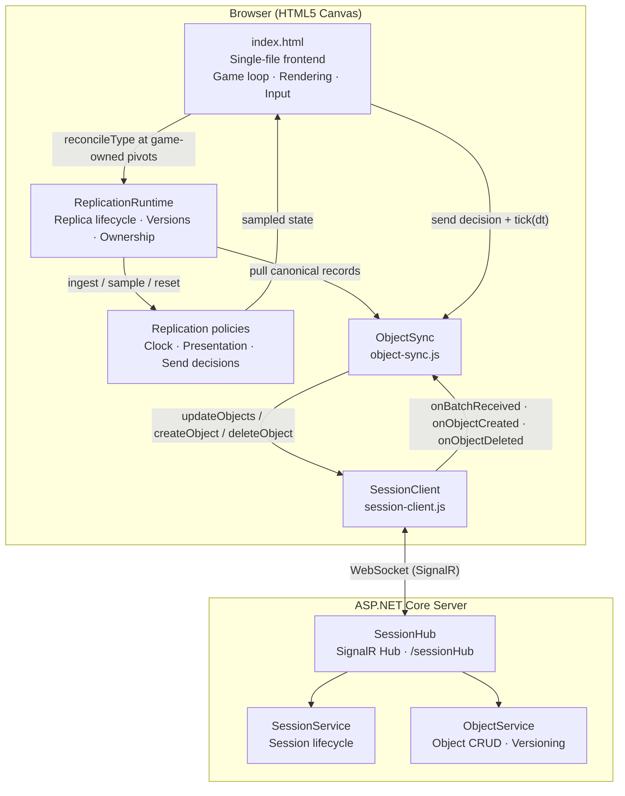

---

## Client Architecture

The browser client uses classic-script modules loaded before `index.html`'s
inline composition root. There is no bundler or transpilation step. Each module
exposes an explicit public object while retaining internal state in closures.
The game composes the layers and supplies Astervoids-specific adapters.

### Layer Boundaries

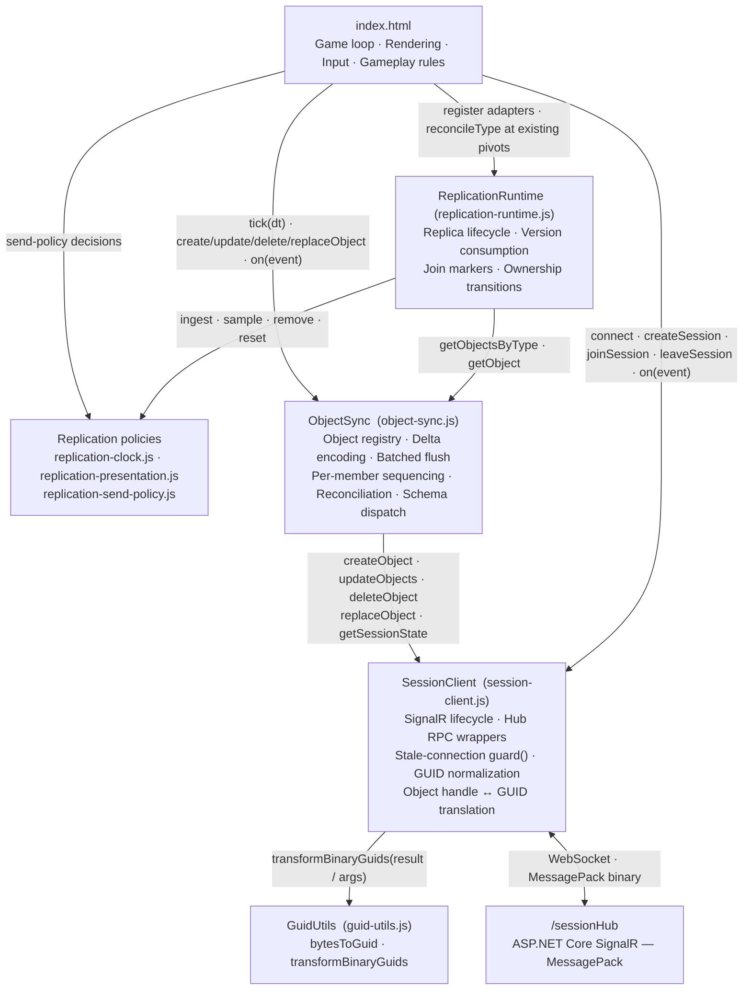

### Dependency Invariants

These rules are enforced purely by module structure and must not be violated when extending the client:

- **Only `SessionClient` holds a `signalR.HubConnection`.** The hub URL `/sessionHub` and `MessagePackHubProtocol` are referenced nowhere outside `session-client.js`. `index.html` contains no `signalR.*` references.
- **Only `SessionClient` calls `GuidUtils.transformBinaryGuids`.** It is applied in both the `guard()` event wrapper (all hub push callbacks) and `invokeHub()` (all RPC responses), so nothing above `SessionClient` ever observes a raw 16-byte `Uint8Array` GUID.
- **Outbound transport IDs are binary only for typed `Guid` contracts.**
  `SessionClient` uses `GuidUtils.guidToBytes` for join/rejoin IDs and object
  mutation/event IDs. String-typed owner overrides, reconnect tokens, and opaque
  payloads remain unchanged; callers above the transport keep readable IDs.
- **Full-object decoding is shared across receive paths.** Creation events and
  responses, replacements, joins, and reconciliation use the same positional
  DTO, scope, and payload decoder. Join installs session schemas first; sparse
  update DTOs keep their separate shape.
- **`ObjectSync` is the sole consumer of `SessionClient.{createObject, updateObjects, deleteObject, replaceObject, getSessionState}`.** The game never calls these transport methods directly.
- **The game never directly manages `memberSequence`, delta encoding, or reconciliation.** Per-member sequence tracking, gap detection, and `GetSessionState` calls are entirely encapsulated inside `ObjectSync`.
- **Send rate is decoupled from frame rate.** The game calls `ObjectSync.tick(frameTimeSec)` at its existing reconciliation pivot; ObjectSync accumulates elapsed time against its RTT-derived interval. Immediate updates retain urgency under backpressure; at most one update invocation is in flight, with no catch-up bursts after stalls.
- **`ReplicationRuntime` is pull-driven.** It never owns a frame loop, calls
  `ObjectSync.tick`, sends a mutation, or subscribes to SignalR. The game invokes
  one type reconciliation at each existing collision-visible simulation pivot.
- **`ReplicationRuntime` never interprets game data.** Record classification
  and entity create/apply/adopt/remove behavior are adapter callbacks.
  Reusable kinematic/control policies define explicit input state contracts and
  receive geometry, prediction, replay, wrapping, and clock behavior through
  injection.
- **Serialization has one seam.** Entity `toSyncData`, `toUpdateData`, and
  `fromSyncData` methods plus the schema selector remain authoritative; runtime
  descriptors do not duplicate wire mappings.
- **The game owns exactly one `requestAnimationFrame` driver.** `gameLoop` is
  the only self-scheduling rAF callback. Auxiliary per-frame work (analog stick
  sampling, mobile HUD refresh) registers through `addFrameCallback` and runs
  at the top of the frame, before `ObjectSync.tick` and the simulation steps, so
  input sampled this frame is visible to this frame's steps. Callbacks are
  isolated so a throwing callback cannot stall the loop. This keeps the browser
  to one animation callback per frame on the most constrained devices, and it
  keeps auxiliary work correctly suspended when the hidden-tab interval
  fallback takes over.

> These are the client-side analogues of the server-side lock ordering described in the [Thread Safety](#sessionservice-thread-safety) section.

### Replication Responsibilities and State Ownership

| Layer | Owns | Does not own |
|---|---|---|
| `SessionClient` | SignalR connection, session identity/epoch, RPC lifecycle | Replicated entities or presentation |
| `ObjectSync` | Canonical records, versions, deltas, batching, sequencing, reconciliation | Game fields, physics, concrete entities |
| Replication policies | Clock estimates, interpolation/dead-reckoning state, send eligibility | Transport, collections, frame scheduling |
| `ReplicationRuntime` | Consumed versions, one-shot join markers, role bindings, migration-pending state | Serialization, simulation, collisions, audio |
| Astervoids adapters | Record-to-entity mapping and game-specific transition effects | SignalR and wire mechanics |
| Astervoids game | Local authority, rules, physics, collisions, rendering, UX | Generic record ordering and migration gates |

The canonical record in `ObjectSync`, a locally authoritative entity, a remote
game instance, and transient presentation state are deliberately separate
objects with one owner each. `ReplicationRuntime` coordinates them without
copying canonical data into a second generic store.

### Pull-Driven Frame Contract

The extraction preserves the existing order rather than introducing one global
replication update:

1. `ObjectSync.tick` pumps the outbound scheduler once per frame.
2. Local authoritative entities simulate and enqueue their latest state.
3. `updateRemoteShips`, `updateAstervoidsFromSync`,
   `updateBulletsFromSync`, and `updateGameStateFromSync` reconcile their type
   at their original game-owned pivots.
4. Collision detection observes the same local and sampled remote state as
   before extraction. Bullet hits sweep each local bullet's step-relative path
   against the current asteroid polygon, including translational asteroid
   motion and wrap-aware broad-phase rejection.
5. Rendering remains outside the runtime.

The hidden-tab fallback keeps its own established order: outbound tick, local
ownership simulation, asteroid and bullet reconciliation, collision handling,
then ship reconciliation. Consolidating these calls into a single automatic
runtime tick is prohibited because it would change collision-visible state.

Outbound authority remains game-owned. `replication-send-policy.js` returns
explicit `{ send, immediate, reason }` decisions, but the game still invokes
entity serializers and `ObjectSync.updateObject`; `ObjectSync` still owns
coalescing, immediate edge flushes, cadence, and backpressure. An
`AuthorityPublisher` was intentionally not introduced because it would combine
independently tested scheduling layers without adding receive-side reuse.

### Replica Lifecycle Contract

`ReplicationRuntime` consumes plain records with `id`, `type`, `data`,
`creatorMemberId`, `ownerMemberId`, `scope`, `version`, `validAt`, and optional
ownership-migration metadata. A registered type adapter classifies each record
as `owned`, `replica`, or `ignore` and supplies collection and lifecycle hooks.

- `beginSession({ epoch, snapshotObjectIds })` scopes all work to a
  `SessionClient` epoch and installs one-shot join markers.
- A join marker is consumed only by the first applicable replica ingest or
  owned adoption.
- Equal consumed versions continue to sample existing presentation state but
  do not ingest another anchor.
- A metadata-only ownership version advances consumption without re-anchoring
  an existing replica. The first later data-bearing version receives a
  `preserveDirection` transition fact.
- Delete, ownership gain, ignored role, missing type, and session reset use
  explicit removal reasons so game adapters can suppress inappropriate
  cosmetic effects.
- Stale-epoch reconciliation, deletion, migration, and reset work is rejected.

This remains a client-side boundary for one joined session. Server authority is
still the in-memory, per-session state protected by `Session.SyncRoot` inside
one application instance; the runtime does not add cross-process or
cross-region session replication.

### Inline Gameplay Workflows and Test Boundaries

The game continues to own orchestration in `wwwroot/index.html`:

- Session entry shares snapshot initialization and membership/configuration
  bookkeeping. Create, join, and auto-rejoin retain explicit cancellation
  checks and viewport/picker updates. Rejoin resets old state **before** the
  join RPC installs its snapshot. Voluntary leave establishes its synchronous
  guard before asynchronous cleanup.
- Visible and hidden simulation share owned-asteroid updates, local-bullet
  expiration, and wave progression. Their orchestration and remote-ship
  reconciliation points remain separate; hidden-tab timing is not the
  deterministic foreground accumulator.
- `calculateGameState` computes score awards, damage, and historical
  player-count bonuses from explicit inputs without mutating them. The
  player-count bonus is identity-based, not a concurrent-ship count: every
  participant that has ever published a ship is recorded in the persisted
  `countedParticipants` ledger, and `peakShipCount` is the high-water count of
  participants already paid. The first participant plays on the base lives and
  each later one adds exactly one, so the award depends on the player rather
  than on who else happens to be aboard, who owns the GameState object, or how
  much the session has churned. Ships publish a `participantId` that survives
  the evict-and-re-register of a rejoin (`SessionClient.getParticipantId`), so a
  reconnect is never paid twice; a ship without one is skipped rather than
  attributed to its (unstable) owning member.
  `calculateGameStateTerminal` computes immutable terminal anchors from an
  explicit server time. `syncGameState` retains ledger validation, local
  effects, game-specific serialization, and publication through `ObjectSync`.
  Its decoded/packed ledger and calculation caches compare actual inputs,
  including score/hit events that do not advance object versions. Private
  ledger snapshots detect in-place mutations. Session/ownership/recovery
  changes invalidate the cache, and cached publication still queues updates
  against `ObjectSync`'s confirmed baseline rather than treating a local write
  as an acknowledgement.
- A session ship that takes a hit its owner predicts to be fatal stops being
  controlled instead of respawning, so the final frames everyone sees are the
  collision that ended the game rather than a fresh ship at centre. The owner
  re-runs the same pure `calculateGameState` locally with its incremented
  `hitCount` applied, which reproduces the lives the authority is about to
  publish — including other ships' unprocessed hits and pending extra-life
  awards — with no extra traffic and regardless of who owns the ship or the
  GameState object. A held ship accepts no input and cannot collide again, but
  it keeps simulating and coasts: `beginShipDeathHold` clears the control
  intent and rotation, leaving `Ship.update` as friction decay, integration,
  and wrap, so the wreck carries its momentum into the terminal stop rather
  than halting under the player. Translation velocity is preserved and spin is
  not, because turn ramping is instantaneous at the shipped
  `SHIP_TURN_DECEL_TIME` and a replica would damp a spinning wreck the moment
  it saw the cleared intent. `buildTerminalTargetPayload` then treats the wreck
  like any other moving object and projects its stopping distance; buffered
  sessions settle onto the same final snapshot. Keeping the instance simulating
  is what makes this safe: published velocity is integrated forward by
  deterministic replay, buffered extrapolation, terminal projection, and
  late-join seeding, so an instance parked while it still advertised a velocity
  would leave every replica extrapolating motion the owner never performed,
  with no heartbeat to correct it. The hold is local state, never replicated:
  peers replay the published motion, not the prediction behind it, and the
  wreck stays drawn. Prediction can be wrong, so a hold is never permanent. It
  releases into a normal respawn once the authority records that hit in
  `processedHits` while lives remain — the only proof of survival, since lives
  are legitimately still positive for the frames before the hit reaches the
  authority. A completed respawn never inherits the coast, because `reset()`
  returns the ship to centre at zero velocity. `hitCount`
  travels only on the per-object event channel, so a hold whose verdict never
  arrives expires after `SHIP_DEATH_HOLD_TIMEOUT_MS` into today's respawn
  rather than leaving that player shipless. Solo play needs none of this: it
  reads its own lives directly and already leaves the wreck where it died.
- Entering an in-progress session adopts shared lives from the GameState record
  (`adoptSharedLives`), never from the local starting default. Reconciliation
  re-applies a replica only when its version is new, and a lobby spectator has
  already consumed the current one, so resetting to the default at entry would
  hold a stale value until the owner next published a change. The GameState
  owner and a plain client take the same value, so entry is symmetric.
- A rejoin restores the role this client actually held, keyed on whether it owned
  a ship rather than on `game.state`. A lobby spectator also reads `playing` from
  the GameState record, so a state-only test re-entered the game on their behalf
  and minted a ship when a backgrounded tab came back. A spectator re-adopts the
  watched GameState on rejoin for the same version-suppression reason as entry.
- Debug snapshot publication is separate from HUD rendering, with the same
  listener gating and update cadence. Entity collections remain ordered arrays.
  Asteroid/bullet reconciliation builds a reference-only ID index once at each
  synchronous pivot; adapter creates/removals update that index for the rest of
  the pass. Rebuilding it at the next pivot observes local expiry, asynchronous
  ID assignment, replacement, and reset without persistent duplicate state.
  Runtime membership facts are shared for that pass; record and cleanup
  snapshots retain callback-mutation safety.

Stationary and swept collision tests share polygon containment and
squared-distance primitives in `collision-geometry.js`, including degenerate
edges and inclusive tangency. Fracture calculation stays in
`asteroid-fracture.js`: parent geometry, impulse response, polygon construction,
and disk fallback are separate stages. Parent mass is density times radius
squared; polygon-area calibration still determines child radii.

Asteroid polar vertices remain authoritative for fracture and serialization.
`rebuildShapeCache()` derives local Cartesian offsets and the true bounding
radius after shape/aspect changes. Movement, rotation, and viewport changes
refresh reusable world points with one rotation transform, shared by drawing
and collision. `getWorldVertices()` returns borrowed read-only storage, valid
until the next refresh; consumers must not retain a pose across refreshes.

Aspect compensation caches immutable results against session mode, effective
severity and both balance/difficulty settings. Motion caps remain enforced at
simulation and serialization boundaries. Collision passes lazily prepare each
asteroid's pixel bounds and wrapped displacement once, sharing exact borrowed
geometry between bullet and ship checks without freezing collection membership:
same-pass split children remain eligible in the existing traversal order.

Local render interpolation uses reentrant scratch storage rather than aggregate
entity arrays and per-entity pose tuples. Restoration remains in `finally`,
including preparation failures; entity references are cleared after use.
Retained storage is bounded to four buffers of at most 1,024 poses each.
Rendered overlays/mobile visibility use change-gated writes. Analog input skips
idle mapping and reuses its result until input, anchor identity, viewport scale,
control mode or mapping configuration changes.

Tests import production modules directly where possible. For declarations that
remain inline, `AstervoidsWeb/test-support/inline-game.mjs` loads selected
functions/classes using Node's parser and explicitly supplied dependencies,
without starting the browser runtime. Expected results and deliberate
architecture/order assertions remain independent of the implementation.

Performance regressions use these same production-function harnesses: repeated
aspect queries reuse one derivation, 600 frames of 200 entities reuse one flat
render buffer, and a 32-bullet/200-asteroid pass prepares asteroid movement once
per object rather than once per pair. These operation/allocation assertions and
wire-size budgets are not substitutes for device frame-time, GC or end-to-end
network profiling.

### Future Native Client Contract

The JavaScript callbacks and `Map` usage are implementation details, not the
cross-language API. A native client should reproduce these protocol-neutral
contracts:

- plain record fields, session epochs, role transitions, version acceptance,
  and removal reasons;
- explicit wall, server-UTC, and monotonic clock domains in milliseconds;
- primitive-input prediction/interpolation kernels and documented clamp rules;
- explicit send decisions, while retaining a separate transport scheduler;
- golden codec, timing, join, migration, and cadence fixtures.

Normative behavior must not depend on DOM APIs, JavaScript object identity, or
hidden calls to `performance.now()`. The existing JS/C# cross-wire fixtures and
policy/runtime vectors are the starting point for a future C/C++ implementation.
Packaging, code generation, a full ECS, distributed authority, and a separate
session/reconnect coordinator remain deferred until a second client proves
those seams.

### SessionClient Public API

#### RPC Wrappers

All wrappers route through `invokeHub()`, which enforces session membership and applies `GuidUtils.transformBinaryGuids` to the result before returning it to the caller.

Create and join/rejoin retain distinct RPCs and snapshot construction, then
share session-entry completion: install validated identity, merge pending member
events, finish the transition, and notify listeners. Epoch checks stop pending
callback delivery and suppress the result if a listener resets the session.

| Wrapper | Hub method | Wire args | Return (after GUID normalization) |
|---|---|---|---|
| `createSession(metadata?)` | `CreateSession` | `metadata?` | `{ session, member }` or `null` |
| `joinSession(sessionId, evictMemberId?)` | `JoinSession` | `sessionId, evictMemberId?` | `{ session, member }` or `null` |
| `leaveSession()` | `LeaveSession` | — | `void` (broadcast only) |
| `getActiveSessions()` | `GetActiveSessions` | — | `{ sessions[], maxSessions, canCreateSession }` |
| `createObject(data, scope, ownerMemberId?, clientValidAt?)` | `CreateObject` | `data, scope, ownerMemberId?, clientValidAt?` | `{ objectInfo, memberSequence }` |
| `updateObjects(updates, senderSequence, senderSendIntervalMs, clientValidAt?)` | `UpdateObjects` | `updates[], senderSequence, senderSendIntervalMs, clientValidAt?` | `{ versions{}, memberSequence, serverTimestamp }` |
| `replaceObject(deleteObjectId, replacements, scope, ownerMemberId?, clientValidAt?)` | `ReplaceObject` | `deleteObjectId, replacements[], scope, ownerMemberId?, clientValidAt?` | `createdInfos[]` (normalized from `[createdObjects, memberSequence, validAt]`; applied before resolution) |
| `deleteObject(objectId)` | `DeleteObject` | `objectId` | `{ success, memberSequence }` |
| `getSessionState()` | `GetSessionState` | — | `{ members[], objects[], memberSequences{} }` |

† `clientValidAt` is the owner's NTP-aligned operation timestamp. Updates sample
it once at flush, after latest-state coalescing, so it is not an exact timestamp
for every simulation pose. The server clamps it to ±2s of its own UtcNow and
forwards `validAt`; if `null`, it falls back to hub-entry time. See
"Networking: Unified `validAt` Interpolation Axis" below.

#### Lifecycle and State Methods

These methods have no corresponding hub RPC.

| Method | Description |
|---|---|
| `connect(force?)` | Opens `/sessionHub` with `MessagePackHubProtocol`; `force=true` tears down the existing connection first (awaits `stop()` with a 3 s timeout before creating a new one) |
| `disconnect()` | Stops the connection and clears all state including `lastSessionId` |
| `on(eventName, callback)` | Registers a named callback from the fixed `callbacks` set |
| `getCurrentSession()` | Returns the current session object (`id, name, members[], objects[], metadata`) or `null` |
| `getCurrentMember()` | Returns the current member object (`id, role`) or `null` |
| `getSessionEpoch()` | Returns the monotonically changing local lifecycle epoch used to reject stale async work |
| `isConnected()` | `true` when the connection is `HubConnectionState.Connected` |
| `isInSession()` | `true` when `currentSession !== null` |
| `getLastSessionId()` | Returns the session id from the most recent join; preserved across unexpected disconnects for auto-rejoin |
| `clearSessionState()` | Blanks `currentSession` and `currentMember` without stopping the transport; used during auto-rejoin |

### SessionClient Event Callbacks

`SessionClient.on(name, fn)` registers callbacks from a fixed set of **16** names. The regular mapping is `OnFooBar` (hub broadcast) → `onFooBar` (JS callback). All handler arguments are walked through `GuidUtils.transformBinaryGuids` by `guard()` before dispatch, so callers never observe raw `Uint8Array` GUIDs.

| JS callback | Hub source | Notes |
|---|---|---|
| `onConnected` | `onreconnected` / initial `connect()` | Fires on first connect and after every successful automatic reconnection |
| `onReconnecting` | `onreconnecting` | Transport lost; SignalR is retrying |
| `onDisconnected` | `onclose` | Connection permanently closed; `error` is `null` for intentional disconnect |
| `onSessionCreated` | `createSession()` response | Not a hub broadcast; fired after local state is populated from the RPC response |
| `onSessionJoined` | `joinSession()` response | Not a hub broadcast |
| `onSessionLeft` | `leaveSession()` | Not a hub broadcast |
| `onMemberJoined` | `OnMemberJoined` | `(memberInfo, senderMemberId, memberSequence)` |
| `onMemberLeft` | `OnMemberLeft` | `(info, senderMemberId, memberSequence)`; may be immediately followed by `onRoleChanged` if the local member was promoted |
| `onRoleChanged` | Derived from `OnMemberLeft` | Fired only when `info.promotedMemberId === currentMember.id`; arg: `(newRole)` |
| `onObjectCreated` | `OnObjectCreated` | `(objectInfo, senderMemberId, memberSequence)` |
| `onObjectsUpdated` | `OnObjectsUpdated` | Arg reorder: hub sends `serverTimestamp` at position 4; callback puts it at position 1 → `(objects, serverTimestamp, senderMemberId, senderSequence, memberSequence, senderSendIntervalMs)` |
| `onObjectDeleted` | `OnObjectDeleted` | `(objectId, senderMemberId, memberSequence)` |
| `onObjectReplaced` | `OnObjectReplaced` | `(event, senderMemberId, memberSequence)` |
| `onSessionsChanged` | `OnSessionsChanged` | No args; signal only — caller must call `getActiveSessions()` to get the updated list |
| `onSessionExpired` | `OnSessionExpired` | `(reason)` — server-driven session destroy via `SessionCleanupService` |
| `onError` | Internal | `(errorMessage)` — fired on connection or RPC errors |

While a create or join RPC is pending, membership broadcasts can overtake its
older response snapshot. `SessionClient` queues those broadcasts, folds them
into the installed member list in arrival order, then dispatches their callbacks
after the session callback has initialized snapshot consumers.

### ObjectSync Public API

#### Lifecycle / Config

| Method | Description |
|---|---|
| `init()` | Subscribes to the six `SessionClient` events the sync layer consumes (`onObjectCreated`, `onObjectsUpdated`, `onObjectDeleted`, `onObjectReplaced`, `onSessionJoined`, `onSessionLeft`) |
| `configure(config)` | Sets `nominalFrameTime`, `minFrameTime`, `deltaEncoding`, `adaptiveSendRate`, and `fieldMap` |
| `clear()` | Resets all local state (objects, sequences, pending updates); called on session leave |

#### Object Mutations

| Method | Description |
|---|---|
| `createObject(data, scope?, ownerMemberId?, isStillNeeded?)` | **Response-first**: invokes `CreateObject`, registers the server-assigned id + version; if `isStillNeeded()` returns `false` after the round-trip, fires a fire-and-forget delete to clean up the orphan |
| `updateObject(id, data, immediate?)` | Mutates the local object immediately and queues for batched flush; `immediate=true` flushes now if possible, otherwise retains urgency for the next eligible tick |
| `deleteObject(id)` | **Local-first**: removes from the local map and `pendingUpdates`, adds to `pendingDeletes`, then invokes `DeleteObject` |
| `replaceObject(deleteId, replacements, scope?, ownerMemberId?)` | Atomic delete-plus-create round-trip; sender applies the response through the same replacement handler as remote broadcasts, before returning the children array |
| `flushUpdates()` | Builds the wire batch (delta or full), compresses field names via `fieldMap`, and calls `SessionClient.updateObjects` |

#### Frame Pump

| Method | Description |
|---|---|
| `tick(frameTimeSec)` | Accumulates nonnegative finite elapsed seconds, capped at one interval; services elapsed eligibility or pending urgency when no update invocation is in flight |

#### Queries

| Method | Description |
|---|---|
| `getObject(id)` | Returns the local object with the given id, or `undefined` |
| `getAllObjects()` | Returns an array of all locally tracked objects |
| `getObjectsByOwner(memberId)` | Returns all objects where `ownerMemberId === memberId` |
| `getObjectsByType(type)` | O(n-matching) type lookup via the internal `typeIndex` |
| `getObjectsByTypeSnapshot(type)` | Same implementation, explicitly transferring ownership of the membership array; records remain canonical references. ReplicationRuntime avoids a second copy when this optional store method exists, and otherwise snapshots legacy stores defensively |
| `getObjectByType(type)` | O(1) singleton lookup (e.g. `GameState`) via `typeIndex` |
| `getObjectCount()` | Returns the number of locally tracked objects |
| `getReconciliationCount()` | Returns the number of completed reconciliations in this session |
| `isDataConfirmed(id, data)` | Shallow-checks fields against the latest server-confirmed response or authoritative snapshot |
| `getSendRate()` | Returns the current effective send rate in Hz (`round(1 / nominalFrameTime)`) |
| `isReconciling()` | `true` while a `GetSessionState` reconciliation round-trip is in progress |

#### Adaptive Send Rate

| Method | Description |
|---|---|
| `updateSendRate(rttMs)` | Scales `nominalFrameTime` linearly from measured RTT (only when `adaptiveSendRate` is enabled); low RTT → 20 Hz, high RTT → 1 Hz |

#### Reconciliation Control

| Method | Description |
|---|---|
| `triggerReconciliation()` | Fetches a full state snapshot from the server and syncs the local object map; no-op while suspended or already reconciling |
| `suspendReconciliation()` | Increments the suspend counter; while `> 0`, `triggerReconciliation()` is a silent no-op |
| `resumeReconciliation()` | Decrements the suspend counter |

#### Cross-Layer Coordination Hooks

| Method | Description |
|---|---|
| `handleOwnershipMigration(migratedObjects)` | Applies server-authoritative `{ objectId, newOwnerId, newVersion }` entries from `MemberLeftInfo`; prevents version drift from blind local increments |
| `handleMemberDeparture(deletedObjectIds)` | Removes member-scoped objects from the local map and fires `onObjectDeleted` for each |
| `trackEventSequence(senderMemberId, memberSequence)` | Public alias for `trackMemberSequence`; keeps the per-member sequence map current for events not handled internally by `ObjectSync` |

#### Event Registration

| Method | Description |
|---|---|
| `on(eventName, callback)` | Registers a callback from the fixed 7-name `callbacks` set |

### ObjectSync Event Callbacks

`ObjectSync.on(name, fn)` registers callbacks from a fixed set of **7** names.

| Callback | Signature | Notes |
|---|---|---|
| `onObjectCreated` | `(obj)` | Fires when an object is first registered locally (from remote creation, reconciliation, or own `createObject` response) |
| `onObjectUpdated` | `(obj)` | Fires when a remote update is applied to a locally tracked object |
| `onObjectDeleted` | `(obj)` | Fires when an object is removed from the local map (remote delete, member departure, or reconciliation ghost removal) |
| `onBatchReceived` | `(serverTimestamp, clientTimestamp?, senderSendIntervalMs?, senderMemberId?, responseTimestamp?)` | Powers the full RTT→TX→BUF pipeline (see [Networking: RTT → TX → BUF Pipeline](#networking-rtt--tx--buf-pipeline)). For remote batches `clientTimestamp` is `null`; for own flush responses `clientTimestamp` is set and RTT is computable as `responseTimestamp - clientTimestamp` |
| `onSyncError` | `(operation, error)` | Fires when a `createObject`, `updateObject`, or `deleteObject` RPC fails |
| `onReconciliationFailed` | `()` | Fires when `GetSessionState` returns `null` or throws — the server no longer recognizes this connection as a session member; drives `attemptAutoRejoin` in the game |
| `onReconciliationComplete` | `()` | Fires at the end of a successful reconciliation round-trip |

### Cross-Layer Coordination Contracts

The following implicit protocols are promoted here to explicit contracts.

#### Member Departure Ordering

Inside the game's `onMemberLeft(info, ...)` handler, the game **must** call `ObjectSync.handleOwnershipMigration(info.migratedObjects)` and `ObjectSync.handleMemberDeparture(info.deletedObjectIds)` **before** reading ownership from the local object map. These calls apply the server-authoritative versions from `MemberLeftInfo` — skipping them would cause blind local increments to diverge from the server version, triggering spurious reconciliations.

#### Auto-Rejoin Reentry

The `attemptAutoRejoin` path wraps its multi-step reentry with `suspendReconciliation` / `resumeReconciliation` (counter-based, so nested calls compose correctly) and uses `clearSessionState()` to drop stale refs without tearing down the transport:

```
ObjectSync.suspendReconciliation()      // prevent snapshot races mid-rejoin
SessionClient.clearSessionState()       // drop stale currentSession/currentMember
                                        //   without stopping the SignalR connection
SessionClient.joinSession(sessionId, evictMemberId)   // evict own stale member if still present
ObjectSync.resumeReconciliation()
```

Cross-reference: [SignalR Reconnection & Reconciliation](#signalr-reconnection--reconciliation).

#### Local-First Delete Safety

`ObjectSync.deleteObject` adds the object id to `pendingDeletes` immediately after removing it from the local map, before the `DeleteObject` invoke resolves. A concurrent `triggerReconciliation` snapshot skips ids in `pendingDeletes` on the "add missing object" pass, preventing a racing snapshot from resurrecting a locally-deleted object. `pendingDeletes` is cleared when the invoke resolves (success or failure).

#### Field-Name Compression Boundary

`ObjectSync.compressData` / `expandData` apply the configured `fieldMap` exactly at the wire boundary:

- **Schema 0 and object events**: after delta computation, field names are
  compressed (for example, `velocityX` → `vx`) before MessagePack map
  encoding, then expanded after decoding.
- **Positional schemas**: readable names are used only to select slots locally;
  no field names are transmitted, so applying `fieldMap` would be both
  redundant and incorrect.

Game logic always uses readable field names. An empty `fieldMap` (the default)
means pass-through; map-key compression is opt-in via
`configure({ fieldMap: { ... } })`.

---

## Backend Data Model

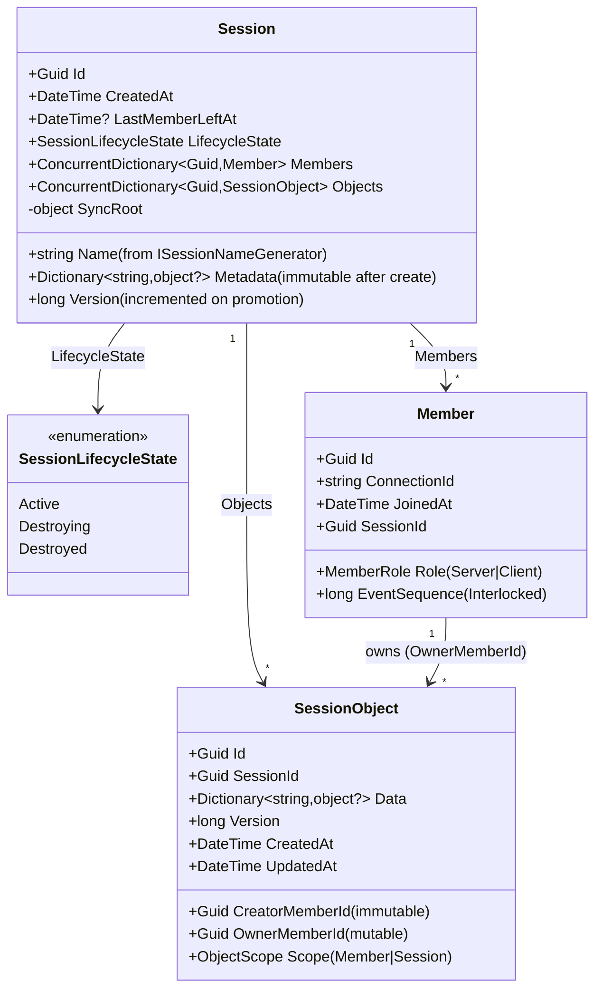

## Service Layer

```mermaid
graph TB
    subgraph "SessionService"
        direction TB
        SS_DICT["State:<br/>_sessions: ConcurrentDictionary&lt;Guid, Session&gt;<br/>_connectionToMember: ConcurrentDictionary&lt;string, Guid&gt;<br/>_memberToSession: ConcurrentDictionary&lt;Guid, Guid&gt;"]
        SS_CFG["Config:<br/>MaxSessions: 6<br/>MaxMembersPerSession: 4<br/>Names from ISessionNameGenerator<br/>(default: FruitNameGenerator, 50 names)"]
        SS_DEP["Member departure (atomic in LeaveSession):<br/>• Remove from indexes<br/>• Promote oldest remaining if Server left<br/>• HandleObjectDeparture: delete Member-scoped,<br/>  migrate Session-scoped (round-robin)<br/>• Mark LastMemberLeftAt for deferred cleanup"]
    end

    subgraph "ObjectService"
        direction TB
        OS_OPS["Operations (all enforce ownership + lifecycle<br/>under session.SyncRoot):<br/>CreateObject → Id, Version=1, Owner<br/>UpdateObject → merge, Version++ (no ownership check)<br/>UpdateObjects → Batch, owner-filtered atomically<br/>DeleteObject → ownership-checked TryRemove<br/>ReplaceObject → atomic delete + create children"]
    end

    subgraph "FruitNameGenerator (ISessionNameGenerator)"
        direction TB
        FNG["50-fruit pool (Apple, Banana, ...)<br/>Pick random unused name<br/>If all used → append counter (Apple2)"]
    end

    subgraph "ServerMetricsService (singleton)"
        direction TB
        SMS["Tracks: CPU/memory/GC/thread pool,<br/>connection counts, hub invocations,<br/>per-member TX/RX bytes, reconciliations,<br/>reconnects.<br/>Exposed via GET /api/srvmon (camelCase JSON)."]
    end

    subgraph "SessionCleanupService (BackgroundService)"
        direction TB
        SCS_OPS["Runs every 10 seconds<br/>Empty timeout: destroy sessions with no members<br/>Absolute timeout: destroy sessions exceeding max lifetime<br/>Notifies connected members via SignalR OnSessionExpired<br/>Broadcasts OnSessionsChanged on any cleanup"]
        SCS_CFG["Config source:<br/>appsettings.json Session section<br/>bound to SessionSettings"]
    end
```

## SessionService: Lookup Chain

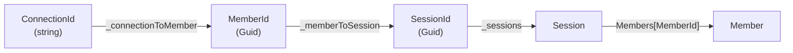

## SessionService: Create & Join

```mermaid
flowchart TB
    subgraph "CreateSession(metadata?)"
        CS1{"Connection already<br/>in a session?"}
        CS2{"Active sessions<br/>>= maxSessions (6)?"}
        CS4["Pick session name via ISessionNameGenerator<br/>(default FruitNameGenerator: random unused fruit;<br/>append counter if pool exhausted)"]
        CS5["Create Session with Name + Metadata"]
        CS6["Create Member with Role=Server"]
        CS7["Add to _sessions, _connectionToMember,<br/>_memberToSession, session.Members"]
        CS8["Return CreateSessionResult<br/>{Success, Session, Creator}"]
        CSE["Return error"]

        CS1 -->|Yes| CSE
        CS1 -->|No| CS2
        CS2 -->|Yes| CSE
        CS2 -->|No| CS4 --> CS5 --> CS6 --> CS7 --> CS8
    end

    subgraph "JoinSession(sessionId, evictMemberId?)"
        JS1{"Connection already<br/>in a session?"}
        JS2{"Session exists<br/>AND Active?"}
        JSE_EVICT{"evictMemberId given<br/>AND stale member found<br/>(different connection)?"}
        EVI["EvictMemberInternal:<br/>remove from indexes, promote if was Server,<br/>HandleObjectDeparture (delete + migrate)"]
        JS3{"Members.Count<br/>>= maxMembers (4)?"}
        WAS{"Session was empty<br/>(rejoining)?"}
        JS4S["Create Member with Role=Server"]
        JS4C["Create Member with Role=Client"]
        ADOPT["AdoptOrphanedObjects:<br/>reassign session-scoped objects<br/>without a current owner"]
        JS5["Clear session.LastMemberLeftAt"]
        JS6["Return JoinSessionResult<br/>{Success, Session, Member, Eviction?}"]
        JSE["Return error"]

        JS1 -->|Yes| JSE
        JS1 -->|No| JS2
        JS2 -->|No| JSE
        JS2 -->|Yes| JSE_EVICT
        JSE_EVICT -->|Yes| EVI --> JS3
        JSE_EVICT -->|No| JS3
        JS3 -->|Yes| JSE
        JS3 -->|No| WAS
        WAS -->|Yes| JS4S --> ADOPT --> JS5
        WAS -->|No| JS4C --> JS5
        JS5 --> JS6
    end
```

## SessionService: Leave & Server Promotion

`LeaveSession` is **atomic** under `session.SyncRoot` — membership change, server
promotion, and object cleanup happen in one critical section and a single
`LeaveSessionResult` is returned to the hub. There is no separate
`HandleMemberDeparture` call (that responsibility moved out of `ObjectService`).

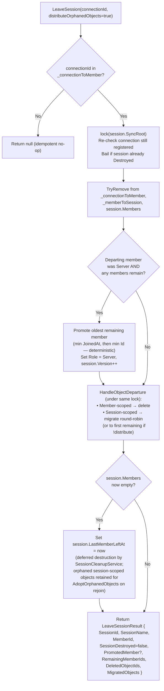

## ObjectService: Update Flow

All mutations run under `Session.SyncRoot`. Ownership and session lifecycle are
validated atomically inside `ObjectService` itself (the hub still pre-checks for
fast early-return / logging, but correctness does not rely on it).

```mermaid
flowchart TB
    subgraph "UpdateObject (single, no ownership check)"
        U1["UpdateObject(sessionId, objectId, data)"]
        U2{"Session active?<br/>Object exists?"}
        U4["Replace obj.Data with merged copy<br/>obj.Version++<br/>obj.UpdatedAt = now"]
        U5["Return updated SessionObject"]
        UF["Return null (failure)"]

        U1 --> U2
        U2 -->|No| UF
        U2 -->|Yes| U4 --> U5
    end

    subgraph "UpdateObjects (batch, ownership enforced in service)"
        B1["UpdateObjects(sessionId, ownerMemberId, updates)"]
        B2{"For each update:<br/>object exists AND<br/>OwnerMemberId == ownerMemberId?"}
        B3["Merge data, Version++,<br/>UpdatedAt = now"]
        B4["Skip (continue)"]
        B5["Return ONLY successfully<br/>updated objects"]

        B1 --> B2
        B2 -->|Yes| B3 --> B5
        B2 -->|No| B4 --> B5
    end

    subgraph "DeleteObject (ownership enforced in service)"
        D1["DeleteObject(sessionId, objectId, ownerMemberId)"]
        D2{"Object exists AND<br/>owned by ownerMemberId?"}
        D3["TryRemove from session.Objects<br/>Return deleted SessionObject"]
        D4["Return null (no-op)"]

        D1 --> D2
        D2 -->|Yes| D3
        D2 -->|No| D4
    end

    subgraph "ReplaceObject (atomic delete + create)"
        R1["ReplaceObject(sessionId, deleteObjectId,<br/>ownerMemberId, replacements[])"]
        R2{"Session active AND<br/>delete target owned<br/>by ownerMemberId?"}
        R3["Delete target,<br/>create each replacement<br/>(Version=1, owner = caller or override)"]
        R4["Return created list"]
        R5["Return null (no changes applied)"]

        R1 --> R2
        R2 -->|Yes| R3 --> R4
        R2 -->|No| R5
    end
```

## SessionService: Member Departure & Ownership Redistribution

`HandleObjectDeparture` is a private helper of `SessionService`, called inside
`LeaveSession` and `EvictMemberInternal` while `session.SyncRoot` is held. The
results (`DeletedObjectIds`, `MigratedObjects`) are bundled into
`LeaveSessionResult` / `EvictionInfo` so the hub can broadcast a single
`OnMemberLeft` event.

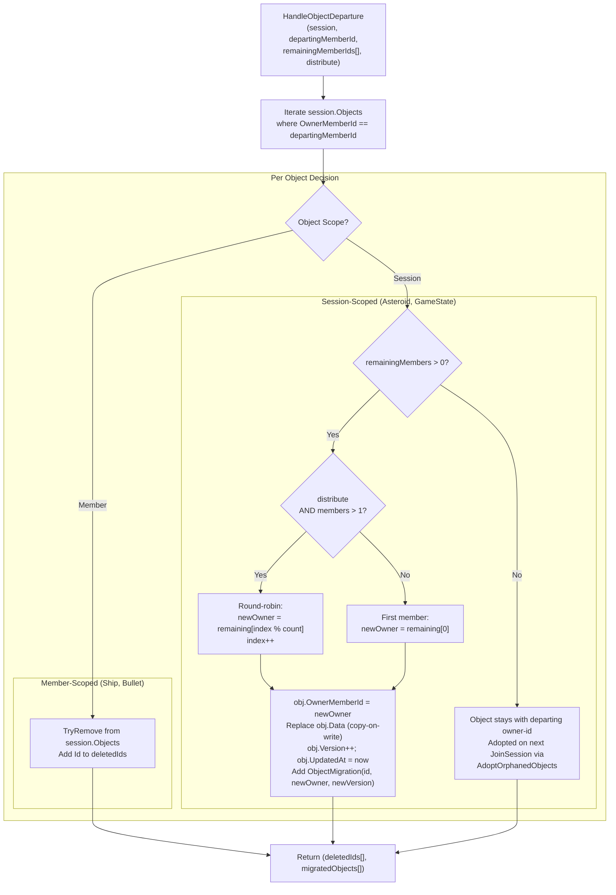

### Round-Robin Example (3 players, Player B leaves)

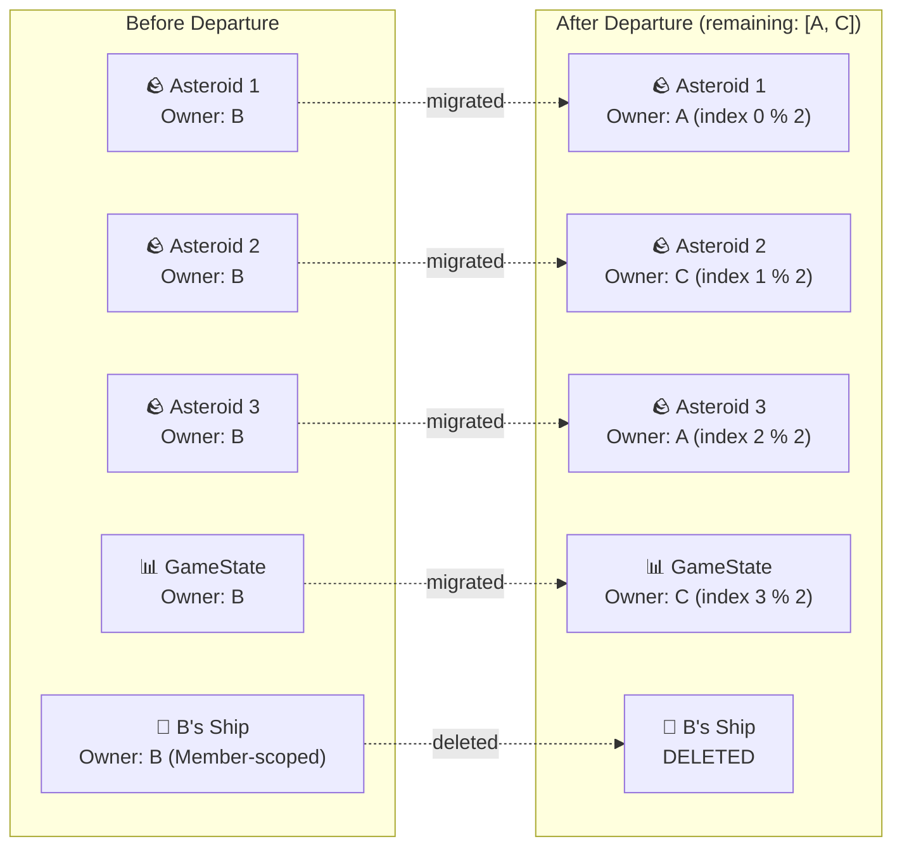

## SessionHub: Method Signatures & Broadcast Patterns

`SessionService` convenience constructors delegate to its configured constructor
using `SessionSettings` defaults. `ObjectService` depends only on the session
service. Hubs and cleanup require an explicitly supplied
`ISessionOperationCoordinator`; production DI shares one singleton rather than
allowing either consumer to create a private fallback. Backend fixtures use
`TestServiceFactory` for defaults and share the coordinator across collaborating
hubs and cleanup services. Coordination across awaits does not replace session
locks.

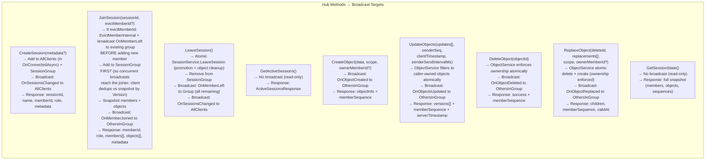

## SessionHub: UpdateObjects Detail

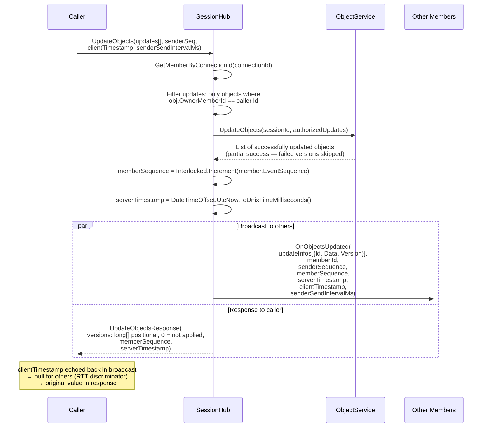

## SessionHub: Leave & Disconnect Flow

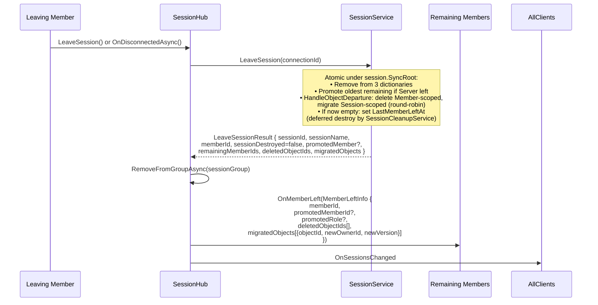

## SignalR Group Management

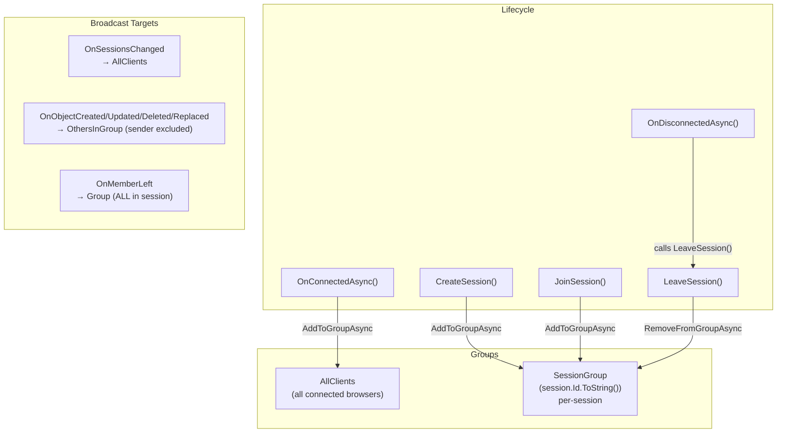

## SessionHub: ReplaceObject (Atomic Delete + Create)

```mermaid
sequenceDiagram
    participant C as Caller (asteroid owner)
    participant HUB as SessionHub
    participant OS as ObjectService
    participant ALL as Other Session Members

    Note over C: Asteroid split — need atomic delete + create children
    C->>HUB: ReplaceObject(deleteId, [{child1Data}, {child2Data}],<br/>scope="Session", ownerMemberId=null)

    HUB->>OS: ReplaceObject(sessionId, deleteId, callerId, replacements)
    Note over OS: Single critical section under session.SyncRoot:<br/>• Verify session active + caller owns delete target<br/>• Remove delete target<br/>• Create each replacement (Version=1, owner=caller or override)<br/>• Either fully committed or no changes applied

    OS-->>HUB: createdObjects[] (or null on failure)

    HUB->>HUB: memberSequence = Interlocked.Increment

    HUB->>ALL: OnObjectReplaced({<br/>  deletedObjectId,<br/>  createdObjects[{Id, Owner, Scope, Data, Version}]<br/>}, memberId, memberSequence, serverTimestamp, validAt)

    Note over ALL: Only other members receive the broadcast

    HUB-->>C: Response: [createdInfos[], memberSequence, validAt]
    Note over C: Shared replacement application installs children<br/>and removes parent before lifecycle callbacks;<br/>public API still returns createdInfos[]
```

SessionClient's optional seventh replacement argument supplies the result
handler; ObjectSync uses it to enforce its replication epoch before applying the
response. Newer updates, migrations, tombstones and reconciled children are not
rewound or re-anchored by a late result. If the invocation fails after the server
may have committed, ObjectSync requests reconciliation rather than retaining a
ghost parent indefinitely.

## Session & Member Model

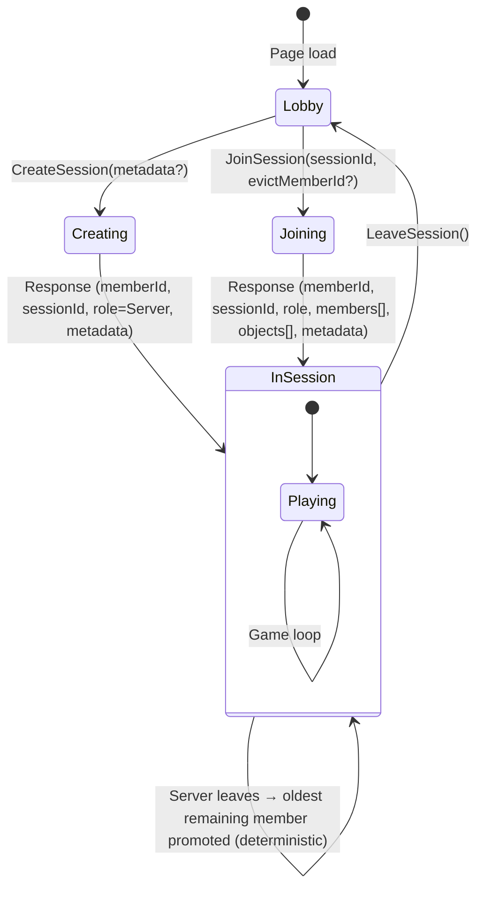

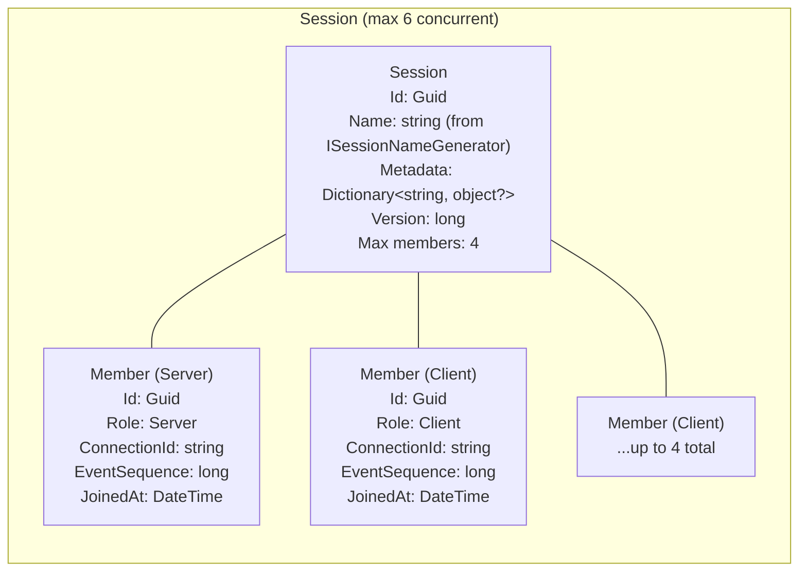

## Object Model & Ownership

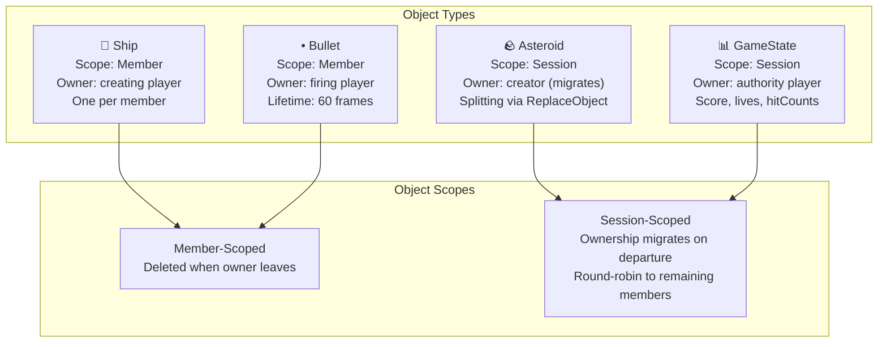

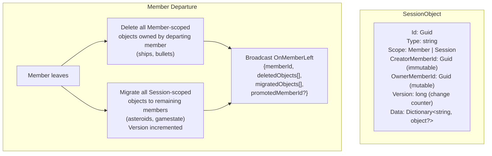

## Async Send/Receive & Sequencing

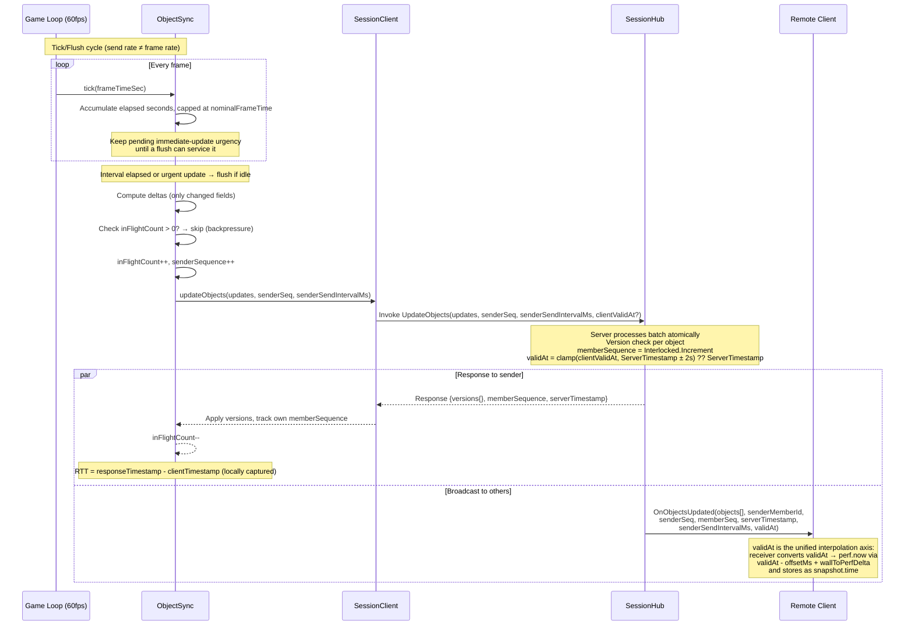

## Sequence Gap Detection & Reconciliation

```mermaid
flowchart TB
    RX["Receive event from member X<br/>with memberSequence N"]
    CHK{"lastSeq[X] exists<br/>AND N > lastSeq[X] + 1?"}
    OK["Update lastSeq[X] = N<br/>Process event normally"]
    GAP["Sequence gap detected!<br/>Expected lastSeq+1, got N"]
    RECON["triggerReconciliation()"]
    FETCH["GetSessionState() from server"]
    SYNC["Sync local objects:<br/>• Add missing<br/>• Update stale versions<br/>• Remove ghosts<br/>Reset memberSequences from snapshot"]

    RX --> CHK
    CHK -->|No gap| OK
    CHK -->|Gap detected| GAP
    GAP --> RECON
    RECON --> FETCH
    FETCH --> SYNC

    NOTE["Note: own-member gaps NOT checked<br/>(response/broadcast channels can race)"]
```

## Networking: RTT → TX → BUF Pipeline

```mermaid
flowchart LR
    subgraph "RTT Estimation"
        SAMPLE["RTT sample =<br/>responseTimestamp - clientTimestamp<br/>(captured on accepted update-batch echoes)"]
        EMA["Asymmetric EMA:<br/>spike: α=0.3 (fast up)<br/>decay: α=0.1 (slow down)<br/>rtt += α × (sample - rtt)"]
        SAMPLE --> EMA
    end

    subgraph "TX (Send Rate)"
        FORMULA["nominalFrameTime =<br/>clamp(rtt/1000,<br/>1/20, 1/1)"]
        TABLE["RTT 4ms → TX 50ms (20Hz)<br/>RTT 100ms → TX 100ms (10Hz)<br/>RTT 500ms → TX 500ms (2Hz)<br/>RTT 1500ms → TX 1000ms (1Hz)"]
        FORMULA --- TABLE
    end

    subgraph "Backpressure"
        BP["flushInProgress?<br/>→ retain elapsed eligibility and urgency<br/>→ flush on next eligible tick after completion<br/>→ no completion-driven or catch-up bursts"]
    end

    EMA --> FORMULA
    EMA --> BP
```

TX is the shared ObjectSync flush cadence for both simulation modes. It is not
the same as buffered BUF (render delay), and it is not a packet guarantee:
game-layer send-on-change gates may queue nothing, while in-flight backpressure
can coalesce multiple simulation frames into a later batch.
Once elapsed eligibility is reached, it remains latched across adaptive interval
increases until serviced. Legacy `minFrameTime` configuration remains accepted
and validated, but elapsed scheduling never invents time for short/zero ticks.

### Advertised send cadence

`senderSendIntervalMs` is the cadence a sender claims on every batch. It is the
**achievable** interval, not the requested TX above: a batch can only be released
on a game-owned tick and the accumulator does not carry surplus time forward, so
the real period is `ceil(TX / tickInterval) × tickInterval`. A 10fps client asked
for 50 ms sends every 100 ms; a backgrounded tab, whose timers the browser clamps
to ~1 s, sends every ~1 s while still requesting 50 ms.

Advertising the request instead would be a claim the sender cannot keep, and
receivers act on it. They seed adaptive delay from it before enough lag samples
exist, size the dead-reckoning prediction window with it, and — most
consequentially — reject observed packet intervals wider than twice its value as
outliers. A sender that overstates its rate by more than 2× has *all* of its
intervals discarded, so the interval variance that feeds steady-state buffering
never accumulates for the objects it owns. Because session-scoped objects
concentrate under one owner, a single degraded member can under-buffer a shared
object set for every other member in the session, while itself seeing nothing
wrong.

`ObjectSync` therefore derives the value from a smoothed estimate of tick
spacing:

- **Smoothed, not instantaneous.** Frame jitter would otherwise move the claim
  every batch, disturbing receivers' gates and a wire field that is otherwise
  constant and nearly free to compress.
- **Clamped at 1 s**, per sample and again on the result, so a GC pause or a
  suspended machine cannot advertise a stall as a cadence and inflate buffering
  session-wide. The clamp never reduces the claim below the configured request.
- **Derived on read**, never written back into `nominalFrameTime`, which would
  couple it to adaptive RTT updates into a feedback loop.

Quantization only ever rounds up, so the advertised interval is always ≥ TX and
this can add buffering but never remove it. `getSendRate()` continues to report
the request; `getEffectiveSendIntervalMs()` reports the claim, and debug
telemetry uses the latter so `tx:` matches the wire.
`AstervoidsWeb/send-interval-advertisement.test.mjs` pins the advertised value to
the spacing actually achieved across a display-cadence × TX matrix, along with
the clamp, the smoothing, and the unticked-sender fallback.

### Heartbeat grid alignment

Send-on-change gates fall back to a periodic heartbeat so idle objects still
refresh. That heartbeat deadline is quantized onto a fixed monotonic grid
(`heartbeatDue` in `replication-send-policy.js`): the next deadline is
`floor((lastSentMs + HEARTBEAT) / HEARTBEAT) × HEARTBEAT` rather than
`lastSentMs + HEARTBEAT`. Objects whose sends drifted apart therefore converge
onto shared deadlines and ride the same flush, instead of each holding an
independent phase that forces its own packet. `HEARTBEAT` is the fixed
`CONFIG.SEND_ON_CHANGE_HEARTBEAT_MS` (250 ms), shared by the ballistic and ship
gates. `AstervoidsWeb/heartbeat-grid.test.mjs` holds the claims below.

Three properties make this safe:

- **Latency never regresses.** The aligned deadline lies in
  `(lastSent, lastSent + HEARTBEAT]`, so a heartbeat can only fire earlier than
  the unaligned one, never later.
- **Steady-state rate is unchanged.** Firing at or after a grid point pushes the
  next deadline a full period out, so a settled object still heartbeats once per
  period.
- **Frame scheduling stays out of the policy layer.** The gate reads only the
  injected `nowMs`; `ObjectSync` remains the sole authority over when bytes
  leave, and its cap-no-carry flush accumulator still makes the effective send
  period `ceil(TX / displayFrameInterval) × displayFrameInterval`.

The grid is deliberately anchored to the caller's **local monotonic** clock: both
gates inject `nowMs: () => performance.now()`, whose origin is that document's
navigation time. Neither shared-time alternative is safe here. The NTP-style
synchronized server clock and `Date.now()` are both *common* axes, so quantizing
against either would put every member of a session on the same 250 ms boundary
and correlate server fan-out and ingress queueing — the opposite of the intent.
`Date.now()` is additionally slewable, which would drag deadlines around under
NTP correction. Per-document `performance.now()` origins keep senders naturally
decorrelated and immune to slewing. The grid period is the fixed heartbeat
constant and must not become per-device or derived from measured FPS — that
would re-couple send rate to frame rate.

The effect is largest where packet count, not payload size, is the cost:
alignment collapses per-object phases into shared flushes, so flush rate and
battery cost stop varying with the sender's display refresh rate, and observers
see a more regular packet interval (lower `intervalStddev`, hence a shorter
turn-prediction horizon in `calculateRateAngularPredictionWindow`).

Ship invulnerability remains authoritative in simulation ticks. The game schema
appends `invulnerabilityRevision` (`u32`) and `invulnerableAt` (`f64` server-time
capture timestamp) to the existing counter. Respawn/reset and expiry advance the
revision; ordinary countdown ticks do not. The game injects that revision as the
ship send gate's transition key, so unchanged invulnerable ships send on the
existing heartbeat rather than every simulation step.

Receivers derive the presentation countdown and blink phase from the captured
remaining ticks/time, including buffered render delay. Before clock bootstrap
they use receipt time; a zero authored timestamp falls back to record `validAt`.
Explicit revisions distinguish respawn teleports from heartbeat timing
corrections, including repeated resets to the same duration. Heartbeat captures
re-anchor any simulation-versus-wall-time drift; owner hidden-tab/step-clamp
semantics remain unchanged. These fields and their interpretation stay in the
game adapter/schema; generic transport treats them as opaque payload data.

Deterministic ship rotation uses two presentation paths. Target-heading touch
controls replay toward their transmitted target angle and cannot turn past it.
Keyboard rate controls replay continuously through the greater of the 250 ms
ship heartbeat, the owner's advertised send interval, and its observed packet
interval. A jitter margin extends that full-rate horizon; if the next packet is
late, angular input tapers linearly to zero within the global 30-frame
dead-reckoning bound. Immediate start, stop, and reversal edges still request a
throttle-bypassing send, and ordinary shortest-angle correction absorbs
remaining prediction error when the authoritative packet arrives.

```mermaid
flowchart TB
    subgraph "Per-Member BUF Calculation"
        direction TB
        PKT["Packet arrives from member X<br/>(remote broadcast only: clientTimestamp=null)"]
        MEM["getMemberDelay(senderMemberId)<br/>Independent state per member"]
        LAG["lag = arrivalServerTime - validAt<br/>(post-flush transit + clock residual)"]
        LAGREC["Retain valid lag sample<br/>(0-5000ms)"]
        INT["interval = serverTimestamp - lastServerTimestamp"]
        OUT{"interval > 2 × remoteSendInterval?"}
        SKIP["Outlier: skip interval<br/>(idle gap / delta suppression)"]
        INTREC["Retain packet interval<br/>(30-sample window)"]

        PKT --> MEM
        MEM --> LAG
        LAG --> LAGREC
        MEM --> INT
        INT --> OUT
        OUT -->|Yes| SKIP
        OUT -->|No| INTREC
    end

    subgraph "BUF Formula"
        direction TB
        READY{"At least 5 lag samples?"}
        WARMREADY{"At least 5 interval samples?"}
        LAGCALC["raw = max(16.67ms,<br/>lagMean + 2×lagStddev<br/>+ intervalStddev)"]
        WARM["Warm-up fallback:<br/>mean = advertised interval ∥ observed mean<br/>factor = min(1, 0.8 + RTT/(2×mean))<br/>raw = max(16.67ms, mean×factor + 2σ)"]
        HOLD["Keep current delay"]
        EMA2["computedDelay += 0.1 ×<br/>(raw - computedDelay)"]
        READY -->|Yes| LAGCALC
        READY -->|No| WARMREADY
        WARMREADY -->|Yes| WARM
        WARMREADY -->|No| HOLD
        LAGCALC --> EMA2
        WARM --> EMA2
    end

    LAGREC --> READY
    INTREC --> READY
```

## Networking: Unified `validAt` Interpolation Axis

Owner operations (`CreateObject`, `UpdateObjects`, `ReplaceObject`, and object
events) carry `validAt`, an NTP-aligned estimate sampled before invocation.
`UpdateObjects` samples once at flush and fans that value across the coalesced
batch, so it is an ordering/presentation anchor rather than an exact simulation
timestamp for every pose. Buffered interpolation uses this axis; deterministic
live updates normally remain arrival-anchored.

```mermaid
flowchart LR
    subgraph "Owner (sender)"
        QUEUE["Game queues latest state<br/>(updates may coalesce)"]
        STAMP["At operation/flush:<br/>clientValidAt = Math.round(serverNowMs())<br/>or null before clock bootstrap"]
        QUEUE --> STAMP
    end

    subgraph "Server hub"
        CLAMP["validAt =<br/>±2s clamp(clientValidAt) ?? hub-entry ServerTimestamp<br/>then max prior ValidAt in batch"]
    end

    subgraph "Receiver"
        CONV["snapshot.time =<br/>validAt - clock.offsetMs + wallToPerfDelta"]
        BRACKET["Bracket search runs in<br/>perf.now domain<br/>(monotonic, immune to wall-clock slewing)"]
        CONV --> BRACKET
    end

    STAMP -->|"clientValidAt"| CLAMP
    CLAMP -->|"validAt"| CONV
```

* **`clock.offsetMs`** is the NTP-style estimate `serverTime - wall` (5-ping bootstrap, 30 s refresh, min-RTT-per-burst selection). Min-RTT sampling reduces transient queue bias, but persistent path asymmetry remains as clock error; projection callers gate initialization and cap elapsed time.
* **`clock.wallToPerfDelta = performance.now() - Date.now()`** is refreshed on every accepted ping burst. The conversion `validAt → snapshot.time` runs through it so bracket-search stays on a monotonic clock while the snapshot key still encodes the global server-time agreement.
* **Causal deterministic replacements.** Normal deterministic updates arrival-anchor, but a replacement child inherits the parent's local presentation timeline: `min(nowPerf, parent.recvPerf + max(0, child.validAt - parent.validAt))`. The timestamp difference cancels absolute shared-clock offset and removes discontinuities from one-off replacement latency. The invoking owner records a local monotonic baseline, so adoption also works before clock bootstrap. Existing dead-reckoning and spawn-projection caps still bound stale estimates.
* **Buffered replacement projection.** Buffered mode keys the first snapshot at `validAt` and adds a parent-pose bridge on that shared axis. Its locally owned children retain bounded `validAt` projection.
* **Migration handoff.** A newly promoted owner deliberately retains the asteroid's currently displayed puppet pose and clears both remote presentation states; `getMigrationSeed` is not used. Observers skip the metadata-only version. Deterministic mode direction-smooths the first data-bearing new-owner correction; buffered mode temporarily uses its fallback delay after removing the departed owner's samples, then switches to the new owner's delay.

### Shared batch `validAt` on `OnObjectsUpdated`

The hot-path `OnObjectsUpdated` broadcast carries one `validAt` for the whole
batch (rather than one per object), saving 8 B per object:

* **One owner flush stamp.** ObjectSync samples one `clientValidAt` after coalescing the batch, so all outbound entries begin with the same operation timestamp. It does not retain each pose's original simulation time.
* **One server monotonic floor.** `ObjectService.UpdateObjects` validates that
  stamp once against the newest previous `ValidAt` among accepted objects, then
  stores the resolved value on every object. The broadcast timestamp therefore
  includes the effect of server-side monotonic clamping for the entire batch.
* **Receiver insertion remains monotonic.** The snapshot presentation policy
  still prevents regressing keys, and its near-coincident-key cushion avoids an
  immediate Hermite jump.

Snapshot/join paths are not batch-collapsed: `JoinSessionResponse` and
`SessionStateSnapshot` carry `validAts: Dictionary<string, long>`, preserving
each object's last accepted operation timestamp. Those timestamps can still be
older/newer than the exact underlying pose time because update writes coalesce.

## Deterministic Terminal Convergence

Deterministic sessions persist a canonical end pose instead of freezing each
member at its latency-dependent displayed pose:

1. The GameState owner stamps immutable `gameOverAt` and `terminalAt` values
   when shared lives first reach zero.
2. Each ship, asteroid, and bullet owner projects its authoritative object over
   the smooth-deceleration stopping distance (half its ballistic displacement
   through `terminalAt`) and writes `terminalEpoch`, `terminalX`, `terminalY`,
   and, when applicable, `terminalAngle` onto that same object record.
3. Existing members start from the exact transform rendered on their preceding
   frame and normally preserve position, velocity, and acceleration in a
   quintic trajectory while reaching the persisted target at rest.
4. A member joining an already-terminal session creates no ship and seeds
   replicas directly at persisted targets. Target-less snapshot or late-create
   records remain hidden until their target-bearing version arrives.

A ship whose owner predicts its hit was fatal is uncontrolled but still
coasting, with its rotation cut, so step 2 treats it exactly like an asteroid
or bullet and projects its remaining stopping distance. Every member converges
on that wreck rather than on a respawned ship, and the motion into the terminal
stop is continuous rather than an abrupt halt. Nothing about this depends on
who owns the ship or the GameState object, and it costs no additional
replicated state.

Terminal writes retry until `ObjectSync` reports their fields in a
server-confirmed response; this works whether delta encoding is enabled or not.
A failed write or ownership race therefore remains eligible without creating
ongoing wire traffic. Member-scoped ships and bullets
still disappear when their owner leaves. Session-scoped asteroids retain the
target through migration; if migration happens before any target was accepted,
the new owner derives a stable bounded target from the canonical record.
Create, replace, delete, migration, reconciliation, and hidden-tab paths keep
running terminal maintenance after gameplay physics and collisions stop.

The target fields remain opaque replicated data below the Astervoids adapter:
`ReplicationRuntime`, `ObjectSync`, SignalR, and the backend do not interpret
kinematics. Each known object type has one superset positional schema containing
both its live and terminal fields. This is essential because the server retains
an object's creation schema when it re-encodes later updates and join snapshots.
Optional presence bits keep mode-specific and terminal fields absent from the
body until needed.

Every canonical position and angle transition selects the nearest topologically
equivalent target. An axis normally retains its incoming derivatives; if doing
so would add a complete toroidal winding, only that axis clamps its presentation
velocity to the monotone shortest-path bound and clears its acceleration. The
velocity can fall to zero when the target is coincident or lies in the opposite
direction. If a target arrives too late to use the shared `terminalAt` without a
visible discontinuity, that member also uses a short local settle window. Exact
eventual pose and continuous position take precedence over pretending it stopped
at a time that has already passed. Buffered adaptive-delay sessions retain their
existing authoritative-snapshot settle behavior and do not wait for terminal
targets.

Terminal convergence covers pose only. Animated ship visuals settle separately
in the render pass, after both the deterministic and buffered rest passes have
re-applied authoritative ship data and before anything is drawn: the thrust
flame is cleared — input handling stops at game over, leaving the flag latched
at its last value — and invulnerability blinking ends with the ship visible, so
no wreck freezes on a hidden blink frame. The settle clears the local countdown
and replica anchor only; the invulnerability revision stays untouched because it
is the wire transition key, not a presentation value.

## Ring Buffer Interpolation

```mermaid
flowchart TB
    subgraph "Per-Object Ring Buffer (max 6 snapshots)"
        S1["snapshot[0]<br/>data, time, velocity, rotationSpeed"]
        S2["snapshot[1]"]
        S3["snapshot[2]"]
        S4["snapshot[3]"]
        S5["..."]
        S6["snapshot[5]<br/>(newest)"]
        S1 --- S2 --- S3 --- S4 --- S5 --- S6
    end

    TARGET["targetTime = renderTime - getDelayForMember(ownerMemberId)"]

    subgraph "Bracket Search (reverse scan)"
        direction TB
        BEFORE{"targetTime ≤ oldest?"}
        CLAMP["Return oldest snapshot (clamped)"]
        BRACKET{"Find i where<br/>snap[i].time ≤ targetTime < snap[i+1].time"}
        HERMITE["Build pseudo-state from snap[i] & snap[i+1]<br/>Hermite interpolate with t ∈ (0,1]"]
        AFTER{"targetTime ≥ newest?"}
        EXTRAP["Extrapolate with velocity<br/>capped at MAX_EXTRAPOLATION (1.0s)"]
    end

    TARGET --> BEFORE
    BEFORE -->|Yes| CLAMP
    BEFORE -->|No| AFTER
    AFTER -->|Yes| EXTRAP
    AFTER -->|No| BRACKET
    BRACKET --> HERMITE
```

```mermaid
flowchart LR
    subgraph "Hermite Interpolation"
        BASIS["Basis functions:<br/>h00 = 2t³ - 3t² + 1<br/>h10 = t³ - 2t² + t<br/>h01 = -2t³ + 3t²<br/>h11 = t³ - t²"]
        POS["Position (x,y):<br/>p = h00·p₀ + h10·m₀ + h01·p₁ + h11·m₁<br/><br/>Tangents m = velocity × velScale × dt<br/>velScale = refDim / gameWidth<br/>Wrap-aware Δ for p₁ - p₀"]
        ANG["Angle:<br/>Same Hermite with rotationSpeed tangents<br/>rpsToPerSec = TARGET_FPS (60)<br/>Shortest-arc via ±π wrapping"]
        SNAP{"‖p₁ - p₀‖ > SNAP_THRESHOLD (0.25)?"}
        SNAPR["Skip interpolation → snap to p₁"]

        BASIS --> POS
        BASIS --> ANG
        POS --> SNAP
        SNAP -->|Yes| SNAPR
    end
```

## Cross-Owner Collision

```mermaid
sequenceDiagram
    participant A as Player A (bullet owner)
    participant SRV as Server
    participant B as Player B (asteroid owner)

    Note over A: A's bullet hits B's asteroid locally
    A->>A: Mark bullet pendingHit=true, hitTargetId=asteroidId
    A->>SRV: UpdateObjects(bullet with pendingHit)
    SRV->>B: OnObjectsUpdated (bullet data with pendingHit)

    Note over B: B scans remote bullets for pendingHit on own asteroids
    B->>B: Process split: create child asteroids
    B->>SRV: ReplaceObject(asteroidId, [child1, child2])
    SRV->>A: OnObjectReplaced (broadcast to others)
    SRV-->>B: Replacement response (same application path)

    Note over A: A sees asteroid replaced → confirms hit, awards points
```

The first pending-hit publication includes the collision pose and claim.
Subsequent publications retry only unconfirmed claim fields, using ObjectSync's
existing confirmation baseline; hidden pending bullets no longer publish motion
or lifetime. The owner still advances local lifetime and deletes on expiry or
target-removal confirmation.

Wave spawning uses at most four concurrent create calls in multiplayer, awaiting
each bounded group before scheduling more. Random generation/invocation order,
ownership, cancellation checks and stale-create cleanup remain game-owned.
Solo spawning remains sequential. This reduces serialized round trips, not the
number of create messages or server-side operation ordering.

## Response-First vs Local-First Patterns

```mermaid
flowchart TB
    subgraph "CreateObject (Response-First)"
        direction TB
        C1["Caller invokes CreateObject"]
        C2["Wait for server response<br/>(server assigns Id, Version=1)"]
        C3["Register object in local Map<br/>from response"]
        C4["Broadcast: OthersInGroup<br/>(sender excluded)"]
        C5["If isStillNeeded callback returns false:<br/>auto-delete server object"]
        C1 --> C2 --> C3
        C2 --> C4
        C3 --> C5
    end

    subgraph "DeleteObject (Local-First)"
        direction TB
        D1["Remove from local Map immediately<br/>(before server call)"]
        D2["Remove from pendingUpdates"]
        D3["Invoke server DeleteObject"]
        D4["Server verifies ownership<br/>(rejects if not owner)"]
        D5["Broadcast: OthersInGroup<br/>(sender excluded)"]
        D1 --> D2 --> D3 --> D4 --> D5
    end

    subgraph "ReplaceObject (Response-First)"
        direction TB
        R1["Invoke server ReplaceObject"]
        R2["Server creates children,<br/>deletes parent"]
        R3["Broadcast: OthersInGroup<br/>Response: children + sequence + validAt"]
        R4["Sender applies response through<br/>the shared replacement handler"]
        R1 --> R2 --> R3 --> R4
    end
```

## Delta Encoding & Deferred Confirmation

```mermaid
sequenceDiagram
    participant OS as ObjectSync
    participant SC as SessionClient
    participant SRV as Server

    Note over OS: computeDelta(): compare current data vs the object's lastSentData<br/>Uses shallow reference comparison (===)<br/>Nested objects must be spread into new refs

    OS->>OS: delta = computeDelta(objectId, data)<br/>lastSentData NOT updated yet

    OS->>SC: updateObjects(deltas, senderSeq, sendIntervalMs)
    SC->>SRV: Invoke UpdateObjects(deltas, ...)

    alt Server accepts batch
        SRV-->>SC: Response {versions: {id→ver}, ...}
        SC-->>OS: confirmSentDeltas(sentDeltas, versions)
        OS->>OS: Update lastSentData only for<br/>confirmed objects
    else Network error / null response
        Note over OS: sentDeltas NOT confirmed<br/>→ all changed fields re-sent next flush
    end

    Note over OS: Full sync forced every 6000 frames<br/>(FULL_SYNC_INTERVAL) — bypasses delta,<br/>sends complete object state

    Note over OS: Field name compression (FIELD_MAP) is applied<br/>after delta computation — wire payloads use short<br/>keys (e.g. velocityX→vx) while game logic uses<br/>readable names. expandData() reverses on receive.
```

## Type Index (ObjectSync)

```mermaid
flowchart TB
    subgraph "Type Index (Map<string, Set<objectId>>)"
        direction TB
        IDX["typeIndex: Map<br/>e.g. 'ship' → {id1, id2}<br/>'asteroid' → {id3, id4, id5}<br/>'gameState' → {id6}"]
    end

    subgraph "Index Maintenance"
        ADD["addToTypeIndex(obj)<br/>On: createObject, handleRemoteObjectCreated"]
        REM["removeFromTypeIndex(obj)<br/>On: deleteObject, handleRemoteObjectDeleted"]
        UPD["updateTypeIndex(obj, oldType, newType)<br/>On: updateObject, handleRemoteObjectsUpdated<br/>(only when data.type changes)"]
    end

    subgraph "Efficient Queries"
        QT["getObjectsByType(type) → O(n) for n = matching<br/>vs O(N) scanning all objects"]
        QS["getObjectByType(type) → O(1) singleton lookup<br/>e.g. GameState"]
    end

    ADD --> IDX
    REM --> IDX
    UPD --> IDX
    IDX --> QT
    IDX --> QS
```

## SignalR Reconnection & Reconciliation

```mermaid
sequenceDiagram
    participant C as Client
    participant SR as SignalR
    participant HUB as SessionHub

    Note over C,SR: Connection lost (network interruption)

    SR->>SR: withAutomaticReconnect<br/>Linear 1s interval<br/>Max 10 attempts (10s window)

    SR->>C: onreconnecting(error) → freeze gameplay,<br/>show #reconnecting-overlay

    alt Reconnection succeeds (transport restored)
        SR->>C: onreconnected(connectionId)
        C->>C: ObjectSync.triggerReconciliation()
        C->>HUB: GetSessionState()

        alt Server still has the member
            HUB-->>C: Full snapshot + memberSequences
            C->>C: Sync local objects:<br/>• Add missing<br/>• Update stale<br/>• Remove ghosts<br/>• Reset sequences<br/>onConnected fires → unfreeze gameplay
        else Server already processed disconnect
            HUB-->>C: null
            C->>C: onReconciliationFailed → re-freeze<br/>and call attemptAutoRejoin (full path below)
        end
    else Max retries exceeded (or mobile auto-rejoin)
        SR->>C: onclose(error)
        C->>C: attemptAutoRejoin(sessionId, oldMemberId)<br/>Guards: rejoinInProgress, leavingSession.<br/>If document.hidden: defer (save pendingRejoinSessionId/MemberId,<br/>resume on visibilitychange).<br/>ObjectSync.suspendReconciliation() while rejoining.
        loop Up to 5 attempts (delay 0.5s, then 2s × n)
            C->>C: connectToSessionHub(force=true) —<br/>await stale.stop() with timeout, clear currentSession/<br/>currentMember, then build new connection.
            C->>HUB: JoinSession(sessionId, evictMemberId=oldMemberId)
            Note over HUB: If old member still present (server hadn't<br/>processed disconnect yet — up to ClientTimeoutSeconds),<br/>it is evicted atomically and OnMemberLeft is broadcast<br/>to remaining members BEFORE the new member is added.
            HUB-->>C: Rejoin response (new memberId, members[], objects[])
        end
        C->>C: resetMultiplayerState() BEFORE handleSessionJoined<br/>loads snapshot (avoids ObjectSync.clear wiping it).<br/>game.connectionLost cleared, ObjectSync.resumeReconciliation().
    end

    Note over C: Stale connection guard: setupEventHandlers()<br/>captures thisConnection reference.<br/>Old connection's onclose/on* events<br/>are silently ignored if connection<br/>has been replaced by connect().
    Note over C: Reconciliation safety: ObjectSync.pendingDeletes Set<br/>prevents triggerReconciliation from resurrecting<br/>locally-deleted objects whose server delete is in flight.
```

## SessionService: Thread Safety

```mermaid
flowchart TB
    subgraph "Serialization Strategy"
        direction TB
        LOCK["_sessionLock (object)<br/>Serializes CreateSession & JoinSession<br/>Prevents TOCTOU races on:<br/>• connection-already-in-session check<br/>• max sessions count check<br/>• concurrent join + capacity check"]
        SYNC["session.SyncRoot (object, per-session)<br/>Serializes ALL session-local mutations:<br/>• member add/remove<br/>• server promotion (deterministic — no race)<br/>• object create/update/delete/replace<br/>• ownership migration<br/>• lifecycle transitions<br/>• LastMemberLeftAt updates"]
        CONC["ConcurrentDictionary (4 instances)<br/>_sessions, _connectionToMember,<br/>_memberToSession, session.Members<br/>Thread-safe individual operations"]
    end

    subgraph "Lock ordering"
        ORDER["Acquisition order is always:<br/>_sessionLock → session.SyncRoot<br/>(prevents deadlocks across cross-session ops)"]
    end

    LOCK --> CONC
    SYNC --> CONC
```

## Hub: Ownership Enforcement

Ownership and session lifecycle are validated **inside the service layer** under
`Session.SyncRoot`, atomically with the mutation. Hub-layer pre-checks remain
only as fast early-return / logging — they are not relied on for correctness.

```mermaid
flowchart TB
    subgraph "ObjectService (authoritative — under SyncRoot)"
        OS_UPD["UpdateObjects: filters batch to objects<br/>where OwnerMemberId == ownerMemberId"]
        OS_DEL["DeleteObject(sessionId, objectId, ownerMemberId):<br/>verifies ownership before TryRemove"]
        OS_REP["ReplaceObject(sessionId, deleteId,<br/>ownerMemberId, replacements[]):<br/>verifies ownership of delete target<br/>before atomic delete + create"]
    end

    subgraph "SessionHub (early-return + logging)"
        HUB_UPD["UpdateObjects: passes caller.Id as ownerMemberId<br/>to ObjectService"]
        HUB_DEL["DeleteObject: optional pre-check + warning if not owner;<br/>passes caller.Id to ObjectService"]
        HUB_REP["ReplaceObject: optional pre-check;<br/>passes caller.Id to ObjectService"]
    end

    HUB_UPD --> OS_UPD
    HUB_DEL --> OS_DEL
    HUB_REP --> OS_REP
```

## Wire Format & Server Monitoring

```mermaid
flowchart TB
    subgraph "SignalR transport (binary MessagePack)"
        direction TB
        MP["AddMessagePackProtocol with CompositeResolver:<br/>• BinaryGuidResolver (16-byte binary GUIDs)<br/>• annotated positional DTOs<br/>• ContractlessStandardResolver for outer response records<br/>• MessagePackSecurity.UntrustedData"]
        DTO["Hot object DTOs are integer-key arrays:<br/>ObjectInfo · updates · requests · replacements · events.<br/>Updates address objects by session-scoped handle.<br/>SyncPayload is [schemaId, dataBytes]."]
        JSGUID["SessionClient normalizes compact arrays to named JS objects,<br/>resolves handles back to GUIDs, transforms binary GUIDs to strings,<br/>then unwraps SyncPayload.<br/>Game/ObjectSync code keeps an ergonomic object contract."]
    end

    subgraph "REST API (camelCase JSON)"
        REST["ConfigureHttpJsonOptions →<br/>JsonNamingPolicy.CamelCase.<br/>Used by GET /api/srvmon."]
    end

    subgraph "ServerMetricsService (singleton, IDisposable)"
        SMS_SAMPLE["Background CPU sampling every 2s.<br/>Tracks: connectedCount, peakConnections,<br/>totalHubInvocations, per-member TX/RX bytes,<br/>reconciliations, reconnects."]
        SMS_EST["SessionHub.EstimatePayloadBytes() uses<br/>a static MessagePackSerializerOptions<br/>matching Program.cs to compute byte counts<br/>per OnHubInvocation / OnBroadcastToMembers call."]
        SMS_API["GET /api/srvmon → snapshot record (camelCase JSON).<br/>/srvmon/index.html polls every 2s and renders<br/>TX Rate / RX Rate / CPU / connection counts."]
    end

    MP --> DTO --> JSGUID
    SMS_SAMPLE --> SMS_API
    SMS_EST --> SMS_API
    REST --> SMS_API
```

## Networking: Compact Wire Protocol

Hub frames are additionally compressed in transit by WebSocket
`permessage-deflate` (RFC 7692), enabled for the `/sessionHub` path only by
`UseWebSocketCompression` in `Program.cs`. Context takeover is left enabled on
both directions — the shared compression window across messages is what makes
the saving possible, because individual hot-path frames are small enough that
compressing them in isolation recovers only a fraction of it. Server window bits
are 12, which costs nothing measurable: a sweep over production-encoded frames is
flat from 11 through 15 bits, because gameplay state drifts continuously and the
dominant match is against the previous frame rather than anything far back. The
~112 KiB less deflate state per connection that 12 holds is therefore free, and it
is charged per connection because takeover retains that state for the connection's
lifetime. `AstervoidsWeb/websocket-deflate-window.test.mjs` holds both claims. See
the `WebSocketCompressionMiddleware` remarks for the measured figures. Two
consequences matter:

- It is purely a transport-layer concern. No DTO, schema, or client code is
  aware of it, and a peer or proxy that does not offer the extension simply
  negotiates it away.
- `UseWebSocketCompression` installs `UseWebSockets` inside its own path
  branch, and must keep doing so. Kestrel exposes only `IHttpUpgradeFeature`;
  the `IHttpWebSocketFeature` the decorator wraps is created by
  `UseWebSockets`, and the copy `MapHub` runs lives in the endpoint's
  sub-pipeline, which executes *after* all outer middleware. Without the
  branch-local call there is nothing to decorate and compression is silently
  never negotiated. `TestServer` supplies that feature on its own, so only the
  real-Kestrel handshake tests in `WebSocketCompressionTests.cs` can detect
  the regression.
- `ServerMetricsService` TX/RX byte counters remain **pre-compression**
  estimates of the MessagePack payload, so `/api/srvmon` numbers are unchanged
  by it and stay comparable with the `WireSizeBenchTests.cs` budgets.

The hot-path object payload (`ObjectInfo.Data`, `ObjectUpdateInfo.Data`,
`ObjectUpdateRequest.Data`) does not flow as a `Dictionary<string, object?>`
on the wire. It is wrapped in the positional
`SyncPayload(byte SchemaId, byte[] Data)` array `[schemaId, dataBytes]`, so
encoding can be selected per object without changing the game-facing data
contract.

The surrounding hot DTOs also use integer MessagePack keys:

| DTO | Wire shape |
| --- | --- |
| `ObjectInfo` | `[id, creatorId, ownerId, scope, syncPayload, version, handle]` |
| `ObjectUpdateInfo` | `[handle, syncPayload, version]` |
| `ObjectUpdateRequest` | `[handle, syncPayload]` |
| `ObjectReplacedEvent` | `[deletedObjectId, createdObjects]` |
| `ObjectEventInfo` | `[objectId, eventKind, payloadBytes]` |
| create/update/delete responses | `[result, memberSequence, timestamp?]` |

### Session-scoped object handles

The two hot legs — the `UpdateObjects` request and the `OnObjectsUpdated`
broadcast — address objects by a **session-scoped integer handle** instead of
the 18-byte binary GUID. The handle costs 1–3 bytes, so a compact asteroid
delta drops from ~31 B to ~16 B on both legs; with the GUID repeated in the
request and again in the broadcast, it was the single largest remaining field
on the uplink.

- `Session.AllocateObjectHandle()` hands out `1, 2, 3, …` per session. Handles
  are **never reused**, so `0` is an unambiguous "no handle" sentinel and an
  in-flight update addressed to a dead handle can only fail to resolve — it can
  never land on a different object.
- `Session` keeps a `handle → Guid` index next to the object map. Every add and
  remove goes through `AddObject` / `RemoveObject` so the two cannot drift.
- The handle is **published, not negotiated**: it rides on every `ObjectInfo`
  alongside the GUID, so create responses, `OnObjectCreated`, replacement
  children, the join response and every reconciliation snapshot teach it. There
  is no mapping message, and a reconnect resync needs no special handling.
- Everything outside those two legs keeps the GUID — `DeleteObject`,
  `ReplaceObject`, `BroadcastObjectEvent`, `MemberLeftInfo.deletedObjectIds`
  and the `validAts` / `memberSequences` pair arrays are all cold paths where
  the extra bytes do not repeat per frame.

`session-client.js` owns the translation, so `ObjectSync` and game code keep
speaking GUIDs:

- It learns `handle ↔ id` from every decoded `ObjectInfo` and forgets the
  mapping on delete, replacement of the parent, and member departure. A session
  transition clears the whole map, since handles mean nothing outside the
  session that allocated them.
- On send it maps `objectId → handle`, dropping any update whose object it has
  never been told about (the ack is then folded against the array that actually
  went on the wire, not the caller's request array).
- On receive it resolves `handle → objectId`. An update for a handle it has not
  learned yet is **parked** (newest per handle, bounded) and replayed once a
  live create teaches the handle; a snapshot that teaches the handle discards
  the parked entry instead, because the snapshot is already newer. This
  replaces the old "create a provisional object from an update for an unknown
  id" fallback, which a handle cannot express.

`UpdateObjectsResponse.Versions` is **positional**, not keyed: entry `i` is the
version assigned to wire element `i`, or `0` when that element was not
applied (unknown handle, or owned by another member). `SessionObject.Version`
starts at 1 and only increments, so `0` is an unambiguous rejection sentinel.
The object id is omitted because the caller already knows which id it sent at
each index, which takes a three-object acknowledgement from 72 B to 15 B.

The alignment holds because `ObjectService.UpdateObjects` returns an
order-preserving *subsequence* of the requested updates, so the hub matches the
two lists with a single forward walk on the handle. A batch that repeats an
object applies each occurrence separately, and each occurrence is acknowledged
at its own request index; `session-client.js` keeps the highest version when
folding such a batch back to `{objectId: version}`.

`session-client.js` converts these arrays to named objects immediately at every
invoke, live-event, snapshot, replacement, and reconciliation boundary.

### Schema registry (game-agnostic)

`object-sync.js` exposes a 3-call surface that the game uses to opt in:

1. `SchemaCodec.register(id, fields)` — declare a positional schema.
2. `ObjectSync.setSchemaIdSelector((data, kind, ctx) => id)` — given a
   payload + its kind (`'create' | 'update' | 'replace'`) + context
   (`{objectId, object}` for updates, where `data.type` may be absent),
   return the byte schema ID or `0` for the generic MessagePack-map path.
3. Pass `schemas: [...]` into `SessionClient.createSession({...})` so
   late joiners receive the same registry via `metadata.schemas`.

The C# counterpart `SyncSchemaRegistry` (per-`SessionId` map) parses
`metadata.schemas` at session create and clears it on the last leave.

### Wire shape (SchemaId >= 1)

```
SyncPayload.Data = <bitmask: ceil(N/8) bytes>
                  + <slot_i ...>   (only present slots, in declaration order)
```

A leading bit-presence mask preserves delta encoding: omitted slots are
absent from both the bitmask and the body, and the receiver merges over
prior state (matching the existing `Object.assign` semantics in JS and
`ObjectService.ApplyUpdate` dict-merge in C#).

### Type tags

| Tag             | Bytes | Range                | Notes                          |
| --------------- | ----- | -------------------- | ------------------------------ |
| `f64`           | 8     | IEEE-754             | Lossless                       |
| `f32`           | 4     | IEEE-754             | ~7 decimal digits              |
| `u8/u16/u32`    | 1/2/4 | unsigned LE          |                                |
| `i8/i16/i32`    | 1/2/4 | signed LE            |                                |
| `bool`          | 1     | 0/1                  |                                |
| `str`           | 2+N   | 2-byte LE len + UTF8 | max 65535 bytes                |
| `guid`          | 16    | binary               | Matches `BinaryGuidResolver`   |
| `bytes`         | 4+N   | 4-byte LE len + raw  |                                |
| `nullable-str`  | 1+…   | flag + (str)         |                                |
| `nullable-guid` | 1+…   | flag + (guid)        |                                |
| `q16`           | 2     | [0, 1]                | resolution ≈ 1.5e-5; clamps    |
| `q16w`          | 2     | [-0.5, 1.5]           | wrap-extended coordinates      |
| `q16s`          | 2     | [-1, 1]              | resolution ≈ 3.0e-5; clamps    |
| `q16_2pi`       | 2     | [0, 2π)              | ~0.0055°; wraps negatives      |
| `q8`            | 1     | [0, 1]                | resolution ≈ 4e-3; clamps      |

`q16_2pi` normalizes via `((v % 2π) + 2π) % 2π` before quantizing so
boundary inputs (e.g. -0.0001 vs +0.0001) round to angularly-close
codes rather than opposite ends of the range.

Both codecs use half-away-from-zero rounding (JS `Math.round`,
C# `MidpointRounding.AwayFromZero`) to keep cross-wire bytes identical
on midpoint inputs.

### Production schemas

Registered in `index.html` `WIREOPT_SCHEMAS`:

| SchemaId | Type | Fields (positional, all optional per payload) |
| --- | --- | --- |
| 1 | Ship | type; pose; velocity; rotation; thrust/invulnerability; identity; score/hit count; replay controls; terminal epoch/pose; invulnerability revision/capture time; participant id |
| 2 | Asteroid | type; pose; radius; velocity/rotation; seed; packed vertices; terminal epoch/pose |
| 3 | Bullet | type; pose/velocity; lifetime; color/owner; optional pending-hit claim; terminal epoch/position |
| 4 | GameState | type; start/wave/state/lives/score; speed/timer; packed hit and score ledgers; counted-participant high-water mark; game-over/terminal times; packed counted-participant ledger |

Every known gameplay type uses exactly one superset schema for create, update,
replace, terminal writes, and snapshot re-encoding. Adaptive-delay and
deterministic ships therefore share schema 1: the presence mask omits replay or
terminal slots when a mode does not produce them. This prevents a later update
from introducing fields that the object's retained creation schema cannot
encode.

`thrustInput` is `f32` because the configured analog range extends past 1.
Ship velocity and asteroid velocity/spin also use `f32`: their supported caps
can exceed the unit interval, and setting a cap to zero permits larger values.
Unit-range brake and turn magnitudes remain `q8`. Asteroid owners apply their
linear/angular limits before create, replacement, and update capture, and
asteroid update deltas include velocity and spin whenever those values change.

Schema 0 remains reserved as the generic extension/fallback path. Its body is a
MessagePack map and can preserve nested maps, arrays, nulls, binary values, and
unknown fields. No current Astervoids gameplay object selects it, but JS and C#
cross-wire, lifecycle, snapshot, and mixed-batch tests keep it operational.

### Nested compact data

- **Asteroid vertices:** seeded polygons are reproducible and transmit no
  vertices; `ASTEROID_VERTICES` and `ASTEROID_JAGGEDNESS` are locked in session
  metadata so every client regenerates identical geometry. Explicit fracture
  geometry uses four bytes per vertex: q16 wrapped angle followed by q16
  normalized distance.
- **GameState ledgers:** processed hit/score maps and the counted-participant
  map are sorted by GUID and encoded as fixed 20-byte entries (16-byte binary
  GUID + little-endian uint32 count).
  `ObjectSync` compares byte arrays by content so repacking an unchanged map
  does not defeat delta suppression or confirmation tracking.
- **Object events:** payload maps are field-aliased, MessagePack-encoded once by
  the sender, and relayed by the hub as opaque `byte[]`. The receiver decodes
  and expands aliases before calling the game handler.

### Wire-size measurements (locked into `WireSizeBenchTests.cs`)

| Payload | Current compact size |
| --- | ---: |
| ship create body (including countdown timing) | 64 B |
| seeded asteroid create body | 40 B |
| bullet create body | 37 B |
| GameState create body | 52 B |
| asteroid x/y/angle update DTO | 29–35 B |
| ballistic bullet update DTO | 29–35 B |
| pending-hit bullet update DTO | 50–60 B |
| full replay-capable ship update DTO (including countdown timing) | 65–75 B |
| three-asteroid update batch | 90–105 B |
| seven-object mixed steady-state batch | 248–268 B |
| three-version update acknowledgement | 15 B |
| aliased ship-state object event | 35–45 B |

The full ship fixture grows by 13 B for explicit countdown timing; unchanged
countdowns no longer trigger per-step ship publication. Replacement response
fixtures additionally cover SignalR MessagePack invocation/completion framing:
the sender receives one completion, with 11 B of authoritative metadata, instead
of a completion plus duplicate child broadcast. Neither budget includes
WebSocket, TLS or IP overhead.

### Hazards verified by tests

- Delta encoding survives positional packing: the mask preserves partial
  updates for every production schema.
- Byte-valued fields use content equality for delta and confirmation checks.
- Joiner schema race: `joinSessionCore` calls
  `SyncPayload.replaceSchemas(metadata.schemas)` before unwrapping
  `response.objects`; `ObjectSync` reapplies the same contract defensively when
  it receives the completed session callback.
- Angle wrap at 0/2π: `q16_2pi roundtrip: angle near 0 vs
  near 2π wrap correctly`.
- Extrapolation drift: receiver uses `pos = snapshot.x + dt *
  snapshot.vx` (non-integrating). 3600-frame simulation asserts max
  render error stays within `quantum + lag × velocity_quantum`.
- `validAt` continuity is preserved: existing `validAt-axis`,
  `spawn-extrapolation`, and `clock-offset` suites stay green at every
  phase.
- JS/C# golden fixtures pin every field type, production schema layout,
  schema-0 structured values, compact DTO shape, and representative byte
  budgets.

## Networking: Regional Deployment

Astervoids can deploy to one or many Azure regions simultaneously. Every
visitor sees every active session in every region; sessions live in
exactly one region (no replication) and the client routes its Create/Join
SignalR connection to the correct region's hub.

### Architectural choices

- **Independent regions, client-side merge.** Each region runs its own
  in-memory `SessionService`; the client polls `GET /api/sessions` on
  every region in parallel and merges the results. No central registry,
  no cross-region writes — keeps the existing per-process state model
  unchanged.
- **One process owns a joined session.** The replication runtime consumes
  canonical records without assuming where they are stored, but current server
  ordering and authority remain process-local. Future distributed sessions
  require a shared ordered session/object store and fan-out below this client
  boundary; client extraction alone does not provide them.
- **Apex entrypoint via Static Web App.** First-time visitors land on the
  static shell via apex CNAME → Static Web App. After the client downloads
  `region-service.js` it takes over: pings every region and pins to its
  measured-best region for API/SignalR traffic.
- **Spectator SignalR connections (picker only).** While the start
  screen is visible, the client opens one read-only SignalR connection
  per region. Each region's hub still broadcasts `OnSessionsChanged` to
  every connected client, so cross-region changes surface within
  ~1 inter-region RTT (typically 50–200 ms). Connections close on
  Join/Create/Solo and on `document.hidden` — backgrounded tabs must
  NOT keep regions warm or scale-to-zero is defeated.
- **Scale-to-zero everywhere.** Container Apps `minReplicas: 0` +
  `cooldownPeriod: 60s` returns regions to zero ~1 min after the last
  connection closes. In the static-apex path there is no Traffic Manager
  probe loop hitting regional APIs, so idle regions are not kept warm by
  DNS routing infrastructure.

### Latency budget

| Event | Single region (today) | Multi-region (this design) | Mechanism |
|---|---|---|---|
| Picker open, regions warm | ~1 RTT to origin | ~1 RTT to slowest region | parallel `/api/sessions` fan-out + parallel WS negotiate |
| Picker open, regions cold | n/a | up to 15 s budget per region; `🔥 Warming up…` shown until first real sample | client-side cold-start detection (samples >1500 ms suppressed from EMA) |
| Change in **same** region as visitor | ~1 LAN RTT (push) | ~1 LAN RTT (push) | unchanged `OnSessionsChanged` push |
| Change in **other** region | n/a | ~1 inter-region RTT | spectator hub in that region pushes `OnSessionsChanged` |
| Spectator WebSocket dropped | n/a | ≤30 s worst case, `↻` badge sooner | belt-and-suspenders REST 30 s repoll |
| Ping column updates | n/a | first value ≤1 RTT after load; settled (`confidence === 1`) ~50 s later | RegionService bursts + EMA(α=0.3) + per-cell re-render |

### Module layout

```mermaid
graph TB
    BR["Browser"]
    subgraph Client modules
        RS["RegionService<br/>region-service.js<br/>Discovers regions · Progressive RTT bursts<br/>EMA · Cold-start handling · bestRegion hysteresis"]
        SP["SpectatorClient<br/>spectator-client.js<br/>N read-only SignalR connections<br/>OnSessionsChanged → per-region refetch"]
        SC["SessionClient<br/>session-client.js<br/>Single join connection · region-aware hub URL"]
        MR["MultiRegionSessions<br/>(inline in index.html)<br/>Parallel /api/sessions fetch · Merge · Coalesce"]
        UI["Session picker UI<br/>Region+Ping columns · 'Your region' banner<br/>'Create in <region>' button · Native <select>"]
    end
    subgraph Per-region server
        API["GET /api/ping<br/>GET /api/regions<br/>GET /api/sessions"]
        HUB["/sessionHub<br/>(CORS-enabled for cross-region)"]
    end
    SA["Azure Static Web App<br/>(apex CNAME · no redirect shell)"]

    BR -->|"apex DNS + static shell"| SA
    SA -->|"client RTT probing + region choice"| API
    RS -->|"GET /api/regions, /api/ping × N"| API
    MR -->|"GET /api/sessions × N"| API
    SP -->|"WS × N (picker only)"| HUB
    SC -->|"WS × 1 (joined region)"| HUB
    SP -->|"sessionsChanged(regionId)"| MR
    MR --> UI
    RS --> UI
```

### Cold-start handling

CAE scaling to zero means a visitor opening the picker after an idle
period hits cold containers on the first ping. `RegionService` handles
this honestly:

1. First-ever ping per region uses 15 s timeout (vs 5 s for warm pings).
2. If the first valid sample is > 1500 ms it's treated as container
   start-up (emits `coldStart` event, **suppressed** from the EMA).
3. State stays `'warming'` (`🔥 Warming up…` shown in the cell) until a
   real sub-1500 ms sample lands. `bestRegion()` never picks a warming
   region.
4. Once a real sample arrives, state → `'measuring'` → `'settled'`.

### Picker assessment lifecycle

Regional RTT bursts run only while the session picker is visible, including
single-region deployments. Entering solo or multiplayer gameplay stops timers,
aborts active probes, and invalidates stale continuations. Returning to the
picker starts fresh bursts while retaining the manifest and prior measurements.
Hidden tabs suspend picker polling/spectators and regional assessment; delayed
bootstrap completion cannot restart them during gameplay. The joined session's
clock synchronization remains independent and active.

Session-list notifications from the active connection refresh only its region,
just like spectator notifications. Explicit refreshes and fallback polling still
cover all regions.

After confidence is full, wholly successful stable RTT bursts progressively
double their five-second interval up to 60 seconds. Stability allows the greater
of 10 ms or 20% deviation from the previous EMA. Failures or meaningful changes
restore the base interval; returning to visibility, going online or a supported
network-connection change triggers prompt reassessment.

Session-list refreshes are single-flight per region. Hints received during a
request coalesce into one pending follow-up rather than aborting useful work;
explicit callers await that follow-up. Teardown still aborts requests and
invalidates old generations so delayed responses cannot repopulate the picker.

### Configuration

- **Server**: `Region__Id` + `Region__DisplayName` env vars (per region).
  Manifest in `appsettings.json` under `Region:Regions`. CORS permits the
  configured region hosts, `Region:ApexHostname`, and exact origins in
  `Region:AdditionalAllowedOrigins`. Bicep supplies the default Static Web App
  origin in that additional list so the public deployment URL can reach
  regional HTTP and SignalR endpoints without publishing private hostnames.
  Only when no origins are configured does the local-development permissive
  fallback apply; deployed origins do not use wildcard host matching.
- **Infra**: `infra/main.bicep` `regions` array param (empty = legacy
  single-region; a non-empty validated array plus custom-domain and BYO
  certificate inputs = multi-region). Primary region (index 0) owns the
  shared ACR + DNS zone.
- **CI**: `REGIONS_JSON` env var in `.github/workflows/azure-deploy.yml`
  (empty by default). Set it to a validated JSON array, with the required
  custom-domain and BYO certificate inputs, to enable multi-region prod.

  ### Deployment permutation contract

  The deployment paths are expected to remain reproducible from IaC inputs:

  - **`main` + empty `REGIONS_JSON`** → production single-region (greenfield-capable).
  - **`main` + valid non-empty `REGIONS_JSON` + custom domain + BYO cert** →
    production multi-region static-apex path (greenfield-capable).
  - **Incomplete multi-region input** → CI fails before Azure mutation; direct
    Bicep/azd calls use the safe single-region path and emit
    `DEPLOYMENT_WARNING`.
  - **non-`main` + shared infra** → branch preview deploys from scratch against shared production infra.
  - **non-`main` + standalone** → isolated env in its own resource group.

  Cleanup automation must only remove branch-ephemeral resources and never delete
  production resources by name-pattern collision.

  ### BYO wildcard cert for regional hostnames

Azure Container Apps' free managed certificates have a hard requirement:
the custom-domain CNAME must point **directly** at the container app's
generated FQDN. That makes them awkward for this deployment's per-region
custom hostnames, where we use a shared wildcard cert across regions and
branches. (Reference:
[Microsoft docs](https://learn.microsoft.com/en-us/azure/container-apps/custom-domains-managed-certificates)).

For multi-region production, the apex now points at a Static Web App, while
gameplay APIs/SignalR still target per-region ACA hostnames. We use a BYO
wildcard cert in Key Vault and bind it on every region's container app (and
on branch container apps too, by reusing the same cert).

The recommended automation is [keyvault-acmebot](https://github.com/shibayan/keyvault-acmebot)
— an open-source Azure Function App that auto-issues and rotates Let's
Encrypt certs into Key Vault. Total cost: <$1/mo for hobby traffic. One
wildcard cert covers all per-region / per-branch ACA subdomains, while the
apex hostname is bound on the Static Web App entrypoint.

#### Setup, permissions, and rotation

The one-time ACMEbot setup, the bicep-managed vs. externally managed
permission paths, and the cert-rotation cadence are operational procedures
rather than architectural contracts. They live in
[CICD_SETUP.md → BYO wildcard certificate (ACMEbot) runbook](CICD_SETUP.md#byo-wildcard-certificate-acmebot-runbook).

The contract this document pins down is narrower:

- Multi-region production **requires** `CUSTOM_DOMAIN_NAME`,
  `CUSTOM_SUBDOMAIN`, and the `CERT_KEY_VAULT_SECRET_URL` /
  `CERT_KEY_VAULT_CERT_NAME` pair; incomplete input is rejected before any
  Azure resource is created.
- Bicep provisions one
  `Microsoft.App/managedEnvironments/certificates` per region's CAE from the
  Key Vault secret URL, and binds `<subdomain>.<domain>` on each region's
  container app with `bindingType: SniEnabled`.
- The same wildcard cert covers branch hostnames, so branch deploys skip
  DigiCert managed-cert provisioning entirely.

### Key files

- `AstervoidsWeb/Configuration/RegionSettings.cs` — manifest binding.
- `AstervoidsWeb/Program.cs` — `/api/ping`, `/api/regions`,
  `/api/sessions` + `RegionalApi` CORS policy.
- `AstervoidsWeb/wwwroot/js/region-service.js` — progressive RTT.
- `AstervoidsWeb/wwwroot/js/spectator-client.js` — multi-region SignalR.
- `AstervoidsWeb/wwwroot/index.html` (Section 10) — picker + inline
  `MultiRegionSessions` module + lifecycle wiring.
- `infra/main.bicep` — `regions` loop, BYO cert plumbing.
- `infra/core/host/static-web-app.bicep` — static apex entrypoint for
  multi-region production.
- `infra/core/host/container-apps.bicep` — CAE + optional BYO cert resource
  from Key Vault.
- `infra/core/host/container-app.bicep` — container app + optional
  `customDomains[bindingType: SniEnabled, certificateId]` binding to the
  CAE's BYO cert.

### Tests

- `RegionEndpointsTests.cs` — `/api/ping` shape + Cache-Control,
  `/api/regions` manifest + camelCase, `/api/sessions` regionId stamp,
  CORS allow-list + reject untrusted origin.
- `SessionServiceTests.cs` — default `RegionId = "local"`, configured
  manifest stamps every emitted `SessionInfo`.
- `PingBudgetTests.cs` — mean handler time < 5 ms over 200 iterations;
  response body shape pinned to `{ now }`.
- `AstervoidsWeb/region-service.test.mjs` — warm-up discard, cold-start
  gating, EMA convergence, confidence monotonicity, `bestRegion`
  hysteresis.
- `AstervoidsWeb/spectator-client.test.mjs` — open/close per region,
  exclude-by-hostname, push dispatch, connection-state transitions,
  error tolerance.
- `AstervoidsWeb/picker-freshness.test.mjs` — bootstrap merge,
  per-region failure isolation, 250 ms push coalescing,
  visibility-driven `stop()`, cold-region non-blocking render.

## Static Asset Delivery

Startup hashes every `wwwroot` file and serves the hash as the `ETag`, with
`Cache-Control: no-cache` so browsers revalidate on each launch. The hash is
re-applied in `StaticFileOptions.OnPrepareResponse`, because the static-file
middleware would otherwise stamp its own last-modified/length validator — which
changes on every container build even for byte-identical files, forcing a full
re-download after each deploy.

Text assets are additionally cached as maximum-quality Brotli encodings
(`StaticAssetCompressionCache`). Quality 11 is roughly 28% smaller than the
quality-1 encoding the response-compression middleware produces on the request
path, but far too slow to run per request, so the cache is warmed on a
background task **after** the host is listening. This preserves the
deliberate ordering in `Program.cs` that lets regional endpoints answer
cold-start RTT probes immediately. Until an entry is ready, requests fall
through to the ordinary response-compression path, so the cache is never a
correctness dependency.

Both representations share the content-hash validator, so `Vary:
Accept-Encoding` accompanies the Brotli response. Range requests bypass the
cache and are served from the identity representation.

Set `StaticAssets:Precompress` to `false` to skip the warm-up entirely, trading
bandwidth for ~213 KiB of resident memory and the startup CPU burst. Test hosts
default it off (`AstervoidsWebFactory`): the suite starts many hosts, and
paying ~1.4 s of Brotli quality-11 CPU per host perturbs the wall-clock budget
asserted by `PingBudgetTests`.

## Project Structure

```
astervoids/
├── ARCHITECTURE.md              # This document
├── README.md                    # Project overview and setup
├── CICD_SETUP.md               # CI/CD pipeline documentation
├── DEV_NOTES.md                # Developer notes
├── astervoids.sln              # .NET solution file
├── azure.yaml                  # Azure Developer CLI config
├── index.html                  # Root redirect page
│
├── AstervoidsWeb/              # Main web application
│   ├── AstervoidsWeb.csproj    # .NET 10.0 Web SDK project
│   ├── *.test.mjs              # Node behavior, policy, runtime, cadence, continuity,
│   │                           # codec, and source-order contract tests
│   ├── test-support/
│   │   └── inline-game.mjs     # Production inline declarations with injected dependencies
│   ├── Program.cs              # App startup, DI, middleware, SignalR mapping,
│   │                           # MessagePack protocol, /api/srvmon endpoint
│   ├── Dockerfile              # Multi-stage Docker build (SDK → aspnet runtime)
│   ├── docker-compose.yml      # Local Docker orchestration
│   ├── appsettings.json        # Configuration (Session section)
│   ├── manifest.json           # PWA manifest
│   │
│   ├── Configuration/
│   │   └── SessionSettings.cs  # MaxSessions, MaxMembersPerSession,
│   │                           # DistributeOrphanedObjects, EmptyTimeoutSeconds,
│   │                           # AbsoluteTimeoutMinutes, ClientTimeoutSeconds,
│   │                           # KeepAliveSeconds
│   │
│   ├── Formatters/
│   │   └── BinaryGuidFormatter.cs      # MessagePack binary GUID encoding:
│   │                                   # BinaryGuidFormatter, NullableGuidFormatter,
│   │                                   # BinaryGuidResolver
│   │
│   ├── Models/
│   │   ├── Session.cs                  # Session entity (Members, Objects, SyncRoot,
│   │   │                               # LifecycleState, Metadata, LastMemberLeftAt)
│   │   ├── Member.cs                   # Member entity (Role, EventSequence)
│   │   ├── SessionObject.cs            # Synced object (Scope, Version, Data dictionary)
│   │   ├── MemberRole.cs               # Enum: Server, Client
│   │   ├── ObjectScope.cs              # Enum: Member, Session
│   │   └── SessionLifecycleState.cs    # Enum: Active, Destroying, Destroyed
│   │
│   ├── Services/
│   │   ├── ISessionService.cs          # Interface + result records (Create/Join/Leave/
│   │   │                               # ActiveSessions/EvictionInfo/ForceDestroy)
│   │   ├── SessionService.cs           # In-memory session management. Atomic LeaveSession,
│   │   │                               # EvictMemberInternal, AdoptOrphanedObjects,
│   │   │                               # HandleObjectDeparture (private helper).
│   │   ├── ISessionNameGenerator.cs    # Pluggable session naming
│   │   ├── FruitNameGenerator.cs       # Default 50-fruit naming with collision counter
│   │   ├── IObjectService.cs           # Interface + ObjectUpdate / ObjectMigration /
│   │   │                               # ReplacementObjectSpec / MemberDepartureResult
│   │   ├── ObjectService.cs            # Object CRUD + ReplaceObject; ownership and
│   │   │                               # lifecycle enforced atomically under Session.SyncRoot
│   │   ├── SessionCleanupService.cs    # Background service: expires empty / long-lived sessions
│   │   ├── ServerMetricsService.cs     # Singleton; CPU/memory/GC/connections/per-member
│   │   │                               # TX/RX/reconciliation/reconnect; powers /api/srvmon
│   │   └── StaticAssetCompressionCache.cs  # Maximum-quality Brotli encodings of text assets,
│   │                                   # warmed in the background after startup
│   │
│   ├── Hubs/
│   │   ├── SessionHub.cs       # SignalR hub: game-agnostic session/object API.
│   │   │                       # Includes MessagePack payload-size estimation for metrics.
│   │   ├── HubDtos.cs          # [MessagePackObject] request/response DTOs (camelCase keys)
│   │   └── WebSocketCompressionMiddleware.cs  # Negotiates permessage-deflate on /sessionHub
│   │
│   └── wwwroot/
│       ├── index.html          # Single-file game: HTML5 Canvas + CSS + JS runtime
│       ├── session-test.html   # Session management test harness
│       ├── manifest.json       # PWA web app manifest
│       ├── debug/
│       │   └── index.html      # Real-time client network metrics (BroadcastChannel)
│       ├── srvmon/
│       │   └── index.html      # Server monitoring page; polls /api/srvmon every 2s
│       └── js/
│           ├── debug-log.js                       # Shared _log/_warn/_error helpers gated on ASTERVOIDS_DEBUG.
│           │                                      # Must load before every other script that logs.
│           ├── session-client.js                  # SignalR lifecycle, hub RPC wrappers, stale-connection
│           │                                      # guard(), GUID normalization, object handle translation.
│           │                                      # See: Client Architecture.
│           ├── object-sync.js                     # Object registry, type index, delta encoding, batched flush,
│           │                                      # per-member sequencing, reconciliation, and schema dispatch.
│           │                                      # See: Client Architecture.
│           ├── replication-clock.js               # Injected server-clock estimator and validAt conversion
│           ├── replication-presentation.js        # Adaptive delay, interpolation, and dead-reckoning policies
│           ├── replication-send-policy.js         # Ballistic/ship send eligibility and immediate-edge decisions
│           ├── replication-runtime.js             # Pull-driven replica lifecycle, versions, joins, and ownership
│           ├── schema-codec.js                     # Positional presence-mask codec and schema registry
│           ├── sync-payload.js                     # Schema-id/binary-body envelope adapter
│           ├── msgpack-codec.js                    # Generic schema-0 and object-event map codec
│           ├── astervoids-wire-codec.js            # Packed asteroid vertices and GameState ledgers
│           ├── guid-utils.js                      # bytesToGuid · transformBinaryGuids (binary GUID → string)
│           ├── signalr.min.js                     # SignalR client library (local copy)
│           └── signalr-protocol-msgpack.min.js    # MessagePack protocol for SignalR client
│
├── AstervoidsWeb.Tests/        # xUnit test project (backend/unit/integration tests)
│   ├── AstervoidsWeb.Tests.csproj   # Test dependencies: xUnit, FluentAssertions, Moq
│   ├── TestBase.cs                  # Shared helpers: CreateTestSession / CreateTestSessionWithClient
│   ├── SessionServiceTests.cs       # Session create/join/leave/naming
│   ├── ObjectServiceTests.cs        # Object CRUD/versioning/replace
│   ├── ServerPromotionTests.cs      # Server promotion, eviction, orphan adoption
│   ├── ConcurrencyTests.cs          # Concurrency / thread-safety tests
│   ├── BinaryGuidFormatterTests.cs  # MessagePack binary GUID round-trip tests
│   ├── ReplaceAfterEvictTest.cs     # Regression: replace right after eviction
│   └── SessionHubTests.cs           # SessionHub unit tests
│
├── infra/                      # Azure infrastructure (Bicep IaC)
│   ├── main.bicep              # Four deployment forms: prod single, prod multi, branch shared-infra, standalone
│   ├── main.parameters.json    # Environment parameters
│   ├── enable-custom-domain.ps1 # Custom domain setup script
│   ├── CUSTOM_DOMAIN_SETUP.md  # Custom domain documentation
│   └── core/
│       ├── host/
│       │   ├── container-apps.bicep  # Container Apps Environment + ACR
│       │   ├── container-app.bicep   # Individual Container App module
│       │   └── static-web-app.bicep  # Static apex hosting (multi-region prod)
│       ├── security/
│       │   ├── acmebot-permissions.bicep # id-acme-cert-reader + DNS role for ACMEbot
│       │   └── kv-cert-user-role.bicep   # KV Certificate User role assignment on ACMEbot KV
│       ├── network/
│       │   └── traffic-manager.bicep      # Legacy/optional Traffic Manager module (not in static-apex path)
│       └── dns/
│           ├── dns-zone.bicep        # Azure DNS zone
│           └── dns-records.bicep     # CNAME + TXT verification records
│
└── .github/
    ├── copilot-instructions.md     # AI coding assistant instructions
    ├── agents/
    │   └── race-condition-reviewer.agent.md  # Race condition review agent
    ├── scripts/
    │   └── sanitize-branch-name.sh # Branch name sanitization for deployments
    └── workflows/
        ├── azure-deploy.yml            # CI/CD: build, test, provision, deploy
        ├── cleanup-orphans.yml         # Cleanup orphaned branch deployments
        └── check-easy-auth-secret.yml  # ACMEbot Easy Auth secret expiry monitor
```

## Infrastructure & Deployment

```mermaid
flowchart TB
    subgraph "Deployment Forms (IaC Matrix)"
        direction TB
        PROD1["Production single-region<br/>environmentName = 'production'<br/>REGIONS_JSON empty<br/>rg-production + single CAE/app path"]
        PRODN["Production multi-region<br/>environmentName = 'production'<br/>Validated REGIONS_JSON + custom domain + BYO cert<br/>static apex + per-region CAE/apps"]
        BRANCH["Branch (CI/CD preview)<br/>useSharedInfra = true<br/>Shares production RG/ACR/primary CAE<br/>Creates one Container App per branch"]
        STANDALONE["Standalone (local azd)<br/>Creates own resource group: rg-{env}<br/>Own ACR + CAE + Container App"]
    end

    subgraph "CI/CD Pipeline (azure-deploy.yml)"
        direction TB
        TRIGGER["Trigger:<br/>push any branch<br/>PR to main (build/test only)<br/>workflow_dispatch"]
        BUILD["Build & Test"]
        DOCKER["Container build + push"]
        DEPLOY["Deploy path selected by branch + REGIONS_JSON"]
        CLEANUP["cleanup-orphans.yml:<br/>Daily/manual removal of<br/>orphaned branch resources"]
    end

    subgraph "Runtime"
        direction TB
        CA["Azure Container App<br/>Port 8080, 0-1 replicas<br/>.NET 10.0 runtime"]
        WS["WebSocket: /sessionHub<br/>SignalR with auto-reconnect"]
        COMP["Response Compression:<br/>Brotli + Gzip (EnableForHttps=true)"]
    end

    TRIGGER --> BUILD --> DOCKER --> DEPLOY
    DEPLOY --> PROD1
    DEPLOY --> PRODN
    DEPLOY --> BRANCH
```

## Game Configuration (CONFIG)

Shared gameplay defaults and debug-control metadata are defined in
[`wwwroot/js/game-config.js`](AstervoidsWeb/wwwroot/js/game-config.js). Runtime-only
settings stay beside their owning systems in the `CONFIG` object in
[`index.html`](AstervoidsWeb/wwwroot/index.html). These production sources are
also imported by the JavaScript tests so physics and UI defaults cannot drift.

Object types: `ship`, `asteroid`, `bullet`, `gameState`. Ship colors: Green, Cyan, Magenta, Yellow (up to 4 players).

## Debug & Test Pages

| Page | Path | Purpose |
|------|------|---------|
| **Debug** | `/debug/index.html` | Real-time client network metrics display using BroadcastChannel. Shows per-member BUF, RTT, jitter, send rate, reconciliation count. Auto-connects to the game page's metrics broadcast. |
| **Server Monitor** | `/srvmon/index.html` | Server-side monitoring page. Polls `GET /api/srvmon` every 2 seconds and renders CPU / memory / GC / connection counts and per-member TX/RX byte rates derived from poll deltas. |
| **Session Test** | `/session-test.html` | Interactive test harness for session management. Tests create/join/leave sessions, object CRUD, and SignalR events. Uses local `signalr.min.js` and `signalr-protocol-msgpack.min.js`. |
