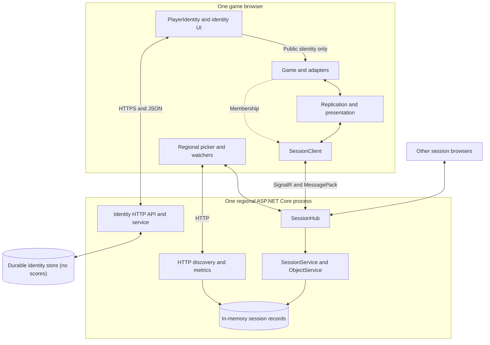
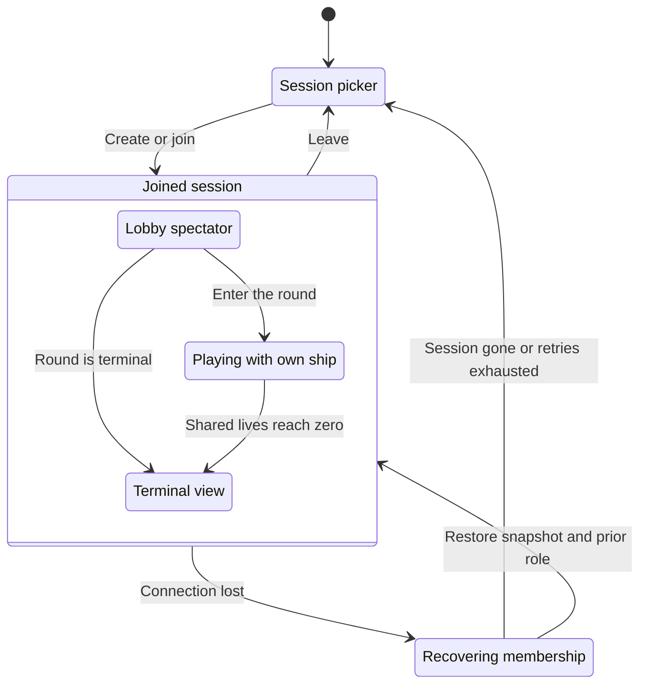
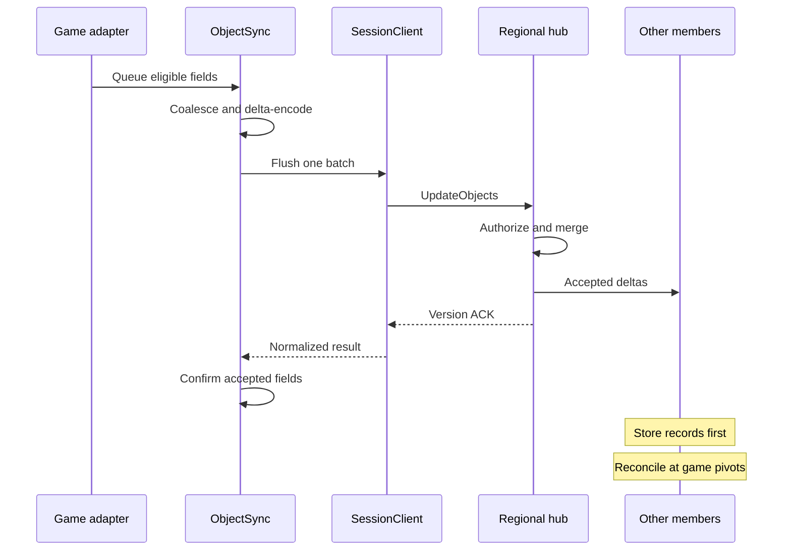
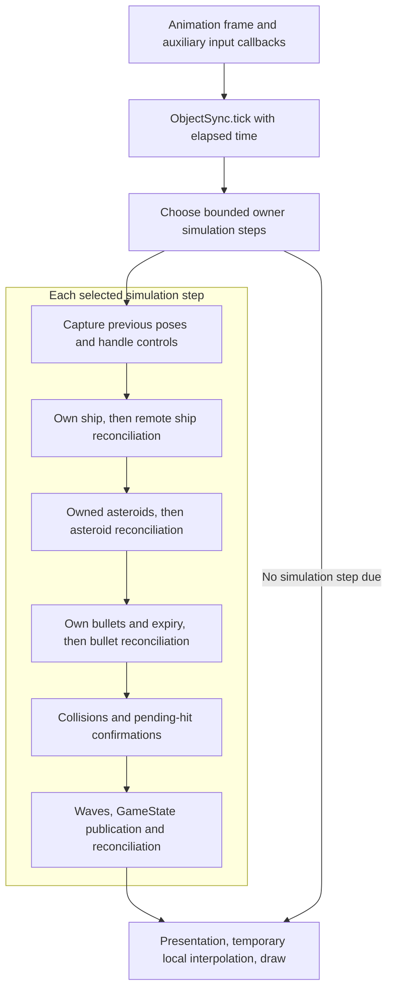
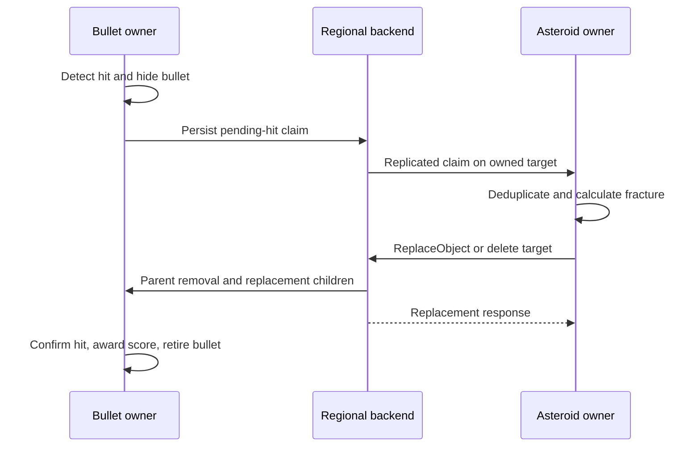
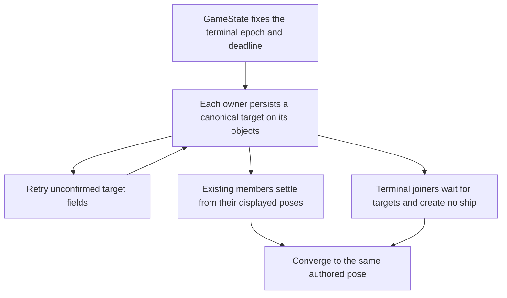
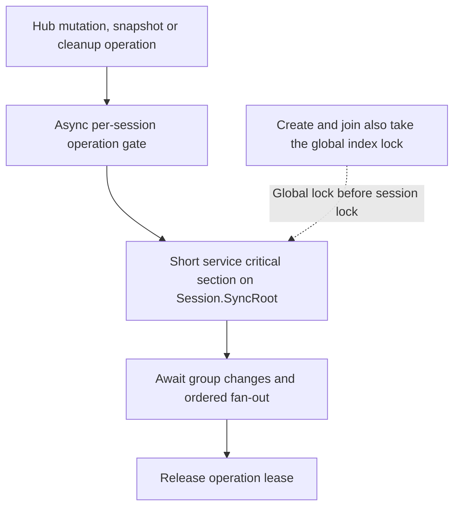
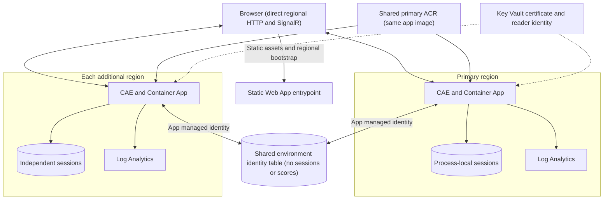
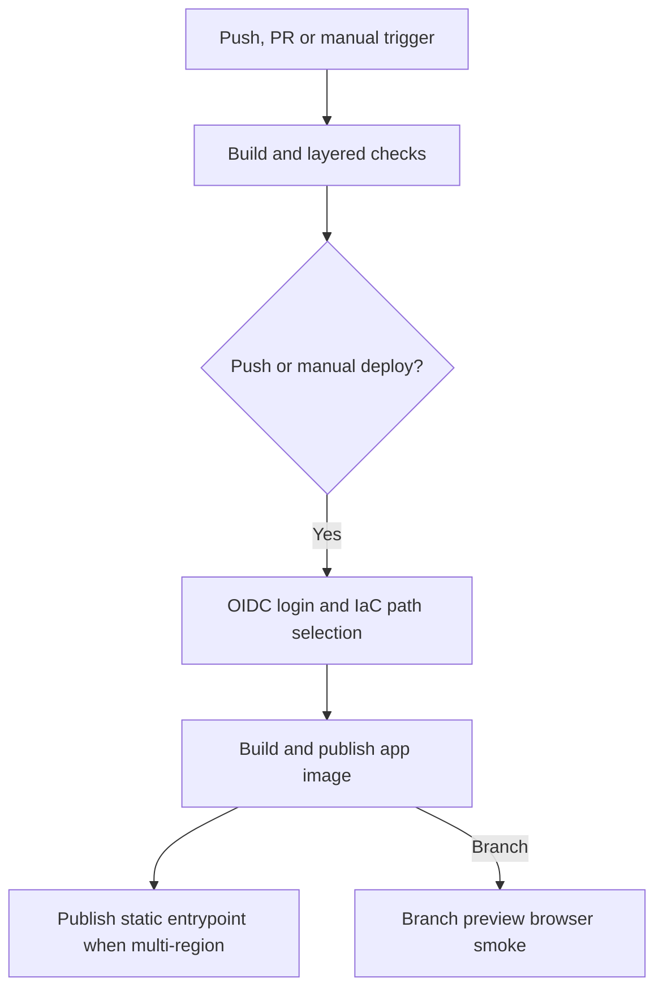

# Astervoids Architecture

Astervoids is an HTML5 Canvas game with an ASP.NET Core backend. Browsers own
gameplay simulation; a regional backend owns membership, object ownership checks,
and ordered shared records. A separate HTTP identity service persists player
identities, tags, invitations, and browser bindings, but not sessions or scores.
This document describes the implemented contracts, not an inventory of a
particular live Azure deployment.

**Read the overview for orientation, then the relevant contract before changing
code.** Diagrams explain relationships and execution order. The accompanying
prose defines the invariants. Source links point to the current checkout rather
than frozen line numbers. Setup commands live in [README.md](README.md), and
deployment procedures live in [CICD_SETUP.md](CICD_SETUP.md).

View the rendered document on GitHub or in a Markdown preview with Mermaid
support. Opening a raw `.md` file in a browser does not itself provide a Markdown
or Mermaid renderer. Without Mermaid support, the diagram source remains
readable and the contracts below still stand on their own.

## Contents

- [System overview](#system-overview)
- [Client architecture](#client-architecture)
- [Discovery and session lifecycle](#discovery-and-session-lifecycle)
- [Durable player identity](#durable-player-identity)
- [Replication contracts](#replication-contracts)
- [Timing, simulation and presentation](#timing-simulation-and-presentation)
- [Gameplay flows](#gameplay-flows)
- [Backend state and concurrency](#backend-state-and-concurrency)
- [Wire protocol](#wire-protocol)
- [Infrastructure and deployment](#infrastructure-and-deployment)
- [Diagnostics and static delivery](#diagnostics-and-static-delivery)
- [Change map and regression evidence](#change-map-and-regression-evidence)
- [Maintaining this document](#maintaining-this-document)

## System overview


```mermaid
flowchart TB
    subgraph Browser["One game browser"]
        Game["Game and adapters"]
        Replication["Replication and presentation"]
        Client["SessionClient"]
        Picker["Regional picker and watchers"]
        IdentityClient["PlayerIdentity and identity UI"]
        Game <--> Replication
        Replication <--> Client
        Game -.->|"Membership"| Client
        IdentityClient -->|"Public identity only"| Game
    end
    subgraph Backend["One regional ASP.NET Core process"]
        Hub["SessionHub"]
        Services["SessionService and ObjectService"]
        Records[("In-memory session records")]
        APIs["HTTP discovery and metrics"]
        IdentityAPI["Identity HTTP API and service"]
        Hub --> Services --> Records
        APIs --> Records
    end
    Identities[("Durable identity store (no scores)")]
    Client <-->|"SignalR and MessagePack"| Hub
    Others["Other session browsers"] <--> Hub
    Picker <--> Hub
    Picker <-->|"HTTP"| APIs
    IdentityClient <-->|"HTTPS and JSON"| IdentityAPI
    IdentityAPI <--> Identities
```

The browser's inline
[`wwwroot/index.html`](AstervoidsWeb/wwwroot/index.html) is the game composition
root: input, physics, collisions, waves, shared-life calculations, Canvas
rendering, HUD, picker, and procedural Web Audio. Classic-script modules provide
replication, presentation policies, transport, and regional discovery. There is
no frontend bundler, transpilation step, or third-party physics engine.

The backend in [`Program.cs`](AstervoidsWeb/Program.cs) hosts `/sessionHub`, HTTP
APIs, and static content. Its session and object services are process-local
singletons. The client communicates through the hub, not directly with peers.
SignalR uses MessagePack; WebSockets are the normal realtime transport, but the
client leaves transport negotiation to SignalR.

### Authority is not one role

| Authority or role | Responsibility | Does not imply |
| --- | --- | --- |
| Regional backend | Membership, ownership authorization, lifecycle, accepted mutation order, versions, snapshots | Server-computed physics, collision validation, or anti-cheat validation of scores |
| Object-owning browser | Simulation and game-specific decisions for that object | Authority over every object in the session |
| `Server` member role | First member, initial round start, deterministic successor promotion | Permanent ownership of GameState or all asteroids |
| GameState object owner | Shared score/life ledgers, wave progression, terminal state | That this member has the `Server` role or is actively playing |
| Identity service | Public player GUID/tag, browser bindings, invitations, atomic naming/rebinding | Server-authenticated score attribution, persistent gameplay, or an account/password system |

GameState ownership can migrate independently of the `Server` role, including
to a joined lobby spectator. Server-accepted gameplay data is owner-authored
data, not a backend-computed physical truth.

### Boundaries and non-guarantees

- A session belongs to one app process in one region. Discovery merges regional
  lists, not running game state. There is no distributed session backplane,
  gameplay database, or transparent cross-region session failover. Shared
  identity storage does not change that boundary.
- Process termination, deployment, or scale-to-zero can end sessions. Object
  records are durable across client recovery only while that session exists,
  not durable across server restarts.
- Fixed-step owner simulation is not peer lockstep or rollback. Receivers
  predict presentation, not authoritative collision outcomes.
- A successful transport reconnect is not restored membership. A local event
  callback is not a persistence acknowledgement. A failed mutation is not an
  automatically retried reliable message.
- Once identity onboarding resolves or the user explicitly chooses guest play,
  solo gameplay is local and does not wait for a session hub to start.

## Client architecture

### Responsibilities and state ownership

| Layer | Owns | Does not own |
| --- | --- | --- |
| Game and type adapters | Input, simulation, collisions, serialization, local authority, entity collections, UI/audio | Hub internals, sequencing, generic reconciliation |
| `ReplicationRuntime` | Consumed versions, one-shot join markers, role bindings, migration transitions | A frame loop, outbound mutations, game-data interpretation |
| Replication policies | Clock estimates, interpolation/dead reckoning, send eligibility | Transport, entity collections, frame scheduling |
| `ObjectSync` | Canonical records, type index, versions, deltas, batching, sequencing, reconciliation | Concrete game entities and physics rules |
| `SessionClient` | Joined-session connection, identity/epochs, RPC lifecycle, GUID/handle translation | Replica collections or presentation |
| `SpectatorClient` | Separate sessionless regional picker connections | Joined-session gameplay, membership, or object synchronization |
| `PlayerIdentity` | Identity HTTP, origin-local browser credential, binding validation and retry state | Game/session authority, score storage, consent/naming/clipboard UI |

The canonical record in ObjectSync, an authoritative local entity, a remote game
instance, and its presentation state are deliberately distinct. Runtime
reconciliation coordinates them without creating another generic object store.

Sources: [ReplicationRuntime](AstervoidsWeb/wwwroot/js/replication-runtime.js),
[ObjectSync](AstervoidsWeb/wwwroot/js/object-sync.js),
[SessionClient](AstervoidsWeb/wwwroot/js/session-client.js),
[SpectatorClient](AstervoidsWeb/wwwroot/js/spectator-client.js),
[PlayerIdentity](AstervoidsWeb/wwwroot/js/player-identity.js).

### Dependency invariants

- **SessionClient owns the joined-session hub connection.** Gameplay code never
  constructs a `signalR.HubConnection`. SpectatorClient is the deliberate
  exception for independent, read-only regional discovery connections.
- **ObjectSync is the game-facing object transport boundary.** Gameplay never
  directly calls SessionClient's object create/update/delete/replace/snapshot
  wrappers. It also never manages `memberSequence`, delta baselines, or sequence
  gap recovery itself.
- **Serialization has one seam.** Entity `toSyncData`, `toUpdateData`, and
  `fromSyncData` methods and game schema selection remain authoritative.
  Descriptors must not duplicate those mappings.
- **ReplicationRuntime is pull-driven.** It never schedules frames, calls
  `ObjectSync.tick`, sends a mutation, or subscribes to SignalR. The game calls
  `reconcileType` at its collision-visible pivots.
- **Generic layers do not interpret gameplay payloads.** Adapters classify
  records and implement entity create/apply/adopt/remove behavior. Prediction,
  controls, wrapping, and clocks enter reusable policies through explicit
  contracts and injection.
- **Send eligibility and flushing remain separate.** Send policies return
  `{ send, immediate, reason }`; the game serializes/enqueues, and ObjectSync
  decides when bytes can leave. There is no combined authority publisher.
- **One foreground animation driver.** `gameLoop` is the only self-scheduling
  `requestAnimationFrame` callback. Auxiliary work registers with
  `addFrameCallback`, runs before transport/simulation, and is isolated so a
  throwing callback cannot stall the loop.

Only SessionClient calls `GuidUtils.transformBinaryGuids` for transport events
and RPC responses. Typed GUID arguments use binary GUID encoding; string-typed
owner overrides, reconnect tokens, and opaque payload bytes remain unchanged.
Game callers keep readable IDs. Shared full-object decoding serves create,
replace, join, and resync paths; sparse updates retain their separate shape.

### Replica lifecycle contract

A runtime record includes identity, type/data, creator, owner, scope, version,
`validAt`, and optional migration metadata. Its adapter classifies it as
`owned`, `replica`, or `ignore`.

- `beginSession({ epoch, snapshotObjectIds })` scopes work and installs
  one-shot join markers. The first applicable ingest or owned adoption consumes
  a marker.
- Equal consumed versions continue sampling existing presentation without
  ingesting a second anchor.
- A metadata-only ownership version advances consumption without re-anchoring
  an existing replica. The first later data-bearing version receives the
  `preserveDirection` transition fact.
- Ownership gain adopts the currently displayed instance where applicable.
  It does not rewind an asteroid to a stale stored pose.
- Delete, ownership gain, ignored role, missing type, and reset have explicit
  removal reasons so adapters can suppress inappropriate cosmetic effects.
- Stale-epoch reconciliation, deletion, migration, and reset work is rejected.

ObjectSync's type index avoids scanning every object for each type query.
`getObjectsByTypeSnapshot` transfers a membership array, not deep-cloned
records. Runtime passes preserve callback-mutation safety and canonical record
identity; generic stores that expose only an iterable are snapshotted defensively.

### Portability boundary

JavaScript callbacks, Maps, DOM APIs, and object identity are implementation
details, not the protocol-neutral contract. A future native client must reproduce
record/version/epoch rules, role transitions, removal reasons, explicit clock
domains, bounded prediction kernels, and send decisions independent of its
transport scheduler.

Use the existing JS/C# codec fixtures and policy/runtime vectors as the starting
point. Hidden reads of `performance.now()` must not enter portable kernels.
Packaging, code generation, a full ECS, distributed authority, and another
session/reconnect coordinator remain deferred until a second client needs them.

## Discovery and session lifecycle

### Regional discovery

[RegionService](AstervoidsWeb/wwwroot/js/region-service.js) prefers injected
`region-bootstrap.js` configuration on the static entrypoint, otherwise
`GET /api/regions`. An empty manifest synthesizes the same-origin region.
Picker-facing names come from deployment configuration, never hardcoded labels.

The picker measures regional `/api/ping` RTT in bursts, excludes warm-up and
initial cold-start contamination, and exposes an EMA and assessment confidence.
Best-region selection uses hysteresis. Stable successful bursts back off;
failure, meaningful latency change, visibility, and network changes cause
reassessment. Create waits for a usable assessed route; join always follows the
chosen session's `regionId`, not whichever region currently has the lowest RTT.

[MultiRegionSessions](AstervoidsWeb/wwwroot/js/multi-region-sessions.js) merges
fresh `/api/sessions` slices. Refreshes are single-flight per region, with one
coalesced follow-up for hints received in flight. A failed region loses its stale
slice without blocking healthy regions. Push hints coalesce for 250 ms; a
30-second visible-picker poll is the fallback.

SpectatorClient opens read-only hub connections to other regions, excluding the
active SessionClient host. `OnSessionsChanged` is only a refetch hint; watchers
never invoke a session join or take a member slot. Active-connection hints refresh
only that connection's region. Explicit refreshes can cover every region.

### Two meanings of spectator

| Kind | Membership | Lifetime |
| --- | --- | --- |
| Regional picker watcher | No session membership, no game slot | Picker visibility only |
| Joined lobby spectator | A real member, counts toward capacity, can inherit session-scoped objects | Joined session, even before creating a ship |

Entering gameplay closes extra regional watchers and stops picker assessment.
A hidden picker stops probes, polling, and watchers so it does not intentionally
keep every region warm. Delayed bootstrap or fetch completions cannot restart
picker work after teardown. Returning to the picker restarts assessment.
The joined game's clock and hidden-tab simulation have a separate lifecycle.

### Entry and recovery


```mermaid
stateDiagram-v2
    state "Session picker" as Picker
    state "Joined session" as JoinedSession
    state "Recovering membership" as Recovering
    state JoinedSession {
        state "Lobby spectator" as Spectator
        state "Playing with own ship" as Playing
        state "Terminal view" as TerminalView
        Spectator --> Playing: Enter the round
        Spectator --> TerminalView: Round is terminal
        Playing --> TerminalView: Shared lives reach zero
    }
    [*] --> Picker
    Picker --> JoinedSession: Create or join
    JoinedSession --> Recovering: Connection lost
    Recovering --> JoinedSession: Restore snapshot and prior role
    Recovering --> Picker: Session gone or retries exhausted
    JoinedSession --> Picker: Leave
```

Initial entry is through the lobby. Recovery restores the prior player or
spectator role, unless the recovered round is terminal, in which case entry is
view-only. Any joined role can disconnect or leave.

SessionClient serializes session transitions and fences asynchronous work with
connection identity and session epochs. Create and join have distinct RPCs and
snapshots. Membership and object broadcasts can overtake their response, so
SessionClient queues raw arguments together until the response installs the
creator's schema registry. Before installing it, SessionClient calls the
game-injected synchronous metadata validator. Astervoids requires the exact
current definitions of schemas 1–4; older, missing, reordered-field, or extended
layouts fail through the entry error/`onError` path, not a reduced-feature game.
An accepted but rejected entry releases its allocated membership with
`LeaveSession`; an ambiguous cleanup closes that connection. Epoch guards prevent
an obsolete rejection from clearing a newer entry.
Snapshot decoding first teaches GUID/handle mappings;
shared entry completion then installs member and public participant identity,
seeds snapshot objects, and replays queued handlers and callbacks in receive order.

Snapshot seeds use ordinary object registration with a null sender, sequence
zero, and the snapshot object's `validAt`. Ownership migrations therefore see
the snapshot owner before a later delta advances its version. Final
`onSessionCreated`/`onSessionJoined` callbacks run **after** replay;
ObjectSync's version-aware backfill preserves newer data/owners and deletion
tombstones rather than overwriting them with the older snapshot.

The queue belongs to one connection/session epoch and entry RPC. Failed,
cancelled, rejected, expired, or superseded entry discards it; callback-triggered
resets stop seeding/replay immediately. Invalid queued payloads fail entry through
the logged error/`onError` path and invalidate already replayed state, not just
the remaining queue. Session-list signals and expiration are not deferred.

The hub entry contracts are distinct:

| Operation | Contract |
| --- | --- |
| `CreateSession(metadata)` | Creates a session and its first `Server` member |
| `JoinSession(sessionId)` | Joins without permission to evict an existing member |
| `RejoinSession(sessionId, staleMemberId, reconnectToken)` | Proves authority over a stale identity before eviction/re-registration |
| `LeaveSession()` | Leaves through the atomic departure path |

The public client `joinSession(sessionId)` chooses join or proven rejoin from
its retained reconnect identity. A caller-supplied member ID alone is not a
rejoin credential. Reconnect tokens are returned to their caller, not published
in member lists. Exact signatures and response fields live in
[SessionHub](AstervoidsWeb/Hubs/SessionHub.cs) and
[HubDtos](AstervoidsWeb/Hubs/HubDtos.cs).

### Reconnect is not rejoin

Transport reconnect emits
`onSessionStateUncertain(reason, epoch)` before `onConnected`. ObjectSync
subscribes and starts epoch-guarded reconciliation without delaying the
transport-ready callback. SessionClient does not depend on a global ObjectSync.

Unfreezing waits for `onReconciliationComplete` or completed full session entry,
not merely `onConnected`.

If `GetSessionState` no longer recognizes the member, `onReconciliationFailed`
drives game-owned auto-rejoin. An ambiguous leave failure also reports uncertain
state while retaining recoverable identity. Voluntary leave establishes its
synchronous guard before asynchronous cleanup so it cannot trigger unwanted
rejoin.

The full rejoin path freezes gameplay, neutralizes controls/audio, and restores
the same region. It suspends reconciliation with a counter, resets old game state
before the new snapshot is installed, replaces obsolete connections with bounded
stop waits, and resumes reconciliation on completion. Hidden tabs defer full
rejoin until visible. A long background interval can force rejoin even if a
connection appeared healthy.

Recovery requests also defer during browser identity verification. They remain
pending even when the transport is connected, and resume once the latest queued
identity refresh succeeds and the tab is visible. A connected transport without
membership also requires rejoin. Starting recovery consumes the pending request;
voluntary leave, changed identity, or failed verification discards it rather than
resurrecting an abandoned session.

Rejoin can assign a new member ID and recreate member-scoped objects. A resolved
public player identity is pinned before snapshot callbacks and remains fixed
for that membership. Guests use the bounded per-tab, per-session participant
mapping that survives reload/rejoin. Guest mode is a current product option,
not an older-schema fallback. Neither participant identity is the reconnect
credential.

Restore the role the client actually held, based on whether it owned a ship.
A lobby spectator can read `playing` from GameState without being a player.
Using that state alone would incorrectly mint a ship on recovery.
Entry/reentry adopts shared lives and watched state from the canonical GameState
record: a spectator may already have consumed its current version, so waiting
for another replica ingest would leave reset defaults visible.

## Durable player identity

### Identity, browser binding, and invitation

[PlayerIdentity](AstervoidsWeb/wwwroot/js/player-identity.js) owns the identity
HTTP/storage boundary; inline `index.html` owns consent, naming, invitation
sharing, and gameplay gating. Identity is independent of a session member, ship,
or GameState record.

| Value | Meaning and lifetime |
| --- | --- |
| Public identity | Backend-generated GUID and immutable, case-preserved ASCII letters/digits/`_`/`-` tag, with length bounded by shared configuration; tags are not globally unique |
| Browser credential | Random 256-bit bearer capability in `localStorage`, scoped to one top-level origin and browser profile/storage context |
| Browser binding | One credential-hash row pointing to zero or one public identity, with an ETag and monotonic revision |
| Invitation | Random 256-bit base64url capability; identifies a pending player until first naming, then remains that identity's access/recovery link |
| Session participant | Public identity pinned for the membership, or the session-local guest identity; not an authentication proof |

`identityTagMaxLength` in
[`shared-config.json`](AstervoidsWeb/wwwroot/shared-config.json) is the single
cross-stack length setting. C# embeds that file and validates it at startup;
MSBuild and static-apex packaging generate `js/shared-config-data.js` from the
same source. Node consumers read the JSON directly. `AstervoidsConfig` derives
the tag pattern, native input constraints, and UI text; the identity client and
game-specific codec reuse those bounds. The generated script loads before the
configuration module, without moving the early invitation-fragment capture or
adding a runtime configuration API call.

The configured maximum must be a positive integer representable by the existing
one-byte tag-length field. Invalid or missing settings fail explicitly, with no
independent client/server default. This public, build-shared contract is not a
per-browser debug override or per-region setting; rebuild and deploy both assets
and backend when changing it, and account for stored names before lowering it.

An identity can have any number of independent browser bindings, not a growing
binding array. Self invitations return the original capability. Possession of
an active link authorizes assuming that identity; the confirmation dialog is not
a second authentication factor. The current protocol has no automatic invitation
expiry or rotation. Changing origin or clearing storage requires link recovery;
identity storage is not a persistent high-score service.

Credential creation and requests use Web Locks. Unavailable storage/locking does
not silently mint a temporary per-tab credential. Known bindings activate without
a naming prompt. `Identity:PromptOnRoot=true` prompts unbound root visitors;
false leaves them anonymous, while invitation controls still permit explicit
naming. Same-identity invitations return silently to `/`; different identities
require Accept/Ignore, and first naming fixes the permanent tag.

The menu pairs Self and Friend invitation actions in a single utility row.
Fullscreen leads the device group; hiding it leaves no empty button slot.
Controller mode and difficulty share the next equal-width row in that group,
using joystick/target labels with a colon. Each click or tap advances one mode
or preset and wraps around. Controller mode alternates Polar and Boxy; Boxy
is the display name for rectilinear controls. Difficulty cycles Shifter (0.2),
Dancer (0.35), Raver (0.5), and Survivor (0.65, the default). It updates solo/new-session
configuration and existing asteroid scales through the same path as live debug tuning.
The selector shows the shared difficulty read-only while joined and is also
disabled during membership changes. Leaving restores the page's local choice;
controller mode stays independently selectable. Neither adds reload persistence.
Existing URL/debug factors outside the presets remain intact and display
`Custom`, with the numeric factor in the accessible label and tooltip; the next
enabled click selects Shifter. The wider debug tuning range is unchanged.
The session list shrinks to the space left by fixed-size menu controls and
scrolls independently, with long names ellipsized instead of widening landscape
columns. Its minimum row height shares the button-height variable. Visible menu
content retains native touch scrolling, including the outer menu on very short
screens, without acquiring gameplay touch controls. A layout observer recomputes
only the list's height budget as viewport and menu content sizes change.
Identity resolution first shows a wait-only dialog explaining player-identity
determination and service warm-up. Its heading receives focus; guest, invitation,
and submit actions are hidden while resolution is pending. Existing verified-binding,
naming, confirmation, and failure-recovery paths then continue normally.
Other identity dialogs keep their heading and actions visible while longer content
scrolls inside the dialog. Narrow screens stack equally sized actions without
scaling text; native input hints and privacy/error text are associated with their
fields. Self and friend sharing have distinct titles and retain the private-link
warning in both clipboard-success and manual-copy paths.

### HTTP and consistency contract

The API authority is the regional app's own origin, or the first configured
region in the static entrypoint's bootstrap manifest. URL parameters cannot
select an identity authority. All identity operations are JSON POSTs under
`/api/identity`: `resolve`, `root`, `invites`, `invites/accept`, and `invites/self`.
The browser sends its credential only in `X-Astervoids-Browser`; requests omit
cookies, disable caching/referrers, and reject redirects.

On the static entrypoint, a single credential-free `/api/ping` request prepares
the configured identity region as soon as its bootstrap loads, before the game
scripts. It neither creates a browser credential nor resolves or trusts a
binding, and normal identity verification does not wait for it. Regional pages
skip this extra request because their app is already serving the page. Failed
preparation reports a constant diagnostic; verification still uses its normal
error handling.

Identity CORS preflight permissions can be cached for ten minutes; identity
responses remain `no-store`, and every actual request still validates its origin
and browser credential. These optimizations overlap startup with page loading
and avoid repeated permission round trips, not container startup or first
storage-access costs. There is no periodic warm-up or keep-alive mechanism;
idle containers retain scale-to-zero.

Invitations use the current site's origin and `#invite=...`. The early-loaded
identity script captures and scrubs the fragment before normal startup.
Accepted or ignored invitations navigate to `/`. Neither capabilities nor
private deployment hostnames enter game payloads, SignalR URLs, public logs, or
committed configuration.

Consent captures expected browser identity/binding ETag and invitation ETag.
Competing first claims or rebindings conflict, re-resolve, and require a new
decision. Mutations carry request IDs with body-bound idempotent receipts;
an uncertain response retains the exact pending request for retry. Cancellation
is not rollback, and a receipt superseded by a newer binding cannot restore the
old one. Public ETags/revisions describe browser decisions; native storage ETags
separately enforce compare-and-swap transactions.

Foreground/focus and storage notifications re-resolve bindings. Requests
coalesce without losing a refresh received while another action is pending.
Queued refreshes keep recovery paused until the newest verification completes.
Create and Join clicks received during a binding refresh remain
pending until its latest queued refresh completes. Entry rechecks verification
after regional handoff and before applying the returned membership. Picker
refreshes cannot re-enable entry controls or submit a duplicate while that
operation is pending. Completing entry restores controls and reports failures
without awaiting unrelated regional watcher startup. Cancellation releases busy
controls before transport cleanup finishes and never replays the discarded click.
During verification/rebinding, `game.identityChanging` pauses foreground and
hidden gameplay. A changed or unverifiable identity cancels pending picker
entry/rejoin, invalidates membership, releases controls/audio, and returns to
the menu before new play. Verification failure requires Retry or explicit guest
play, never continued publication under an unverified old binding.

### Backend storage and HTTP isolation

[PlayerIdentityService](AstervoidsWeb/Identity/PlayerIdentityService.cs) uses
[IIdentityStore](AstervoidsWeb/Identity/IdentityStore.cs) independently of session
locks and the session operation coordinator. Rows share one transaction partition:
`I:` identity, `V:` invitation-hash lookup, `B:` browser-hash binding, and `O:`
request receipt. First naming, binding replacement, and their receipt commit
atomically. Identity rows retain the original invitation capability for self
recovery; friend-creation receipts retain the private response for exact retries.
The backend stores the browser bearer credential only as a hash.

- Development uses [FileIdentityStore](AstervoidsWeb/Identity/FileIdentityStore.cs):
  a stable exclusive lock and same-directory atomic file replacement. Corrupt
  storage is unavailable, never silently reset. File storage outside development
  requires explicit opt-in and is not the Azure deployment path.
- Azure uses [AzureTableIdentityStore](AstervoidsWeb/Identity/AzureTableIdentityStore.cs)
  with `DefaultAzureCredential`, preprovisioned tables, and native conditional
  transactions. Missing tables, permission failures, and outages do not fall
  back to files or memory. Regional apps share the environment's primary
  endpoint, not independent writable replicas.

[IdentityEndpoints](AstervoidsWeb/Identity/IdentityEndpoints.cs) and
[IdentityHosting](AstervoidsWeb/Identity/IdentityHosting.cs) bound bodies and JSON
shape, validate supplied origins exactly, and isolate identity CORS from the
permissive unconfigured regional fallback. Root/invite/accept mutations have
per-instance browser-hash and connection-IP rate limits with `Retry-After`.
Responses, including failures, are uncompressed and `no-store`; error responses
and SDK diagnostics must not expose capabilities or storage details. Identity
availability is separate from `/api/ping` and app startup readiness.

## Replication contracts

### Mutation pipeline


```mermaid
sequenceDiagram
    participant Game as Game adapter
    participant OS as ObjectSync
    participant SC as SessionClient
    participant Hub as Regional hub
    participant Peers as Other members
    Game->>OS: Queue eligible fields
    OS->>OS: Coalesce and delta-encode
    OS->>SC: Flush one batch
    SC->>Hub: UpdateObjects
    Hub->>Hub: Authorize and merge
    Hub->>Peers: Accepted deltas
    Hub-->>SC: Version ACK
    SC-->>OS: Normalized result
    OS->>OS: Confirm accepted fields
    Note over Peers: Store records first
    Note over Peers: Reconcile at game pivots
```

The backend merges owner-authorized patches into current records in request
order. Disjoint fields accumulate; the last accepted write to a field wins.
There is **no expected-version/CAS input precondition**. Server-assigned versions
order replicas and acknowledgements; they are not optimistic-concurrency tokens
submitted with a patch.

Broadcasts normally target `OthersInGroup`; the sender uses its RPC response.
Do not assume network arrival order between the response and broadcasts.
Wire layouts are defined once in [Wire protocol](#wire-protocol), not in every
sequence diagram.

### Mutation and failure semantics

| Operation | Local behavior and confirmation | Failure/race obligation |
| --- | --- | --- |
| Create | Response-first, server assigns ID/handle/version | If no longer needed when the response arrives, clean up the created orphan |
| Update | Local canonical write plus coalesced outbound fields | Only accepted response versions advance the confirmed delta baseline |
| Delete | Local-first, remove pending updates and track `pendingDeletes` | A racing snapshot must not resurrect an in-flight local delete |
| Replace | Atomic backend parent removal and child creation, response-first installation | Apply sender response through the same epoch-guarded path as broadcasts |
| Object event | Immediate local dispatch, then owner-authorized relay | No persistence, replay, or recovery of the occurrence itself |

Replacement installs the children and removes the parent before lifecycle
callbacks. Late replies must not rewind newer updates, migrations, tombstones,
or reconciled children. An invocation failure may occur after backend commit;
ambiguous replacement failure requests reconciliation rather than retaining a
ghost parent. A valid empty replacement list intentionally deletes the parent.

On member departure, the game first captures ship calculation inputs, then applies
`ObjectSync.handleOwnershipMigration(info.migratedObjects)` and
`handleMemberDeparture(info.deletedObjectIds)` before deciding who now owns
GameState. The new owner adopts canonical GameState and calculates from the
pre-cleanup ships so departed participants and their last accepted score counters
are not lost. Use the server's new versions, not blind local increments.

### Delta baselines and retries

ObjectSync retains the latest queued value per field and compares it to
server-confirmed `lastSentData`. Ordinary values retain shallow comparison
semantics; nested mutable values require appropriate replacement references.
Byte arrays compare by content and are copied when capturing sent baselines.
Repacking an unchanged counter map must not force another update.

**A failed flush does not automatically requeue its sent entries.** The
confirmed baseline remains old, so unconfirmed fields are included when a
producer next enqueues that object. Critical pending-hit claims, ship scores, and
terminal targets explicitly retry until confirmed. This distinction matters when a
send-on-change producer otherwise has nothing new to send.

The periodic full-data bypass is counted in delta-enabled flushes, not render
frames. It is not an independent timer or a blanket retransmission service.
`isDataConfirmed` checks confirmed fields, not optimistic local state.

Field aliasing applies after delta selection only to schema-0 map payloads and
object events. Positional schemas select slots using readable names and transmit
no field names; applying `fieldMap` there would erase matching fields.

### Sequencing and snapshot recovery

Each member's accepted operations carry a sequence. A gap from another member
requests `GetSessionState`; own-member gaps are not treated the same way because
response and broadcast channels can race. The snapshot includes members,
objects, member sequences, and individual object `validAt` values.

Reconciliation adds missing records, updates older versions, removes ghosts,
and resets sequence knowledge without undoing newer work received during the
snapshot round trip. Session epochs, per-object revisions, pending deletes, and
parked ownership migrations guard that merge.

Delete tombstones and migrations parked for not-yet-registered IDs stay separate
from the live object map. Do not collapse them into a single collection.
Unknown-handle updates are parked at the transport boundary until identity
metadata arrives; they cannot invent a full object from an integer handle.

### Durable records and transient events

Object records are the client recovery contract. Object events are notifications,
not an event log. Sequence-gap recovery can restore a record, but cannot recreate
an occurrence that left no durable state.

State that must survive reconnect or late join belongs in adapter serialization.
Use events where a missed occurrence is acceptable, or pair an event with
recoverable record state. New fields still require a schema/default strategy and
JS/C# compatibility coverage; a new event is not a shortcut around that review.

Ship score/hit notifications and same-owner impact cues use the transient channel.
Rare ship score changes also persist through `syncLocalShipScore`, outside the
motion send gate; ordinary hit-count notifications remain event-only. Shared
totals and history become recoverable when the GameState owner publishes the
corresponding ledgers. Local event dispatch is neither durable score storage
nor a backend acknowledgement.

## Timing, simulation and presentation

Sources: [game loop and adapters](AstervoidsWeb/wwwroot/index.html),
[clock](AstervoidsWeb/wwwroot/js/replication-clock.js),
[send policies](AstervoidsWeb/wwwroot/js/replication-send-policy.js),
[presentation policies](AstervoidsWeb/wwwroot/js/replication-presentation.js),
[shared configuration](AstervoidsWeb/wwwroot/js/game-config.js).

### Foreground execution order


```mermaid
flowchart TB
    Frame["Animation frame and auxiliary input callbacks"]
    Tick["ObjectSync.tick with elapsed time"]
    Policy["Choose bounded owner simulation steps"]
    subgraph Step["Each selected simulation step"]
        Input["Capture previous poses and handle controls"]
        Ship["Own ship, then remote ship reconciliation"]
        Asteroid["Owned asteroids, then asteroid reconciliation"]
        Bullet["Own bullets and expiry, then bullet reconciliation"]
        Collision["Collisions and pending-hit confirmations"]
        State["Waves, GameState publication and reconciliation"]
        Input --> Ship --> Asteroid --> Bullet --> Collision --> State
    end
    Render["Presentation, temporary local interpolation, draw"]
    Frame --> Tick --> Policy --> Input
    State --> Render
    Policy -->|"No simulation step due"| Render
```

The selected step body may run repeatedly before one render. Outbound tick comes
first, so it may flush state queued by an earlier simulation step. There is no
private ObjectSync timer or independent ReplicationRuntime loop.
Receive pivots are gameplay-visible: moving remote reconciliation across a
collision check changes the state that check observes.
Identity verification/rebinding temporarily bypasses this foreground path and
the hidden interval; it does not introduce another simulation clock.

The default deterministic policy runs nominal 60 Hz owner steps, at most five
per foreground frame, with elapsed accumulation capped at 250 ms. Excess backlog
is dropped rather than replayed as a catch-up burst. Buffered mode instead uses
one variable-dt step bounded to three nominal ticks.

### Hidden multiplayer is a distinct path

When the foreground animation loop is suspended, a separate interval pumps
transport and advances owned objects with bounded dt. Browser throttling can
reduce it to roughly one callback per second; this is not wall-clock catch-up
or the deterministic foreground accumulator.

The hidden order preserves asteroid and bullet reconciliation **before**
collision handling and ship reconciliation **after** it. Terminal maintenance
continues after gameplay stops. Returning after more than five seconds hidden
can require full rejoin. Do not combine foreground and background orchestration
merely because they share individual update helpers.

### Coordinates, units and integration

| Quantity | Domain |
| --- | --- |
| Position `x/y` | Normalized gameplay viewport |
| Radius, size, linear velocity | Isotropic reference based on `min(viewport width, height)` |
| Linear velocity | Reference dimensions per second |
| Angular velocity and gameplay timers | Nominal 60 Hz ticks |
| Local scheduling and presentation | Monotonic milliseconds |
| `validAt` and terminal epochs | Server UTC milliseconds, explicitly converted when sampled locally |

The session fixes aspect ratio and aspect compensation inputs at creation.
Clients letterbox/pillarbox rather than changing the simulation's space.
Wrapping waits for the whole object bound to exit; asteroid margins use its true
vertex bound, not its area-equivalent radius.

Owner integration is game-specific:

- Ships apply turn/angular motion, `0.99^dt` friction, thrust, speed cap,
  braking, translation/wrap, and timer updates. Braking does not reverse motion.
  Turn ramp defaults currently make control changes immediate.
- Normal bullets use muzzle-direction velocity **without adding ship velocity**,
  wrap, and expire on their simulation lifetime. A crash-generated hidden bullet
  is different: it carries the ship's contact velocity.
- Asteroids move ballistically and spin. Owners enforce motion caps before
  simulation and serialization, including replacement creation.

Defaults and tunable bounds belong to the owning `CONFIG` and
`GameConfig.DEFAULTS`, not a second exhaustive constants catalog here.
Session metadata locks mode, seed, schemas, and selected gameplay configuration;
local URL/debug overrides must not override those shared invariants.

### Send eligibility, cadence and backpressure

Ship-intent and ballistic policies decide whether a state is worth sending.
Control edges can request an immediate flush; stationary objects still receive
heartbeat eligibility. Neither implies an immediate network packet.

ObjectSync coalesces fields and allows **one update invocation in flight**.
Elapsed eligibility and urgency remain pending under backpressure. Completion
does not create a catch-up burst; a subsequent eligible tick services the queue.
Elapsed eligibility remains latched if the adaptive interval increases.
Legacy `minFrameTime` remains accepted/validated but does not invent elapsed time.

The requested send interval is RTT-adaptive, currently bounded from 50 to
1,000 ms. Actual tick-bound opportunities are:

```text
achievable interval = ceil(requested interval / tick spacing) * tick spacing
```

The accumulator caps at one interval and resets to zero without carrying surplus
time. Empty queues or an in-flight invocation can make traffic sparser still.

`senderSendIntervalMs` advertises achievable cadence, not the requested interval.
It is derived on read from smoothed tick spacing, with stall/clamp protection;
it is never written back into the adaptive request. `getSendRate()` reports the
request, whereas `getEffectiveSendIntervalMs()` and debug telemetry report the
claim. An exaggerated rate would make receivers reject genuine packet intervals
as outliers and under-buffer that owner's objects.

### Heartbeats and invulnerability

The 250 ms heartbeat grid is anchored to each document's **local monotonic**
clock. Quantized deadlines bring objects on one sender onto shared flushes,
without synchronizing every browser's network bursts. A shared server/wall-clock
grid would correlate ingress/fan-out, and wall-clock slewing would move deadlines.

Grid alignment can make the next heartbeat earlier, never later than an
unaligned deadline; steady-state cadence remains unchanged. The period must not
be made per-device or derived from measured FPS. Send policies still read an
injected clock and leave frame scheduling to ObjectSync.

Ship invulnerability is authoritative in simulation ticks. Reset/respawn and
expiry advance `invulnerabilityRevision`; ordinary countdown ticks do not.
The revision is the send gate's transition key, while `invulnerableAt` captures
server time for receiver countdown/blink presentation. Before clock bootstrap,
receivers use receipt time; zero authored time falls back to record `validAt`.

Explicit revisions distinguish respawn teleports from heartbeat corrections,
including repeated resets to the same duration. Heartbeat captures re-anchor
simulation-versus-wall-time drift without publishing every countdown tick.
These meanings stay in the ship adapter/schema, not in generic replication.

### Clocks and validAt

ReplicationClock estimates server time with minimum-RTT samples, bootstrap
bursts, rejection/smoothing, periodic refresh, and visibility refresh.
Minimum-RTT selection reduces queue bias, not persistent path asymmetry.
Projection callers must gate uninitialized clocks and bound elapsed time.

The explicit conversion is:

```text
offsetMs = estimated server UTC - local wall time
wallToPerfDelta = performance.now() - Date.now()
local presentation time = validAt - offsetMs + wallToPerfDelta
```

Owner create, update, replace, and event calls can supply `clientValidAt`.
Updates sample it **at flush**, after coalescing; it is not the exact simulation
timestamp of every pose. Values within 2 seconds of server receive time are
accepted. Missing/out-of-range values fall back to receive time, then previous
accepted time establishes a monotonic floor. This is validation/fallback, not
clipping an invalid value to the nearest edge of a time window.

An accepted update batch shares the newest relevant prior `ValidAt` as its
floor, and the broadcast carries one resolved anchor. Join/resync snapshots
instead carry individual object times. The backend policy is defined in
[ValidAtPolicy](AstervoidsWeb/Services/ValidAtPolicy.cs) and
[ObjectService](AstervoidsWeb/Services/ObjectService.cs).

### Deterministic and buffered presentation

These are alternatives, not two sequential interpolation layers.

| Policy | Anchors and sampling | Bounds and corrections |
| --- | --- | --- |
| Deterministic | Live updates normally anchor on receiver ingest time; replay owner controls and ballistic motion | Prediction capped at 30 nominal ticks, ordinary correction smoothing about 90 ms, explicit teleport/large-error handling |
| Buffered | Up to six snapshots on the validated `validAt` axis; sample behind current time using per-owner delay | Wrap-aware Hermite position/angle interpolation, clamping before oldest, extrapolation after newest capped by `MAX_EXTRAPOLATION` (currently 2 seconds) |

Deterministic mode uses fixed-step owner simulation and seeded owner-side
decisions, not shared lockstep. Receivers do not repeat other owners' random
spawn/fracture decisions. Join age can be projected within bounds, but ordinary
live motion is not blindly advanced through estimated network transit.

Target-heading touch controls replay toward the transmitted heading without
turning past it. Rate controls replay through a horizon based on heartbeat,
advertised/observed packet cadence, and jitter, then taper angular input within
the global prediction bound. Immediate start/stop/reversal edges still request
urgency; shortest-angle correction absorbs residual error.

Buffered delay is independent per owner. Valid arrival-lag and packet-interval
samples feed a target based on mean lag, lag variation, and interval variation,
with a nominal-frame floor and smoothing. Warm-up uses advertised/observed
cadence until enough samples exist. Intervals wider than twice the advertised
cadence are excluded as likely idle/delta-suppression gaps. Initial delay is
about 33 ms, not an assertion that every link has that latency.

Hermite tangents convert reference-space velocity and tick-based angular speed
to the sampling axis. Position and angle interpolation respect wrapping;
large-error guards can snap. Extrapolation samples from an anchor, rather than
integrating previously predicted output and accumulating quantization drift.

### Replacement and migration continuity

A deterministic replacement child inherits the parent's receiver timeline:

```text
child anchor = min(nowPerf, parent.recvPerf + max(0, child.validAt - parent.validAt))
```

The timestamp difference cancels absolute shared-clock offset. The invoking owner
also records a monotonic baseline, allowing adoption before clock bootstrap.
Existing prediction/projection caps still apply. Buffered replacement instead
uses a parent-pose bridge on the shared `validAt` axis.

A new asteroid owner keeps its live displayed pose and clears remote
presentation state; it does not seed from a speculative migration projection.
Observers skip the metadata-only ownership version. The next data-bearing update
gets direction-preserving correction in deterministic mode. Buffered mode drops
the departed owner's samples, uses fallback delay, then learns the new owner's.

### Rendering and allocation invariants

Render sampling is not authoritative simulation. Local previous/current pose
interpolation is temporary and restored in `finally`, including preparation
failures. Remote presentation refresh, terminal/rest processing, and final ship
visual cleanup precede drawing. Canvas batching, overlays, sound, and input
anchors do not create another physics clock.

Asteroid polar vertices are authoritative for fracture/serialization.
`rebuildShapeCache()` derives Cartesian offsets and a true bound after shape
changes. Movement, rotation, or viewport changes refresh reusable world points
shared by drawing and collision. `getWorldVertices()` returns borrowed read-only
storage, valid only until the next refresh.

Collision passes lazily prepare asteroid bounds and wrapped displacement once
per object without freezing collection membership: same-pass split children
remain eligible in the established traversal. Per-type reference indexes are
rebuilt at game-owned pivots and maintained for the duration of each pass.

Aspect compensation caches immutable results keyed by all relevant inputs.
Reentrant render scratch storage is bounded and releases entity references.
HUD/overlay writes are change-gated; analog input avoids idle remapping and
invalidates cached results on input, anchor, viewport, mode, or mapping changes.
Operation/allocation regressions protect these properties, not device frame-time
or end-to-end network performance.

## Gameplay flows

### Collision and cross-owner hit confirmation

The bullet owner tests only its own bullets, using relative swept translation,
wrap-aware bounds, then the asteroid's current polygon. Ship collision uses
bounding-circle rejection and vertex inclusion, not a general continuous
rigid-body solver. Only the local ship owner decides its damage.


```mermaid
sequenceDiagram
    participant Shooter as Bullet owner
    participant Hub as Regional backend
    participant Target as Asteroid owner
    Shooter->>Shooter: Detect hit and hide bullet
    Shooter->>Hub: Persist pending-hit claim
    Hub->>Target: Replicated claim on owned target
    Target->>Target: Deduplicate and calculate fracture
    Target->>Hub: ReplaceObject or delete target
    Hub->>Shooter: Parent removal and replacement children
    Hub-->>Target: Replacement response
    Shooter->>Shooter: Confirm hit, award score, retire bullet
```

Every remote hop is relayed through ObjectSync, SessionClient, and the hub.
The asteroid owner, bullet owner, and GameState owner can be different members.
For cross-owner splits, session-scoped children are assigned to the shooter.
Same-owner hits resolve directly; solo play requires no replicated transaction.

The first pending-hit publication includes collision pose and claim fields.
Later attempts retry only unconfirmed claim fields, not hidden-bullet motion or
lifetime. Local lifetime still advances, and expiry or target removal retires
the bullet. The target owner deduplicates processed bullet IDs.

A survivable ship crash creates a hidden contact bullet with ship velocity and
uses the same hit paths. Its cross-owner claim rides the creation payload because
no synchronized bullet exists yet. A predicted-fatal crash or final solo-life
crash leaves the asteroid intact. Same-owner impact cues are transient events.

### Fracture physics

[Collision geometry](AstervoidsWeb/wwwroot/js/collision-geometry.js) shares
containment and squared-distance primitives, including degenerate edges and
inclusive tangency. [Asteroid fracture](AstervoidsWeb/wwwroot/js/asteroid-fracture.js)
separates geometry preparation, impulse response, polygon construction, and
disk fallback.

The owner clips a seeded jagged cut through the parent polygon and recenters
children around their centroids. Parent mass is density times radius squared;
polygon geometry supplies centroid/inertia and calibrates child radii. Impact
changes center-of-mass motion and contact torque; children inherit motion and
receive mass-weighted separation energy.

Invalid clipping uses a disk fallback. Undersized-fragment removal, shooter
avoidance, and final speed/spin caps are gameplay modifiers, not a guarantee of
global conservation. Replicas consume the authored outcome rather than rerunning
another owner's fracture randomness.

### Deterministic randomness

Shared seeds are not a shared PRNG cursor or a lockstep simulation. The following
are the cross-member-relevant random choices; local flame/audio/menu cosmetics
and cryptographic identity/invitation generation are separate.

| Behavior | Random inputs and consuming authority | What another member reconstructs |
| --- | --- | --- |
| Wave spawning | Owner's session-seeded `simRng` chooses safe-position candidates, direction/speed, shape seed, angle, and spin in deterministic mode; buffered mode uses ordinary randomness | Authored asteroid records, not the owner's sequence of draws |
| Base asteroid outline | `Asteroid.generateShape` uses its seed, radius, and session-locked vertex count/jaggedness | The seeded polygon independently, including disk-fallback shapes |
| Jagged fracture cut | Owner mixes asteroid seed with impact angle/offset for `buildFracturePolyline` | Explicit packed child vertices, not a replayed cut |
| Fragment separation direction | Owner uses the impact/seed mix plus a distinct salt in `separationAngleOffset` | Authored child velocity/spin, not a replayed impulse |
| Final-life ship edges | Hash of normalized ship object ID and `gameOverAt`, sampled in server time | The same cosmetic decomposition without additional geometry traffic |

The local session stream is reseeded on adoption; its draw position is not
replicated. Fracture children still receive fresh `Math.random()` shape seeds
which are then replicated. The current fracture mix uses
`((asteroid.seed || 0) * 0x100000000) >>> 0`, so integer wave seeds contribute zero
to that term.
These are limits on whole-run reproduction from a session seed, not a reason
to rerun another owner's decisions or change the existing wire format.
Sources: [inline RNG/shape/spawn/terminal helpers](AstervoidsWeb/wwwroot/index.html)
and [fracture RNG helpers](AstervoidsWeb/wwwroot/js/asteroid-fracture.js).

### Waves, score and shared lives

The GameState owner coordinates progression. Current defaults start with three
lives and one asteroid; each wave adds an asteroid and increases its speed
multiplier, with a cap and a simulation-tick delay between empty fields and the
next wave. Exact tuning belongs to game configuration. Asteroid score depends
on size.

Multiplayer wave spawning uses bounded groups of at most four concurrent create
calls. Random generation/invocation order, cancellation checks, ownership, and
stale-create cleanup stay game-owned. Solo spawning is sequential. Concurrency
reduces serialized round trips, not message count or backend operation ordering.

`calculateGameState` is a pure calculation over explicit inputs, not a mutation
of them. `syncGameState` owns validation, serialization, side effects, and
publication. Its persisted ledgers include processed hits/scores, counted
participants, personal score/number/tag histories, and score-life awards so a
new owner does not repeat effects. Persistence here means the lifetime of the
process-local session, not storage in the durable identity service.

Every additional unique participant earns one entry life once; it is not based
on concurrent ship count. Ships publish a stable `participantId`, and ships
without one are skipped rather than attributed to a changing member ID.
`peakShipCount` is a high-water count of participants already paid.
Shared score awards are applied before damage; participant entry lives are
applied after damage, only while lives remain. The entry-life ledger caps at
255 identities. Personal history registration is separate and is not capped
or evicted to satisfy that limit or a standings display limit.

Ledger/calculation caches compare actual inputs, including score/hit events
that do not advance object versions. Private ledger snapshots detect in-place
mutation. Session, ownership, and recovery transitions invalidate caches.
Cached publication still queues against confirmed ObjectSync state, never an
optimistic local write. Packed counter IDs and values must be valid before
serialization.

### Personal score history and departure

GameState carries `participantScores`, `participantNumbers`,
and `participantTags`, keyed by normalized participant GUID. The **GameState
owner**, not necessarily the `Server` member, registers every observed ship
participant at zero, including fatal entrants and terminal/departure inputs.
New IDs within a calculation are GUID-sorted before receiving successive positive
ordinals; existing ordinals never change. The first valid tag is retained across
departures and ownership migration.

The same positive `Ship.score - processedScores[shipId]` delta updates team score
and that participant's historical total. Duplicate/lower counters do not count;
retired ship baselines remain. A recreated ship starts its counter at zero, while
its participant retains the session total. Multiple browser bindings of the same
durable identity aggregate independent ship counters into one participant and
one entry-life award. Pure spectators acquire no history until publishing a ship.

`syncLocalShipScore` checks confirmation of the score counter alone. An
unconfirmed score queues the ship's current `toUpdateData()` motion snapshot
alongside the counter: every data-bearing version re-anchors replica presentation,
so a score-only patch would timestamp the previous pose as fresh and disrupt motion.
Visible, hidden, and terminal maintenance retry with the latest pose independently
of the motion send gate; confirmed scores add no steady-state pose traffic.
Voluntary leave lets atomic member departure remove ships rather than
pre-deleting calculation inputs.
Explicit ship deletion also supplies the deleted record to the same calculator.
This preserves accepted records, not a guarantee of delivery for never-confirmed
client writes.

Score-history readers validate GUIDs, unsigned integer ranges, duplicate entries,
and matching score/number participant sets. Missing, partial, or malformed history
is visibly unavailable; a sum different from the persisted team total is not
presented as complete attribution. Tag validation/cache failure is separate:
unavailable names become `Unknown` without hiding otherwise valid scores.
Caches inspect private snapshots, including same-version/in-place mutations.
Fresh GameState creation initializes all six packed ledgers. The owner refuses
publication and effects when score history is missing/incomplete or entry-life
history disagrees with its paid count; it never silently publishes a team-only
older contract. The pure calculator can still omit personal history for local
fatal-hit prediction, which is not a publication path.

### HUD and final standings

Multiplayer shows `Your Score: value : player tag` above
`Team Score: value : session name`. The playing personal value projects the
persisted participant total plus positive unprocessed ship counters; it is not
another accumulator. Tags come from the membership-pinned public identity and
replicated history, not current rank, member position, or per-frame HTTP lookup.
Names never fall back to ordinal-based `Player N` labels. Named spectators keep
their tag but have no personal score; unnamed participants show `Unknown`.

Final standings replace the multiplayer playing HUD. They use persisted history,
including departed and zero-score participants, sorted by score descending,
ordinal ascending, then normalized GUID lexical order. Show only the highest
`floor(maxMembers * 1.5)` rows; the viewer's own persisted total remains above
the team total even when their row is outside that limit. Pure spectators show
`Your Score: --`; unavailable history does not invent zero scores.

Capacity comes from a matching session advertisement and survives same-session
reentry. If absent, one lookup per entry uses the already joined hub's
`getActiveSessions`; unknown capacity defers rows, not the full team total or a
known personal total. Consumers show unavailable data for inconsistent histories
rather than fabricating missing attribution.

HUD and native HTML/CSS overlays fit the creator-aspect gameplay viewport, not
letterbox margins or the surrounding browser window. Narrow HUDs move Wave/Lives
to a second row, session names ellipsize, and bounded final results wrap/scroll.
Only the results region opts into native keyboard/touch scrolling. Layout is
change-gated and responds to viewport resize without changing Canvas/world
geometry. Solo scoring and `Final Score` remain unchanged; its HUD adds the
active player tag.

### Damage, respawn and predicted death hold

A surviving hit resets the ship to center with zero velocity and simulation-tick
invulnerability. For a predicted-fatal hit, the owner locally reruns the same
pure life calculation with the new `hitCount`, including unprocessed hits and
pending extra-life awards, without an extra round trip.

The hold clears controls and rotation but **preserves translation velocity**.
`Ship.update` continues friction, movement, and wrapping. The visible wreck
cannot collide again while awaiting the authority's verdict. Parking an instance
that still advertises velocity would make replicas extrapolate motion the owner
never performed.

Survival is confirmed only when the authority records that hit in `processedHits`
while lives remain; positive lives before processing are not proof. A surviving
verdict releases the hold into a normal reset, not a coasting respawn. Because
hit notifications are transient, a missing verdict times out after three seconds
rather than leaving the player shipless.

The hold is local, not a replicated flag. Peers replay authored motion, not the
prediction behind it. Solo play reads local lives directly and leaves the final
wreck where it died.

### Deterministic terminal convergence


```mermaid
flowchart TB
    Authority["GameState fixes the terminal epoch and deadline"]
    Owners["Each owner persists a canonical target on its objects"]
    Retry["Retry unconfirmed target fields"]
    Members["Existing members settle from their displayed poses"]
    Joiners["Terminal joiners wait for targets and create no ship"]
    Rest["Converge to the same authored pose"]
    Authority --> Owners
    Owners --> Retry --> Owners
    Owners --> Members --> Rest
    Owners --> Joiners --> Rest
```

When shared lives first reach zero, the GameState owner fixes immutable
`gameOverAt` and `terminalAt`; the default convergence window is 750 ms.
Each object owner projects its authoritative pose through half the remaining
ballistic travel, the stopping distance of a smooth zero-end-velocity stop.
It persists `terminalEpoch`, `terminalX`, `terminalY`, and applicable
`terminalAngle` on that object's ordinary record.

Existing members start from the exact preceding rendered transform, normally
preserving position, velocity, and acceleration through a minimum-jerk quintic
trajectory. Targets retry until confirmed, with or without delta encoding.
New terminal viewers create no ship; target-less snapshot or late-create
replicas stay hidden until target-bearing data arrives.

Terminal fields remain opaque below the game adapter. Known object types use a
superset schema that can encode live and terminal fields. Gameplay physics and
collisions stop, but create/replace/delete, migration, reconciliation, hidden-tab
work, and target publication keep running.

The pose deadline does not freeze scores. Late/in-flight ship awards accepted by
the existing calculator update team and personal totals/standings while
`gameOverAt`, `terminalAt`, and `terminalShipId` remain fixed. There is no separate
score deadline or second terminal authority.

Member-scoped objects still disappear on departure. Session-scoped objects keep
accepted targets through migration. If an owner must author a target before its
local instance is adopted, it derives a bounded target from the canonical
record's `validAt`, not a new join-time-dependent pose.

Wrapping chooses a reachable, topologically equivalent target. A complete
toroidal winding is retained only if incoming motion can cover it in the window;
gratuitous winding falls back to the nearest target, bounds presentation velocity,
and clears acceleration. Coincident or opposite-direction targets can reduce
velocity to zero. Late targets may extend that member's local settle window.
Exact eventual pose and continuous position outrank pretending every member
stopped at an already-past common time.

Buffered sessions retain their authoritative-snapshot settling path and do not
wait for canonical terminal targets. A final unsent owner pose can therefore
differ from the last stored snapshot; this is not the deterministic exact-target
guarantee.

### Terminal ship visuals

Pose convergence and cosmetic cleanup are separate. After both rest passes have
reapplied authoritative data, the render pass clears latched thrust visuals and
ends invulnerability blinking with the ship visible. It does not change the
invulnerability revision, which is a wire transition key.

Only the multiplayer ship whose processed damage exhausts shared lives separates
into three triangle edges. The GameState owner records immutable `terminalShipId`
at the first positive-to-zero transition, after score-life awards and in the
existing hit-processing order. A predicted death hold does not select that ship.

The effect is render-only: offsets are seeded by ship ID and `gameOverAt`,
sampled in server time through `terminalAt`, and follow the ship's moving origin.
Rigid edges rotate about their midpoints and decay to exact rest. Late viewers
sample the settled shape rather than replaying it. Collision vertices, pose, and
replication are unchanged. Solo and old terminal records without the ID retain
an intact triangle.

`SHIP_TERMINAL_SEPARATION` and `SHIP_TERMINAL_ROTATION` are session-configured
limits. Zero disables a component, negative values are treated as zero, and
members adopt creator values rather than diverging through local URL overrides.

## Backend state and concurrency

This section describes process-local gameplay authority. The independent durable
identity transaction model is defined in [Durable player identity](#durable-player-identity).

Sources: [SessionService](AstervoidsWeb/Services/SessionService.cs),
[ObjectService](AstervoidsWeb/Services/ObjectService.cs),
[Session](AstervoidsWeb/Models/Session.cs),
[operation coordinator](AstervoidsWeb/Services/SessionOperationCoordinator.cs),
[cleanup service](AstervoidsWeb/Services/SessionCleanupService.cs).

### Records and lookup boundaries

| Record | Important state |
| --- | --- |
| Session | Identity/name, metadata, lifecycle, version, creation/empty times, members, objects, handle indexes |
| Member | Identity, connection, role, join time, session, event sequence, private reconnect proof |
| SessionObject | GUID/handle, immutable creator, mutable owner, scope, generic data, version, timestamps including `ValidAt` |

Indexes resolve connection ID to member ID to session ID. Individual concurrent
dictionary operations do not make multi-record lifecycle transitions atomic.
Expected lifecycle failure uses typed results or the operation's documented
nullable result, not exceptions for normal branching.

`GetSession` and `GetSessionByConnectionId` return detached, lock-consistent
snapshots, including independent members, objects, indexes, metadata, and
supported mutable payload containers. Locking or mutating such a copy does not
synchronize with live authority.

Hot infrastructure instead uses `GetSessionForSynchronization` and the
documented live lookup/result paths. These require the established lock ordering
and in-lock authorization/lifecycle checks. Do not clone a whole session on
each hot object update or treat every service result as immutable.
See [ISessionService](AstervoidsWeb/Services/ISessionService.cs).

### Two complementary synchronization layers


```mermaid
flowchart TB
    Entry["Hub mutation, snapshot or cleanup operation"]
    Gate["Async per-session operation gate"]
    Mutation["Short service critical section on Session.SyncRoot"]
    Publish["Await group changes and ordered fan-out"]
    Release["Release operation lease"]
    Index["Create and join also take the global index lock"]
    Entry --> Gate --> Mutation --> Publish --> Release
    Index -.->|"Global lock before session lock"| Mutation
```

The shared `SessionOperationCoordinator` uses per-session `SemaphoreSlim` leases
to preserve commit/group/broadcast order across awaits. It is a production DI
singleton shared by hubs and cleanup; fixtures share the same coordinator through
`TestServiceFactory`. A private fallback coordinator would not coordinate them.
Stateless clock `Ping` does not take this operation gate.

Synchronous service locks protect data:

- `_sessionLock` serializes create/join index and capacity decisions.
- `Session.SyncRoot` protects membership, promotion, objects, ownership,
  lifecycle, and empty-time transitions.
- When both locks are needed, ordering is global then session.
- No synchronous monitor is held across an asynchronous hub/group operation.

Ownership and lifecycle are checked **inside ObjectService under the same lock
as mutation**. Hub pre-checks are early-return/logging optimizations, not the
authorization boundary. Data merges are copy-on-write, and snapshot construction
detaches mutable containers.

### Publication, join and mutation invariants

Create parses/registers schemas before publishing the session through
SessionService. Failed creation clears registration. Join adds the connection
to its group before taking the snapshot so live broadcasts cannot fall into a
snapshot/subscription gap; version ordering handles overlap. Group or entry
publication failure rolls membership back.

Scope strings accept `Member` or `Session` case-insensitively; omission retains
each operation's documented default. Only a null/omitted owner defaults to the
caller. Explicit malformed, empty, unknown, or departed owners reject rather
than silently changing ownership.

Replace validates every child's scope and owner before allocating handles,
creating children, or deleting the parent. Invalid input leaves the original
state intact. Accepted patches assign increasing object versions; handles are
never reused within a session.

### Departure and lifetime

`LeaveSession` and stale-member eviction atomically remove the member, promote
if necessary, and process objects in one service critical section.

| Case | Result |
| --- | --- |
| Departing member had `Server` role | Promote oldest remaining member, with GUID tie-break |
| Departing member owned a member-scoped object | Delete it and its handle mapping |
| Departing member owned a session-scoped object | Distribute ownership among remaining members by default |
| No member remains | Preserve orphan session-scoped records during empty grace |
| First member joins an empty retained session | Assign `Server` role and adopt orphan objects |

Ships and bullets are member-scoped; asteroids and GameState are session-scoped.
Creator identity does not change on migration. Migrated versions increase but
`validAt` is preserved. The hub relays authoritative deleted IDs, migration
versions, and optional promotion in `OnMemberLeft`.

The configured limits in [appsettings.json](AstervoidsWeb/appsettings.json)
currently allow six active sessions and four members per session, with 60 seconds
of empty grace and a 20-minute absolute lifetime. Empty retained sessions are not
a persistence service. Cleanup scans every ten seconds, acquires the same
operation gate, rechecks conditions under the session lock, destroys expired
state, and removes schemas/groups while notifying clients.

Session schemas survive the empty grace period with retained objects; they are
not simply discarded whenever the last member leaves. Lifecycle progresses
through active, destroying, and destroyed states. Runtime restart discards the
entire process-local store regardless of those configured lifetimes.

## Wire protocol

The authoritative definitions are
[HubDtos](AstervoidsWeb/Hubs/HubDtos.cs),
[SyncPayload codec](AstervoidsWeb/Hubs/SyncPayloadCodec.cs),
[PositionalSchemaCodec](AstervoidsWeb/Hubs/PositionalSchemaCodec.cs),
[client codec](AstervoidsWeb/wwwroot/js/schema-codec.js), and
[game schemas](AstervoidsWeb/wwwroot/js/game-wire-schemas.js).
Consult those definitions for exact method signatures and field order before
changing a contract.

### DTO boundaries

| Surface | MessagePack shape |
| --- | --- |
| Full object | `[id, creatorMemberId, ownerMemberId, scope, payload, version, handle]` |
| Update request entry | `[handle, payload]` |
| Update broadcast entry | `[handle, payload, version]` |
| Update acknowledgement | `[versions[], memberSequence, serverTimestamp]` |
| Payload | `[schemaId, dataBytes]` |
| Replacement event | `[deletedObjectId, createdObjects]` |
| Create/replace response | `[objectInfo-or-createdObjects, memberSequence, validAt]` |
| Object event | `[objectId, eventKind, payloadBytes]` |

The hot `UpdateObjects` arguments are updates, sender sequence, advertised send
interval, and optional `clientValidAt`. Broadcast metadata includes sender/member
sequences, sender member ID, server UTC, advertised interval, and one batch
`validAt`. **Local `clientTimestamp` used to measure RTT is not an echoed wire
argument.**

Session responses use named fields. Join/snapshot `validAts` and snapshot
`memberSequences` are GUID/long pair arrays on the wire, normalized for client
consumers. Entry installs schemas before payload decoding; shared full-object
decoding resolves scope/identities consistently across responses, broadcasts,
join, and recovery paths.

Typed GUIDs use 16-byte binary values. SessionClient translates compact transport
shapes to named JS objects, including a versions map for ObjectSync. That
game-facing map must not be confused with the positional wire acknowledgement.
Wire object/response tuples require their current field counts; keyed pre-compact
objects, pre-handle full objects, raw pre-envelope data dictionaries, string wire
enums, and dictionary-shaped GUID-pair collections are not accepted. Named
session responses and named game-facing objects remain the current API.
Absent optional lifecycle metadata and sparse object data remain valid.
Serialization uses the configured MessagePack resolvers and untrusted-data
security setting; HTTP APIs separately use camelCase JSON.

### Handles and positional acknowledgement

`Session.AllocateObjectHandle` assigns increasing session-local integers.
Zero is a missing/rejected sentinel; handles are never reused, so a late update
for a deleted handle cannot mutate a different object. All add/remove paths keep
the GUID map and handle index consistent.

Every full ObjectInfo publishes the mapping: create, replacement, join, and
resync need no separate negotiation. SessionClient learns and forgets mappings
at these boundaries and clears them on transition. Hot updates use handles;
cold operations such as delete, replace, events, departure, and snapshots retain
GUID identities.

An outbound update without a known handle cannot go on the wire. A received
unknown-handle update is parked, newest-per-handle and bounded, until a live
create teaches it. A teaching snapshot discards the parked entry because its
state is already authoritative.

`versions[i]` acknowledges **wire request occurrence i**; zero means unapplied.
ObjectService returns an order-preserving accepted subsequence, and the hub
aligns it to the request using a forward walk. Repeated occurrences of one object
are applied and acknowledged separately. SessionClient keeps the highest version
when folding them into its game-facing map.

The same occurrence alignment selects original encoded deltas for broadcast.
Do not cache payloads only by handle: two disjoint patches to one object must
not become two copies of the last patch. Unknown/unowned requests remain zero
acknowledgements and do not shift later accepted payloads.

### Schema registration and encoding

The game registers positional schemas, supplies ObjectSync's schema selector, and
publishes definitions in session metadata. The server's
[SyncSchemaRegistry](AstervoidsWeb/Hubs/SyncSchemaRegistry.cs) is session-scoped.
Create/join/rejoin install the returned registry before decoding snapshots or
queued live payloads, following [entry ordering](#entry-and-recovery).
For generic SessionClient consumers without the Astervoids validator, missing
schema metadata clears positional registrations and retains schema 0, not the
previous session/startup layout. Astervoids rejects that missing game contract.
Registry replacement validates the entire lower-case `{ id, fields }` descriptor
set before installing it; duplicate IDs and old `Id`/`Fields` aliases reject
rather than silently overwriting or partially installing definitions.

Schema 0 is a generic MessagePack-map extension path. It preserves supported
nested maps, arrays, nulls, bytes, and unknown fields. Current Astervoids object
types select schemas 1 through 4:

| Schema | Type | State family |
| --- | --- | --- |
| 1 | Ship | Pose/motion, controls, score/hits, invulnerability timing/revision, participant identity/tag, terminal target |
| 2 | Asteroid | Pose/motion, radius/seed, optional packed fracture vertices, terminal target |
| 3 | Bullet | Pose/motion/lifetime, ownership/color, optional pending-hit claim, terminal target |
| 4 | GameState | Round/lives/score, wave state, packed hit/score/entry-life and personal-score/number/tag ledgers, terminal anchors and final-life ship |

Each known type has **one superset schema** across live modes, create, update,
replace, and terminal publication. The backend retains the object's creation
schema for later re-encoding; an update-only field absent from that schema
would disappear from recovery snapshots.
Missing positional registrations now fail encoding rather than downgrading
stored objects to schema 0. Empty positional writes likewise retain their
selected schema. Schema 0 is selected explicitly (or by a generic caller's
default), never to repair an unsupported positional contract.

GameState preserves slots 0-15 and has `bytes` fields:
`participantScores` at 16, `participantNumbers` at 17, and `participantTags` at 18.
Ship appends `participantTag: str` at slot 27 after `participantId: guid` at 26;
its presence mask remains four bytes. The nineteen-slot GameState mask is three
bytes. The game validates every field name, type, position, and field count in
all four advertised definitions, not just the score/tag slots. Sixteen- and
eighteen-slot GameState generations and older Ship definitions are unsupported.
Schema-list order and additional distinct generic schemas do not change the
game contract. Ship tags are created once, not sent on every pose update.

```text
schema payload = presence mask of ceil(fieldCount / 8) bytes
               + present field slots in declaration order
```

Presence bits preserve partial updates. Omitted slots merge over prior state,
not zero it. Schemas have a bounded field count; changing slot order, type, or
null semantics requires JS/C# compatibility review.

| Type family | Representation |
| --- | --- |
| `f64`, `f32` | IEEE-754 little-endian |
| Signed/unsigned 8/16/32-bit integers | Fixed width, little-endian where applicable |
| `bool` | One byte |
| `str` | uint16 byte length, then UTF-8 |
| `guid` | 16 bytes in the shared GUID ordering |
| `bytes` | uint32 length, then raw bytes |
| Nullable string/GUID | Presence flag, then value when present |
| `q16`, `q8` | Quantized unit interval |
| `q16w` | Quantized wrap-extended position interval `[-0.5, 1.5]` |
| `q16s` | Quantized signed unit interval |
| `q16_2pi` | Quantized wrapped angle |

Wrap-extended position encoding prevents offscreen wrap margins from being
clamped to the visible edge. Terminal positions/angles use full-precision
fields. Ship thrust and ship/asteroid velocities use ranges capable of expressing
their configured limits rather than assuming every quantity lies in `[0, 1]`.

Do not infer universal byte equality from language rounding names: JavaScript
`Math.round` and C# `MidpointRounding.AwayFromZero` differ at negative signed
halfway inputs. The existing signed quantizers use those respective operations.
Exact midpoint behavior needs explicit compatibility coverage, not the blanket
claim that both languages round every input identically.

### Packed game data and compatibility evidence

[AstervoidsWireCodec](AstervoidsWeb/wwwroot/js/astervoids-wire-codec.js) owns
game-specific nested packing:

- Seeded asteroids can regenerate their initial polygon from the seed and
  session-locked geometry settings. Explicit fracture geometry uses four bytes
  per polar vertex: wrapped angle plus normalized distance. Old unpacked vertex
  arrays are rejected. Malformed explicit geometry is ignored by the game adapter,
  not replaced with an invented seeded polygon. Rejection emits a payload-free
  debug warning once per record/version; weak record keys do not retain discarded
  records. Repaired geometry can be adopted normally, including same-version repairs.
- Counter ledgers sort entries by GUID and encode 16-byte identity plus
  little-endian uint32. Personal-score/number maps normalize GUIDs and validate
  nonnegative scores, positive ordinals, matching participants, and duplicate
  entries before use. These histories are distinct from the entry-life ledger.
- Participant tag maps sort normalized GUIDs and encode a 16-byte GUID, one-byte
  ASCII length, and tag bytes bounded by shared `identityTagMaxLength`.
  Invalid/duplicate entries or truncated bytes
  reject; tag failure must not erase valid score history.
- Game ledger readers require packed bytes, not older dictionary-shaped wire
  fields. Decoded calculation maps are still ordinary objects. Duplicate packed
  counter entries reject rather than overwrite one another.
- Event payload maps are aliased and MessagePack-encoded once by the sender.
  The hub relays opaque bytes; the receiver expands aliases before dispatch.

Keep cross-wire fixtures for every scalar type, production schema, mixed batch,
schema-0 structure, and compact DTO. Include boundary/wrap inputs and preserve
positional field order. Quantization-drift checks sample from anchors rather
than accumulating prediction error.

Exact byte budgets live in
[WireSizeBenchTests](AstervoidsWeb.Tests/WireSizeBenchTests.cs), not a duplicated
size table here. Distinguish payload/SignalR framing, compressed WebSocket bytes,
and TLS/IP overhead when interpreting them.

**Polygon-fracture geometry remains explicit.** Late join, reconciliation, and
ownership migration recover a child from its replicated record, without the
deleted parent or the owner's RNG cursor. Seed-recipe compression was evaluated
but not adopted: at existing geometry defaults, the small compressed-traffic
saving did not justify another geometry format and its compatibility cost.
No event-seed recipe payload is supported or being introduced.

### Current-schema cleanup inventory

Removed compatibility paths are the mixed-generation game capability gates,
score-only/tagless creation and publication, ordinal name fallbacks, old unpacked
game fields, pre-compact/pre-envelope DTO acceptance, descriptor casing aliases,
and positional-to-dictionary downgrades. The current positional layouts and
cross-language bytes are unchanged; no event, extra full snapshot, or render-loop
send was added.

Deliberately retained:

- Schema-0 dictionaries, arbitrary session-defined positional schemas, and
  pre-encoded current envelopes are reusable transport features. The backend
  remains unaware of Astervoids fields and does not enforce game schema IDs.
- Presence masks, missing terminal targets, partial lifecycle metadata,
  nullable slots, malformed-data rejection, stale-epoch fences, snapshot
  recovery, ownership migration, and confirmation/retry rules are current
  correctness requirements, not legacy-client support.
- Guest identity, both buffered and deterministic simulation, polygon fracture
  and the selectable disk split, and same-origin single-region routing remain
  supported even where older comments describe their origins as “legacy.”
- The score-motion fix remains: an unconfirmed score queues the latest motion
  snapshot, while confirmed scores add no steady-state pose traffic.

## Infrastructure and deployment

[`infra/main.bicep`](infra/main.bicep) is the topology source of truth for every
path. This diagram shows configured multi-region production, not proof that a
particular environment currently has these resources:


```mermaid
flowchart TB
    Browser["Browser (direct regional HTTP and SignalR)"]
    Static["Static Web App entrypoint"]
    Registry["Shared primary ACR (same app image)"]
    Certificate["Key Vault certificate and reader identity"]
    IdentityTable[("Shared environment identity table (no sessions or scores)")]
    subgraph RegionA["Primary region"]
        AppA["CAE and Container App"]
        StateA[("Process-local sessions")]
        LogsA["Log Analytics"]
        AppA --> StateA
        AppA --> LogsA
    end
    subgraph RegionB["Each additional region"]
        AppB["CAE and Container App"]
        StateB[("Independent sessions")]
        LogsB["Log Analytics"]
        AppB --> StateB
        AppB --> LogsB
    end
    Browser -->|"Static assets and regional bootstrap"| Static
    Browser <--> AppA
    Browser <--> AppB
    Registry --> AppA
    Registry --> AppB
    Certificate -.-> AppA
    Certificate -.-> AppB
    AppA <-->|"App managed identity"| IdentityTable
    AppB <-->|"App managed identity"| IdentityTable
```

The Static Web App serves copied `wwwroot` content and generated regional
bootstrap configuration. It does not proxy gameplay HTTP or WebSockets.
The browser stays on the entry URL and talks directly to its selected region.
The identity client on the static entrypoint instead uses the first configured
region; every regional identity API accesses the same production Table endpoint.
The repository's Traffic Manager module is not invoked by the current
`main.bicep` path.

### Deployment forms

| Form | Topology and state |
| --- | --- |
| Production, empty region manifest | One production CAE/app, same-origin frontend/APIs, durable production identity store |
| Production, valid multi-region configuration | Static entrypoint, independent CAE/app/logs per region, shared primary registry and the same production identity store |
| Branch preview with shared infrastructure | Separate single-region app/memory and retained identity account, reusing production RG/ACR/primary CAE and DNS, never production identity data |
| Standalone azd environment | Separate resource group, registry, CAE/app, and environment identity account |
| Local development | Same application boundaries through `dotnet watch`; development file identity store, with explicit configuration needed outside Development |

Each app uses a single active revision and zero-to-one replicas, with HTTPS
ingress to port 8080. This avoids pretending multiple independent in-memory
replicas share a session; it does not make session state durable. Current
deployment defaults include 1 vCPU/2 GiB, a 60-second scale-down cooldown,
30-second termination grace, and per-CAE Log Analytics retention of 30 days.
Source: [container app](infra/core/host/container-app.bicep) and
[environment](infra/core/host/container-apps.bicep).

Configured CORS permits exact region/apex/additional origins, including the
default Static Web App origin supplied by Bicep. Because Azure terminates HTTPS
before the container's HTTP hop, Bicep also declares each app's default and bound
custom HTTPS origins in `Region__AdditionalAllowedOrigins`. Identity POST
validation does not trust arbitrary forwarded headers or wildcard hosts.
Only the unconfigured regional API policy has a permissive local-development
fallback, not identity CORS. Picker sockets and active connections can keep
regions warm; no Traffic Manager probe loop is required.

### Identity infrastructure and retention

[Identity storage](infra/core/storage/player-identity.bicep) provisions one
StorageV2 `Standard_LRS` account/Table per deployment environment, keyed by
subscription, resource group, and environment name, not app revision or region.
It lives in the resource group's home location. Production topologies share the
same account; previews and standalone environments have their own stores.

Each app has its own system-assigned managed identity and an exact-table
[Storage Table Data Contributor grant](infra/core/security/player-identity-role.bicep).
The certificate-reader identity is not reused. Shared-key authorization is
disabled; apps use Entra-authenticated HTTPS to the public storage endpoint.
No private endpoint, cross-region storage failover, or game-state backplane is
provisioned.

Provisioning orders table, app/principal, then role assignment. Startup probes
must not wait for Table permission propagation. Bicep forces `Identity__Provider`
to `AzureTable` and supplies the endpoint/table; caller `Identity__*` overrides
are filtered. `IDENTITY_PROMPT_ON_ROOT` controls onboarding only, never storage.

Storage survives ordinary deploys, app restarts, scale-to-zero, and orphan preview
cleanup. Retention is manual: there is no automatic TTL, backup schedule, or
deletion lock. LRS is not cross-region disaster recovery, and deleting an
environment's table/account or resource group can invalidate bindings/invites.
See [identity deployment and retirement](CICD_SETUP.md#durable-player-identity)
for readiness, cost, scope verification, and deliberate retirement procedures.

### BYO wildcard cert for regional hostnames

Multi-region requires a validated nonempty manifest, complete custom-domain
configuration, and the BYO certificate inputs. CI rejects incomplete combinations
before Azure mutation. Direct Bicep/azd requests retain the safe single-region
path and emit a deployment warning.

Regional CAE certificate resources read an existing Key Vault wildcard
certificate using a reader identity. Apps bind that certificate to their
configured regional hostnames. Branches can reuse the production certificate;
single-region/branch paths also support managed-certificate configurations.
Managed certificates require a direct hostname-to-app CNAME.

Optional ACMEbot permission wiring targets an existing Function App/vault
installation; it does not provision a new certificate automation service.
Setup, role assignments, and rotation belong to the
[BYO certificate runbook](CICD_SETUP.md#byo-wildcard-certificate-acmebot-runbook).

Custom domain/subdomain values and derived hostnames are private. Logs being
masked does not make step summaries, PR comments, environment URLs, names, or
workflow outputs safe. Public evidence uses only default Azure hostnames;
committed examples use placeholders, never real domains or app/client IDs.
CI reads `CERT_KEY_VAULT_SECRET_URL`, `CERT_KEY_VAULT_CERT_NAME`, and
`CERT_READER_IDENTITY_ID` from repository **secrets**, not variables; those
certificate details can also reveal a private hostname by correlation.

### Delivery and cleanup


```mermaid
flowchart TB
    Trigger["Push, PR or manual trigger"]
    Gates["Build and layered checks"]
    Deploy{"Push or manual deploy?"}
    Azure["OIDC login and IaC path selection"]
    Apps["Build and publish app image"]
    Entry["Publish static entrypoint when multi-region"]
    Preview["Branch preview browser smoke"]
    Trigger --> Gates --> Deploy
    Deploy -->|"Yes"| Azure --> Apps
    Apps --> Entry
    Apps -->|"Branch"| Preview
```

The canonical [workflow](.github/workflows/azure-deploy.yml) validates .NET/xUnit,
Node behavior, local real-browser playability, workflow/Squad helpers, and
Bicep. PRs validate; push/manual runs can deploy. Single-region production uses
azd, while multi-region/branch paths use shared deployment helpers for provision,
build/push, and rollout. Static entry publication is a separate output of the
multi-region path.

The [Dockerfile](AstervoidsWeb/Dockerfile) builds with the .NET Alpine SDK and
ships the ASP.NET Alpine runtime. Federated Azure authentication avoids putting
credentials in the repository.

Branch preview browser smoke against a default Azure URL is different evidence
from local playability. A successful rollout or unvisited URL does not prove a
playable preview.

[Orphan cleanup](.github/workflows/cleanup-orphans.yml) removes branch-ephemeral
apps and related DNS/certificate resources on its scheduled/manual path.
Production and regional resources must be protected from branch-name collisions.
Previews cannot use the reserved `production`/`production-*` environment namespace.
Identity accounts/tables and their player data are deliberately not purged.
Operational procedures and deployment commands remain in CICD_SETUP rather
than being repeated here.

## Diagnostics and static delivery

### Three observability surfaces

| Surface | Data path and purpose |
| --- | --- |
| `/debug` | Same-origin BroadcastChannel between browser tabs, local timing/network/game diagnostics and config controls |
| `/srvmon` | Polls the selected region's `/api/srvmon` for process/session/connection metrics |
| Azure host logs | Console/application logs through each CAE to Log Analytics |

Browser diagnostics compute/publish detailed snapshots only while a listener's
heartbeat is present, separately from HUD rendering. URL/localStorage defaults
and debug edits remain subject to shared session configuration.
BroadcastChannel diagnostics are not gameplay telemetry sent to the backend.

[ServerMetricsService](AstervoidsWeb/Services/ServerMetricsService.cs) reports
CPU, memory, GC, thread pool, connections, invocations, sessions/members/objects,
reconciliation/reconnect counts, and byte estimates. The hot UpdateObjects path
uses arithmetic [WireSizeEstimator](AstervoidsWeb/Hubs/WireSizeEstimator.cs);
serialize-to-measure `EstimatePayloadBytes` remains for cold operations.
These are pre-compression payload estimates, not packet captures.

[`session-test.html`](AstervoidsWeb/wwwroot/session-test.html) is a separate
interactive session/object harness using the local SignalR libraries. New logs
must not expose object payloads, member identity, or session metadata without
reviewing privacy implications.

### HTTP assets and WebSocket compression are different

On ACA, startup content hashing supplies stable ETags for `wwwroot` files.
`Cache-Control: no-cache` means conditional revalidation, not prohibition on
storing assets. `OnPrepareResponse` reapplies the hash so container-build file
timestamps do not force unchanged content to download again.

Text assets have a background-warmed Brotli quality-11 cache after the host starts
listening. Until an entry is ready, ordinary Brotli/Gzip response compression
serves the request. The cache is not a correctness dependency; early regional
ping responses must not wait for expensive precompression.

Compressed and uncompressed static representations share the hash validator, with
`Vary: Accept-Encoding`. Range requests bypass the precompressed cache.
`StaticAssets:Precompress` can disable warm-up; test hosts normally do so to
avoid perturbing endpoint timing budgets.

WebSocket `permessage-deflate` is separately optional for `/sessionHub`.
The current server uses a 12-bit window with context takeover; unsupported or
stripped negotiation leaves the protocol working uncompressed.
[WebSocketCompressionMiddleware](AstervoidsWeb/Hubs/WebSocketCompressionMiddleware.cs)
must install `UseWebSockets` inside its branch before decorating the upgrade
feature. Real Kestrel handshake coverage is necessary because TestServer supplies
features that can conceal middleware-ordering regressions.
Identity HTTP responses are a separate sensitive surface: they bypass response
compression entirely, including errors, and use `Cache-Control: no-store`.

## Change map and regression evidence

Use this map to find the owning layer, then exercise the production boundary
instead of copying implementation into a parallel test model.

| Change | Primary source | Relevant evidence |
| --- | --- | --- |
| Game adapters, entry, rules | [Inline runtime](AstervoidsWeb/wwwroot/index.html) | [Inline production loader](AstervoidsWeb/test-support/inline-game.mjs), [replication order](AstervoidsWeb/replication-order.test.mjs) |
| Replica lifecycle/ownership | [ReplicationRuntime](AstervoidsWeb/wwwroot/js/replication-runtime.js) | [Runtime contracts](AstervoidsWeb/replication-runtime.test.mjs), [reference indexing](AstervoidsWeb/replication-index.test.mjs) |
| Entry schemas and participant pinning | [SessionClient](AstervoidsWeb/wwwroot/js/session-client.js) | [Raw replay, snapshot seeding, stale epochs and mixed schemas](AstervoidsWeb/session-client-join-schema.test.mjs) |
| Identity, invitations and browser binding | [PlayerIdentity](AstervoidsWeb/wwwroot/js/player-identity.js), [identity backend](AstervoidsWeb/Identity) | [Client behavior](AstervoidsWeb/player-identity.test.mjs), [service transactions](AstervoidsWeb.Tests/PlayerIdentityServiceTests.cs), [file persistence](AstervoidsWeb.Tests/FileIdentityStoreTests.cs), [HTTP isolation](AstervoidsWeb.Tests/IdentityEndpointsTests.cs), [browser flows](browser-smoke/identity.spec.mjs) |
| Personal scores, departure and standings | [Inline runtime](AstervoidsWeb/wwwroot/index.html), [packed ledgers](AstervoidsWeb/wwwroot/js/astervoids-wire-codec.js) | [Personal score contracts](AstervoidsWeb/personal-score.test.mjs), [life calculation](AstervoidsWeb/game-state-calculation.test.mjs), [browser playability](browser-smoke/playability.spec.mjs) |
| Send scheduling and prediction | [ObjectSync](AstervoidsWeb/wwwroot/js/object-sync.js), [policies](AstervoidsWeb/wwwroot/js/replication-send-policy.js) | [Advertised cadence](AstervoidsWeb/send-interval-advertisement.test.mjs), [heartbeat grid](AstervoidsWeb/heartbeat-grid.test.mjs), [deterministic simulation](AstervoidsWeb/deterministic-sim.test.mjs) |
| Schema or transport boundary | [Game schemas](AstervoidsWeb/wwwroot/js/game-wire-schemas.js), [Hub DTOs](AstervoidsWeb/Hubs/HubDtos.cs) | [Cross-language codec](AstervoidsWeb/schema-codec-cross.test.mjs), [production schemas](AstervoidsWeb/production-wire-schemas.test.mjs), [GUID boundary](AstervoidsWeb/session-client-guid-boundary.test.mjs) |
| Death/terminal behavior | [Game runtime](AstervoidsWeb/wwwroot/index.html), [presentation](AstervoidsWeb/wwwroot/js/replication-presentation.js) | [Death hold](AstervoidsWeb/ship-death-hold.test.mjs), [terminal convergence](AstervoidsWeb/terminal-convergence.test.mjs), [terminal visuals](AstervoidsWeb/ship-gameover-visuals.test.mjs) |
| Regional discovery | [RegionService](AstervoidsWeb/wwwroot/js/region-service.js), [MultiRegionSessions](AstervoidsWeb/wwwroot/js/multi-region-sessions.js) | [Regional behavior](AstervoidsWeb/region-service.test.mjs), [picker freshness](AstervoidsWeb/picker-freshness.test.mjs), [spectators](AstervoidsWeb/spectator-client.test.mjs) |
| Backend lifecycle, ordering, endpoints | [Services](AstervoidsWeb/Services), [SessionHub](AstervoidsWeb/Hubs/SessionHub.cs) | [C# suites](AstervoidsWeb.Tests), including shared-coordinator fixtures, snapshots, codecs, and concurrency |
| Hosting and rollout | [Main Bicep](infra/main.bicep), [deployment helpers](.github/scripts/deployment-helpers.sh) | Bicep compilation, [workflow helpers](.github/scripts/workflow-helpers.test.sh) including [compiled identity wiring](.github/scripts/identity-infrastructure.test.mjs), real preview evidence |

For inline declarations, `test-support/inline-game.mjs` loads selected production
functions/classes with explicit dependencies without starting DOM or transport
loops. Keep expected results independent. Normalize CRLF before source-marker
or ordering assertions; never weaken a contract to accommodate a checkout.

Preserve coverage of late replies, stale epochs, equal/metadata-only versions,
delete resurrection, ownership handoffs, repeated-handle acknowledgements,
clock conversion, timing clamps, and visibility changes. UI entry, simulation,
and cleanup ordering are behavior, not formatting.

Wire changes need both language stacks and golden fixtures. Performance
operation/allocation assertions and wire budgets are not substitutes for real
device, cellular/network, frame-time, or GC measurements. Local browser smoke,
deployment success, and visited branch-preview playability remain distinct.

## Maintaining this document

- Keep this Markdown file as the maintained architecture source. Overview
  diagrams summarize relationships; detailed contracts have one authoritative
  home below them. Do not append a second independently maintained atlas.
- Prefer source-file/symbol links and executable fixtures over duplicated API
  catalogs, directory inventories, every tunable default, or historical byte
  measurements. Commit-pinned evidence is appropriate for a historical claim,
  not an automatic assertion about current behavior.
- When behavior changes, update the affected contract and its overview together.
  Keep deployed topology conditional, proposed extensions clearly marked, and
  public examples free of private deployment values.
- Use conventional Mermaid flowcharts, state diagrams, and short sequences.
  Quote complex flowchart labels. Avoid literal semicolons in sequence message
  or note text: Mermaid treats them as statement separators. Prefer a comma,
  period, or separate note.
- After diagram edits, render every block with a Mermaid-capable preview and
  inspect the document through its final section. Balanced Markdown fences
  alone do not prove that embedded diagrams parse. Keep navigation and
  cross-document anchors working, especially the certificate runbook link.
